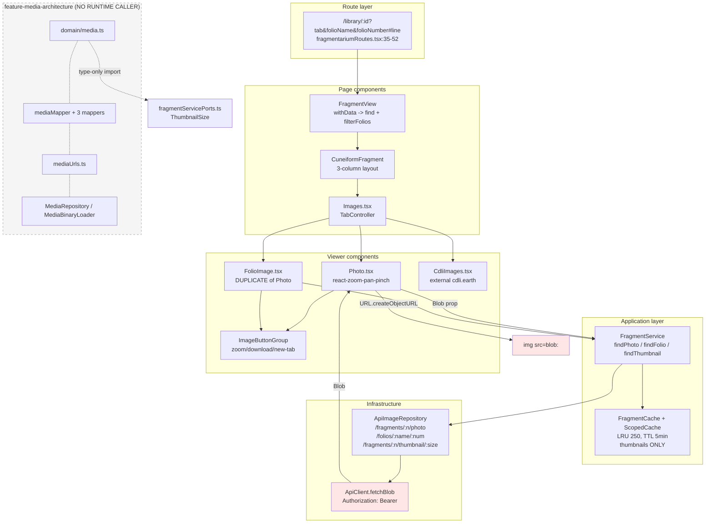
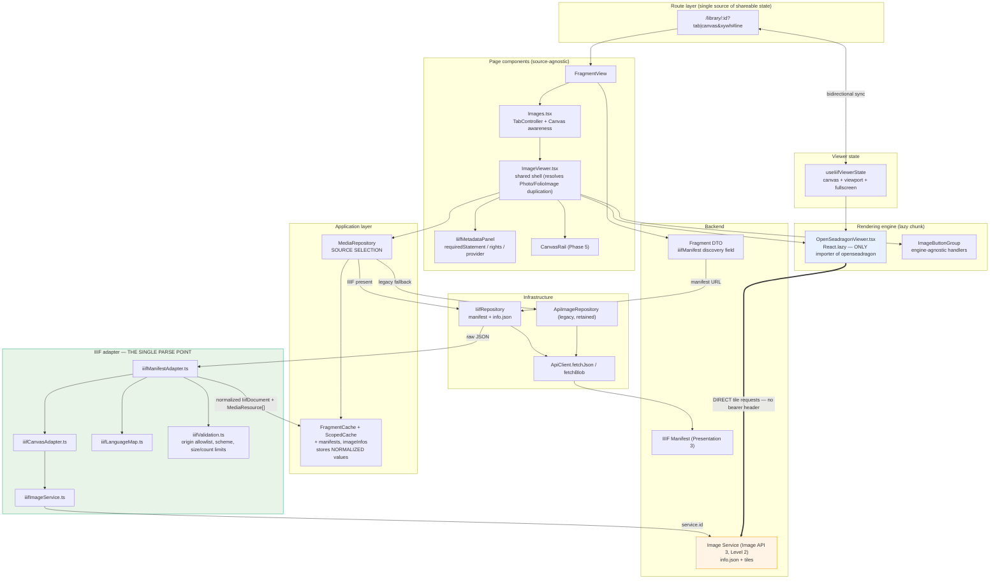

# IIIF Frontend Architecture Handoff — eBL Frontend

**Document status:** Investigation and planning only. No IIIF code was implemented, and no production code was modified during this pass.
**Prepared on:** 2026-08-24
**Repository:** `ebl-frontend` (Electronic Babylonian Library front end)
**Branch investigated:** `feature-media-architecture`

Evidence labels used throughout:

| Label       | Meaning                                                                                                                                 |
| ----------- | --------------------------------------------------------------------------------------------------------------------------------------- |
| `CONFIRMED` | Directly verified by reading the file or executing a targeted command in this repository, or read from an authoritative primary source. |
| `INFERRED`  | Reasoned from confirmed evidence, but not directly observed.                                                                            |
| `PROPOSED`  | A recommendation of this document. Not implemented. Not present in the codebase.                                                        |
| `UNKNOWN`   | Could not be determined from the frontend repository alone; requires the backend handoff or a product decision.                         |

---

## 1. Executive verdict

**The `feature-media-architecture` branch is a sound but incomplete foundation for consuming IIIF.** `CONFIRMED`

It is sound because it establishes exactly the boundary IIIF needs: a _normalized, readonly, framework-free media domain_ (`MediaResource`, `MediaRepresentations`, `MediaSummary`) that is deliberately separated from the wire format by a _permissive DTO layer_ and _pure normalization mappers_. That is precisely the shape an IIIF adapter should target. The branch already solved the hardest conceptual problem — "the backend wire shape is not the UI's domain model" — and it solved it with excellent test discipline.

It is incomplete because **none of it runs**. `CONFIRMED` by execution: the branch ships a test-support guard (`src/test-support/mediaArchitectureIsolationGuard.ts`) plus a test (`src/fragmentarium/infrastructure/mediaArchitectureIsolation.test.ts`) that _assert_ no production source file imports any media-architecture module. That test passes. Every media module on this branch is dormant scaffolding with test-only callers.

Three findings dominate the IIIF decision:

1. **The current image pipeline is Blob-based and bearer-token authenticated, which is structurally incompatible with naive tiled IIIF rendering.** `CONFIRMED` Every image in eBL is fetched through `ApiClient.fetchBlob` with an `Authorization: Bearer` header and rendered via `URL.createObjectURL`. A IIIF tile source issues hundreds of plain ``/XHR tile requests that cannot carry that header. This is the single largest piece of frontend work and the single largest backend dependency.
2. **A direct-URL precedent already exists and should be the migration path.** `CONFIRMED` `SummaryThumbnail` in the search results renders `` directly from a backend-supplied path, with no bearer token. IIIF tiles should follow that model, not the Blob model.
3. **The branch's media domain models _representations of a file_, whereas IIIF models _a view of an object_.** `CONFIRMED` `MediaResource.representations` is a fixed triple (`original` / `display` / `thumbnails`), which cannot express an Image Service, tile pyramid, or `info.json`. This is the specific extension point IIIF requires — not a reason to discard the branch.

**Recommended strategy:** a **hybrid** — eBL-owned React components and navigation, with **OpenSeadragon** as the tiled-image rendering engine, and **`@iiif/parser` + `@iiif/presentation-3` types** for Manifest parsing and typing. **Not Mirador.** See §15–§16.

**Recommended first integration surface:** the **fragment detail page's `Photo` tab** (`src/fragmentarium/ui/images/Photo.tsx`, reached via `src/fragmentarium/ui/images/Images.tsx`). It is the highest-value research surface, is already tab-isolated, and has an existing zoom/pan implementation to replace behind a flag. Thumbnails, search results and editorial tooling should **not** change in the first release.

---

## 2. Repository, branch, HEAD, base, and working-tree state

All values `CONFIRMED` by direct command execution on 2026-08-24.

| Property                                    | Value                                                                                                                                      |
| ------------------------------------------- | ------------------------------------------------------------------------------------------------------------------------------------------ |
| Absolute repository path                    | `/workspaces/ebl-frontend`                                                                                                                 |
| Current branch                              | `feature-media-architecture`                                                                                                               |
| Current HEAD SHA                            | `7e5583d7127fb52c12538b545f49352fd160a5c3`                                                                                                 |
| Upstream tracking branch                    | **None.** `git rev-parse --abbrev-ref --symbolic-full-name @{u}` → `fatal: no upstream configured for branch 'feature-media-architecture'` |
| Remote                                      | `origin` → `https://github.com/ElectronicBabylonianLiterature/ebl-frontend.git`                                                            |
| Default branch                              | `origin/master` (from `refs/remotes/origin/HEAD`)                                                                                          |
| Merge-base with `origin/master`             | `cccacb0e85443b098ffa218e203edacf71c12610`                                                                                                 |
| Merge-base with local `master`              | `d93126190b58fb9af1df4cc76294664c36b48be1`                                                                                                 |
| Commits unique to branch vs `origin/master` | 16                                                                                                                                         |
| Branch is unpublished                       | Yes — no upstream, not present on `origin`                                                                                                 |

### Working-tree status (`git status --porcelain=v1`)

```
 M craco.config.js
?? .deepcode/
?? .devcontainer/devcontainer-lock.json
?? PR_750_CLAUDE_FINAL_ADVERSARIAL_REVIEW.md
?? PR_750_CLAUDE_FINAL_INDEPENDENT_REVIEW.md
?? PR_765_CLAUDE_FINAL_ADVERSARIAL_REVIEW_HANDOFF.md
?? docs/
```

Notes on working-tree state:

- **`craco.config.js` is modified but uncommitted.** `CONFIRMED` The diff adds a Jest `moduleNameMapper` entry mapping `maplibre-gl/dist/maplibre-gl.css` to `identity-obj-proxy`. It is unrelated to media or IIIF but is relevant to §25 because it is the only build-config change in flight, and any IIIF library that ships CSS (OpenSeadragon does not; Mirador's Emotion runtime does not either, but Clover does) would need a comparable Jest mapping.
- **`docs/` is entirely untracked.** `CONFIRMED` (`git ls-files docs` returns nothing.) The pre-existing `docs/*.md` files (map/\*, `review-feature-media-architecture.md`, `handoffs/frontend-request-performance-handoff.md`) are local, uncommitted working notes. This handoff is written into that same untracked directory, so it adds no tracked file and no production code.
- **All tracked and untracked work was preserved.** No branch switch, fetch, pull, merge, rebase, reset, clean, or stash was performed.

### Is the branch complete runtime behavior, scaffolding, or documentation-only contracts?

**It is unused scaffolding plus contract tests, and this is deliberate and enforced.** `CONFIRMED` See §9.

---

## 3. Instructions reviewed

| Path                                           | Present                                  | Notes                                                                                                                                        |
| ---------------------------------------------- | ---------------------------------------- | -------------------------------------------------------------------------------------------------------------------------------------------- |
| `CLAUDE.md`                                    | **Absent** `CONFIRMED`                   | Searched repo-wide excluding `node_modules`; no `CLAUDE.md` at any depth.                                                                    |
| `AGENTS.md`                                    | **Absent** `CONFIRMED`                   | Same search; none found.                                                                                                                     |
| `.github/copilot-instructions.md`              | **Present** `CONFIRMED`                  | 7,696 bytes. The single authoritative instruction file. `applyTo: '**'`.                                                                     |
| `.github/instructions/**/*.md`                 | **Absent** `CONFIRMED`                   | `.github/` contains only `copilot-instructions.md` and `workflows/`.                                                                         |
| `.cursorrules` / `.windsurfrules` / `.claude/` | **Absent** `CONFIRMED`                   | None found.                                                                                                                                  |
| `README.md`                                    | Present                                  | Project-level readme.                                                                                                                        |
| Root architecture docs                         | Untracked working notes only `CONFIRMED` | `docs/map-*.md`, `docs/review-feature-media-architecture.md`, `docs/handoffs/frontend-request-performance-handoff.md`. None tracked at HEAD. |

### Binding conventions extracted from `.github/copilot-instructions.md` (all `CONFIRMED`)

These constrain every IIIF implementation phase proposed in §28:

- **Frontend React + TypeScript project.** Use frontend-appropriate patterns.
- **Backend API schema is the source of truth for request and response field names.** Align the client to the backend schema by default; do not introduce client-side aliases. → _Directly governs §19 and §27: the IIIF discovery field name must come from the backend contract, and the frontend must not invent an alternative._
- **Full import paths** (e.g. `common/useObjectUrl`) instead of relative paths where module aliases exist. _(Note: the existing `Photo.tsx` and `FolioImage.tsx` violate this with `./ImageButtonGroup` — pre-existing.)_
- **Explicit type annotations; avoid `any`/`unknown` unless necessary.** _(The branch's DTO layer uses `unknown` deliberately and correctly for untrusted wire input — this is the "very necessary" case.)_
- **250-line hard ceiling per `.ts`/`.tsx` file, including tests.** Split into focused modules before finalizing. → _This is why the branch has seven separate `mediaMapper._.test.ts`files, and it constrains IIIF module decomposition in §28.*`CONFIRMED`compliant: the largest branch module is`mediaMapper.compatibility.test.ts`at 226 lines; largest source module is`mediaSummaryMapper.ts` at 170 lines.
- **DRY is a hard gate**: shared domain logic/mapping must be extracted.
- **No code comments unless explicitly requested.**
- **Use `yarn`, not `npm`.**
- **`yarn lint` and `yarn tsc` are hard gates after any code change.**
- **Full test suite (`yarn test --watchAll=false`) is a hard gate after any code change; zero failures and zero console output.** Console noise is a defect to be fixed at root cause, never suppressed. Never remove/skip tests without explicit approval.
- **100% coverage in affected code after changes.**
- **Mandatory `TASK-<id>-todo.md` and `TASK-<id>-log.md` per task**, kept updated, and removed before PR merge.
- Reviews exported to `TASK-<id>-review.md` with a fixed template.

**Precedence handling for this pass:** the task prompt explicitly prohibits running the full test suite, installing packages, committing, pushing, deploying, and touching production. Those prohibitions override the corresponding instruction gates. Because **no code was changed**, the `yarn lint` / `yarn tsc` / full-suite gates are not triggered. The mandatory TODO and log files were created as `TASK-IIIF-FE-todo.md` and `TASK-IIIF-FE-log.md` — these are the only files created outside `docs/`, and they are the files the instructions explicitly require (and require to be removed before merge).

---

## 4. Investigation commands executed

Every command run during this investigation, in order. All are read-only inspections except the two file writes that created the mandated task files and this document.

**Git / ground truth (read-only):**

```bash
pwd
git rev-parse --abbrev-ref HEAD
git rev-parse HEAD
git rev-parse --abbrev-ref --symbolic-full-name @{u}      # errored: no upstream (expected)
git remote -v
git status --porcelain=v1
git symbolic-ref refs/remotes/origin/HEAD
git branch -a --list
git merge-base HEAD origin/master
git merge-base HEAD master
git log --oneline origin/master..HEAD
git rev-list --count origin/master..HEAD
git diff --stat cccacb0e..HEAD
git diff --name-status cccacb0e..HEAD
git diff cccacb0e..HEAD -- src/fragmentarium/application/fragmentServicePorts.ts
git diff cccacb0e..HEAD -- src/fragmentarium/ui/images/Photo.test.tsx
git diff craco.config.js
git ls-files docs
git ls-tree -r HEAD --name-only            # filtered to *.md
git log --oneline --name-status origin/master..HEAD -- '*.md'
git show 501c817a:docs/media-architecture.md
git show aa159104:docs/media-rollout-contract.md
```

**Instruction discovery (read-only):**

```bash
ls -la CLAUDE.md AGENTS.md .github/copilot-instructions.md
find .github -name "*.md" -type f
find . -path ./node_modules -prune -o \( -name "CLAUDE.md" -o -name "AGENTS.md" \
  -o -name ".cursorrules" -o -name ".windsurfrules" \) -print
ls -la .claude
ls -R .github
ls *.md
ls -R docs
cat .github/copilot-instructions.md
```

**Source inspection (read-only `cat -n` / `sed -n` / `grep` / `find` / `wc`):**

```bash
cat -n src/fragmentarium/domain/media.ts
cat -n src/fragmentarium/domain/mediaGallery.ts
cat -n src/fragmentarium/infrastructure/mediaDtos.ts
cat -n src/fragmentarium/application/MediaRepository.ts
cat -n src/fragmentarium/application/MediaBinaryLoader.ts
cat -n src/fragmentarium/infrastructure/mediaMapper.ts
cat -n src/fragmentarium/infrastructure/mediaMapperValidation.ts
cat -n src/fragmentarium/infrastructure/mediaUrls.ts
cat -n src/fragmentarium/infrastructure/mediaSummaryMapper.ts
cat -n src/fragmentarium/infrastructure/mediaResourceMapper.ts
cat -n src/fragmentarium/infrastructure/mediaRepresentationMapper.ts
cat -n src/test-support/mediaArchitectureIsolationGuard.ts
cat -n src/fragmentarium/infrastructure/mediaArchitectureIsolation.test.ts   # head -80
cat -n src/fragmentarium/application/fragmentServicePorts.ts
cat -n src/fragmentarium/ui/images/Photo.tsx
cat -n src/fragmentarium/ui/images/Images.tsx
cat -n src/fragmentarium/ui/images/ImageButtonGroup.tsx
cat -n src/fragmentarium/ui/images/FolioImage.tsx
cat -n src/fragmentarium/ui/images/CdliImages.tsx
cat -n src/common/ui/ApiImage.tsx
cat -n src/common/ui/BlobImage.tsx
cat -n src/common/ui/LinkedImage.tsx
cat -n src/common/ui/ExternalLink.tsx
cat -n src/common/hooks/useObjectUrl.ts
cat -n src/common/hooks/useNearViewport.ts
cat -n src/fragmentarium/infrastructure/ImageRepository.ts
cat -n src/http/ApiClient.ts
cat -n src/fragmentarium/application/fragmentCache.ts
cat -n src/fragmentarium/application/fragmentCacheKeys.ts
cat -n src/fragmentarium/application/scopedCache.ts
cat -n src/common/utils/cache.ts
cat -n src/fragmentarium/ui/fragment/FragmentView.tsx
cat -n src/fragmentarium/ui/fragment/CuneiformFragment.tsx
cat -n src/fragmentarium/ui/FragmentLink.tsx
cat -n src/router/fragmentariumRoutes.tsx
cat -n src/fragmentarium/domain/Folio.ts
cat -n src/fragmentarium/domain/annotation.ts
cat -n src/fragmentarium/ui/image-annotation/annotation-tool/FragmentAnnotation.tsx
cat -n src/fragmentarium/ui/search/FragmentariumSearchResultComponents.tsx
cat -n src/fragmentarium/ui/front-page/LatestTransliterations.tsx
cat -n src/signs/ui/display/SignImages.tsx
cat -n src/signs/domain/CroppedAnnotation.ts
cat -n src/query/QueryResult.ts
cat -n src/auth/Session.ts
cat -n src/ErrorReporterContext.ts
cat -n src/fragmentarium/application/FragmentService.ts   # targeted ranges
cat -n src/fragmentarium/domain/FragmentDtos.ts           # targeted ranges
cat -n src/test-support/FakeApi.ts                        # head -50
cat -n craco.config.js
cat -n eslint.config.js                                   # targeted ranges
sed -n '1,140p' package.json
```

**Grep / inventory sweeps (read-only):**

```bash
grep -rn "<each new media module path>" src --include=*.ts --include=*.tsx -l   # importer graph
grep -rn "findThumbnail|ThumbnailImage|thumbnail" src --include=*.tsx --include=*.ts -l
grep -rn "hasPhoto" src --include=*.ts --include=*.tsx
grep -rn "SummaryThumbnail|usesSummaryThumbnail|thumbnailPath" src
grep -rn "dompurify|DOMPurify|sanitize" src
grep -rn "dangerouslySetInnerHTML" src --include=*.tsx
grep -rn "Content-Security-Policy|csp" public/index.html
grep -rn "React.lazy|lazy\(|Suspense|import\(" src
grep -rln "i18n|react-intl|useTranslation|LanguageContext" src
grep -rn "REACT_APP_" src
grep -rn "filterFolios|isAllowedToReadFragments|hasBetaAccess|scopes" src/auth/*.ts
grep -rn "ApiImage|BlobImage|LinkedImage|findImage" src --include=*.tsx
grep -n "openseadragon|mirador|@iiif|iiif" yarn.lock       # zero matches
grep -n "a11y" eslint.config.js .eslintrc.json             # zero matches
find src -iname "*photo*" -o -iname "*folio*" -o -iname "*thumbnail*" \
     -o -iname "*image*" -o -iname "*annotation*"
find src -iname "*cache*"
wc -l src/fragmentarium/domain/media.ts src/fragmentarium/infrastructure/media*.ts ...
```

**Targeted verification (the only test execution — a single, narrowly scoped test path, not the full suite):**

```bash
npx craco test --watchAll=false --runInBand --no-coverage \
  --testPathPattern="mediaArchitectureIsolation"
```

Result `CONFIRMED`: `Test Suites: 2 passed, 2 total / Tests: 47 passed, 47 total` in ~35 s. This is the empirical proof behind §9 — the media architecture has no production importer.

**Primary-source web checks (all fetched 2026-08-24):** `https://iiif.io/api/presentation/3.0/`, `https://iiif.io/api/image/3.0/`, `https://iiif.io/api/auth/2.0/`, `https://iiif.io/api/content-state/1.0/`, `https://iiif.io/api/search/2.0/`, `https://registry.npmjs.org/openseadragon/latest`, `https://registry.npmjs.org/mirador/latest`, `https://registry.npmjs.org/@samvera/clover-iiif/latest`, `https://registry.npmjs.org/@iiif/helpers/latest`, `https://registry.npmjs.org/@iiif/presentation-3/latest`, `https://api.github.com/repos/openseadragon/openseadragon/releases`, `https://api.github.com/repos/ProjectMirador/mirador/releases`.

**Files written (the only mutations):** `TASK-IIIF-FE-todo.md`, `TASK-IIIF-FE-log.md`, `docs/IIIF_FRONTEND_ARCHITECTURE_HANDOFF.md`. No production code was touched.

---

## 5. Feature-branch intent and diff summary

### Diff vs merge-base `cccacb0e` — 28 files, +2,835 / −1 `CONFIRMED`

| Status | Path                                                                   | Lines   |
| ------ | ---------------------------------------------------------------------- | ------- |
| A      | `src/fragmentarium/domain/media.ts`                                    | 113     |
| A      | `src/fragmentarium/domain/media.test.ts`                               | 69      |
| A      | `src/fragmentarium/domain/mediaGallery.ts`                             | 35      |
| A      | `src/fragmentarium/domain/mediaGallery.test.ts`                        | 156     |
| A      | `src/fragmentarium/infrastructure/mediaDtos.ts`                        | 55      |
| A      | `src/fragmentarium/infrastructure/mediaMapperValidation.ts`            | 42      |
| A      | `src/fragmentarium/infrastructure/mediaMapper.ts`                      | 16      |
| A      | `src/fragmentarium/infrastructure/mediaSummaryMapper.ts`               | 170     |
| A      | `src/fragmentarium/infrastructure/mediaResourceMapper.ts`              | 103     |
| A      | `src/fragmentarium/infrastructure/mediaRepresentationMapper.ts`        | 138     |
| A      | `src/fragmentarium/infrastructure/mediaUrls.ts`                        | 58      |
| A      | `src/fragmentarium/infrastructure/mediaUrls.test.ts`                   | 101     |
| A      | `src/fragmentarium/infrastructure/mediaMapper.boundary.test.ts`        | 39      |
| A      | `src/fragmentarium/infrastructure/mediaMapper.compatibility.test.ts`   | 226     |
| A      | `src/fragmentarium/infrastructure/mediaMapper.mime-security.test.ts`   | 141     |
| A      | `src/fragmentarium/infrastructure/mediaMapper.representations.test.ts` | 169     |
| A      | `src/fragmentarium/infrastructure/mediaMapper.resources.test.ts`       | 224     |
| A      | `src/fragmentarium/infrastructure/mediaMapper.summary.test.ts`         | 149     |
| A      | `src/fragmentarium/infrastructure/mediaMapper.url-security.test.ts`    | 127     |
| A      | `src/fragmentarium/infrastructure/mediaArchitectureIsolation.test.ts`  | 140     |
| A      | `src/fragmentarium/application/MediaRepository.ts`                     | 8       |
| A      | `src/fragmentarium/application/MediaRepository.test.ts`                | 86      |
| A      | `src/fragmentarium/application/MediaBinaryLoader.ts`                   | 13      |
| A      | `src/fragmentarium/application/MediaBinaryLoader.test.ts`              | 88      |
| A      | `src/test-support/mediaArchitectureIsolationGuard.ts`                  | 175     |
| A      | `src/test-support/mediaArchitectureIsolationGuard.test.ts`             | 184     |
| **M**  | `src/fragmentarium/application/fragmentServicePorts.ts`                | +3 / −1 |
| **M**  | `src/fragmentarium/ui/images/Photo.test.tsx`                           | +7      |

Ratio: **~1,036 lines of source, ~1,799 lines of test.** The branch is test-dominant by design.

### The two modified files are the entire runtime footprint `CONFIRMED`

`src/fragmentarium/application/fragmentServicePorts.ts:24-26` — the only production file touched:

```diff
-export type ThumbnailSize = 'small' | 'medium' | 'large'
+import type { ThumbnailSize } from 'fragmentarium/domain/media'
+
+export type { ThumbnailSize }
```

This is a **type-only** re-export. It is architecturally significant for two reasons:

1. It makes `fragmentarium/domain/media` the single source of truth for `ThumbnailSize`, which now flows into `ImageRepository`, `FragmentService.findThumbnail`, and `fragmentCacheKeys.thumbnailKey`. `CONFIRMED`
2. It **deliberately evades the isolation guard**. The guard's `collectModuleReferences` skips `node.importClause?.isTypeOnly` imports and `node.isTypeOnly` export declarations (`src/test-support/mediaArchitectureIsolationGuard.ts:54-67`). A type-only import erases at compile time and adds no runtime edge, so the branch can share the type without wiring the module. `CONFIRMED` — this is a correct and intentional design, not a loophole abuse.

`src/fragmentarium/ui/images/Photo.test.tsx` — adds a 7-line regression test asserting the existing photo toolbar still renders (`Open in New Tab` button). It is a _characterization_ test guarding the current viewer against future media refactors. `INFERRED` intent, `CONFIRMED` content.

### Branch commit history (16 commits) `CONFIRMED`

```
7e5583d7 fix: fixed more bugs
4c84a112 Merge remote-tracking branch 'origin/master' into feature-media-architecture
c1fb4540 fix: address bugs
3944b686 fix: addressed pr comments
e7b25fef Merge remote-tracking branch 'origin/master' into feature-media-architecture
501c817a update docs for myself
7f61d339 fix: address PR comments
1564393c address comments
e2719bb8 fix
aa159104 fix(media): harden architecture compatibility checks
39532c67 test(media): complete frontend architecture contract coverage
f4055e51 docs(media): define gallery, security, accessibility, and rollout contracts
f46b1288 feat(media): define media repository and binary-loading contracts
7d5ee16d feat(media): add media compatibility mapping
fb024a22 feat(media): add frontend media domain and DTO types
844794ab docs(media): define frontend media architecture and scope boundaries
```

### Recovered branch design documents — the authoritative statement of intent `CONFIRMED`

The branch authored two design documents that were later **deleted from the tree** (in `3944b686` and `7e5583d7`), so HEAD tracks no documentation. Their content was recovered read-only via `git show`. They are the single most valuable artifact for anyone continuing this work, and their key commitments are reproduced here because they directly constrain IIIF.

From `docs/media-architecture.md` (at `501c817a`):

> **No-Runtime-Change Boundary** — "The media architecture modules introduced by this work must remain isolated from current production imports. They may be imported by tests and documentation examples only until a later runtime integration PR connects them deliberately."
>
> Non-goals included: no calls to `/fragments/{number}/media`, no changes to `FragmentRepository` / `FragmentService` / `ImageRepository`, no gallery component, no route or tab work, no Blob fetching or object URL creation.
>
> "Media IDs are opaque UUID strings from the backend contract. The frontend must use them as stable identity values and must not derive identity from museum number, filename, checksum, URL, or array position."
>
> "SVG is not a separate media type. An SVG hand copy is represented by `type = COPY` and `representations.original.mimeType = image/svg+xml`."

From `docs/media-rollout-contract.md` (at `aa159104`) — **the most IIIF-relevant document in the branch**:

> **Future Binary Authentication Contract** — "A raw `` cannot reliably attach the required bearer token. The first runtime implementation should therefore follow: `authenticated API fetch → Blob → object URL → image element`. […] **Direct URL optimization is allowed only for explicitly public media.**"
>
> Requirements: bearer tokens never appear in URLs; components do not decide whether media is public or restricted; the repository or binary loader owns authenticated fetch behavior; requests support cancellation; object URLs are revoked; **authentication identity changes invalidate restricted binary caches**.
>
> **Future SVG Security Contract** — the frontend must never fetch SVG text and inject it into the DOM, never use `dangerouslySetInnerHTML`, `<object>` or `<embed>` for media, never render untrusted raw inline SVG, and never infer media format from filename extension alone.
>
> **Future List-Performance Contract** — the list flow must remain `one fragment query → compact mediaSummary per result → thumbnail binary requests only near viewport`, and must not add a media request per search row, or eager thumbnails for every result.
>
> **Accessibility Contract** — "prefer semantic HTML over heavy ARIA composites. Avoid defaulting to listbox, tab, or carousel patterns when button lists and figures communicate the interaction clearly." Required: real buttons, accessible names, `aria-pressed`, alt text, figure/figcaption, keyboard focus movement, Enter/Space, Home/End, visible focus, reduced motion, adequate touch targets, no color-only meaning.
>
> **Rollout order:** (1) repository wiring for `/fragments/{number}/media`; (2) `mediaSummary` in list-query mapping with legacy fallback; (3) authenticated binary loader with cancellation and auth-aware invalidation; (4) accessible gallery component; (5) SVG raster-preview handling; (6) retire `legacyThumbnailPath` only after migration completes.

**This rollout contract is the frontend's existing, considered position, and IIIF must be reconciled with it — most acutely on the "direct URL only for explicitly public media" rule (§23).**

---

## 6. Current frontend media architecture

### 6.1 Stack constraints `CONFIRMED` (from `package.json`, `yarn.lock`)

| Concern                            | Actual                                                                                          |
| ---------------------------------- | ----------------------------------------------------------------------------------------------- |
| React                              | `^18.2.0`                                                                                       |
| TypeScript                         | `~5.9.3`                                                                                        |
| Build                              | `react-scripts` 5.0.1 via `@craco/craco` ^7.1.0 (webpack 5)                                     |
| Router                             | `react-router-dom` ^6.30.4                                                                      |
| UI kit                             | `react-bootstrap` ^2.9.0 + `bootstrap` ^5.3.3 + `sass`                                          |
| Promises                           | `bluebird` ^3.5.2 — pervasive in repository/service layer                                       |
| Zoom/pan (current)                 | `react-zoom-pan-pinch` **3.7.0** (pinned exact)                                                 |
| Image annotation                   | `react-image-annotation` ^0.9.10                                                                |
| Sanitization                       | `dompurify` ^3.4.11, `rehype-sanitize` ^5.0.1                                                   |
| Error reporting                    | `@sentry/react` ^7.99.0                                                                         |
| Auth                               | `@auth0/auth0-spa-js` ^2.1.0                                                                    |
| Map (heavy dep precedent)          | `maplibre-gl` ^5.24.0                                                                           |
| **Server state library**           | **None.** No react-query / TanStack Query / SWR / Redux / Zustand / MobX. `CONFIRMED`           |
| **IIIF / OpenSeadragon / Mirador** | **None.** `grep -n "openseadragon\|mirador\|@iiif\|iiif" yarn.lock` → zero matches. `CONFIRMED` |
| Node / package manager             | Node ^20, yarn ^1.5.1 (Yarn Classic)                                                            |

**Implication:** IIIF is a greenfield addition. There is no existing IIIF parsing, no tile engine, and no server-state cache library to hang Manifest caching on. State/caching must reuse the bespoke `FragmentCache`/`ScopedCache` machinery or introduce a deliberately scoped new cache (§25).

### 6.2 The HTTP and authentication layer — the decisive constraint

**`src/http/ApiClient.ts`** `CONFIRMED`

- `apiUrl(path)` (L13-15) → `${process.env.REACT_APP_DICTIONARY_API_URL}${path}`. All API URLs are built from one env var.
- `createHeaders(authenticate, headers, path)` (L104-119): attaches `Authorization: Bearer <token>` when `authenticate === true` **or** when `this.auth.isAuthenticated()`. **So a logged-in user sends a bearer token on every API request, including image requests that pass `authenticate: false`.** `CONFIRMED`
- `fetch` (L149-189) wraps `cancellableFetch`, throws `ApiError` on non-OK, and reports to `ErrorReporter` with `{ endpoint, method, status, authError: true }` for 401/403.
- `fetchBlob(path, authenticate)` (L197-201) → `response.blob()`. **This is the only way binary media enters the app.**
- Returns `Bluebird`, not native `Promise`.

**Why this is the crux for IIIF:** a IIIF Image API tile source works by letting the browser (or OpenSeadragon) issue _many_ direct requests to `{image-service}/{region}/{size}/{rotation}/{quality}.{format}`. Those are plain `` loads or XHRs originated by the viewer. **They cannot carry an `Authorization: Bearer` header** unless the viewer is given a custom loader — and even then, ``-based tile loading in OpenSeadragon's default `ImageLoader` cannot. `CONFIRMED` (architecture fact, verified against the Image API 3.0 URI template and the current `ApiClient` design.)

Three resolutions exist, evaluated in §23:

1. Backend serves IIIF image endpoints as **cookie-authenticated or public** → tiles work natively. _(Recommended.)_
2. Frontend supplies OpenSeadragon a **custom tile loader** that fetches each tile via `ApiClient.fetchBlob` and converts to an object URL. _(Works, but multiplies requests × object-URL churn and defeats HTTP caching — see §25.)_
3. Restrict IIIF to public media only in v1 and keep restricted media on the existing Blob path. _(Recommended as the v1 fallback.)_

### 6.3 The Blob → object URL rendering pipeline `CONFIRMED`

**`src/fragmentarium/infrastructure/ImageRepository.ts` (58 lines) — class `ApiImageRepository implements ImageRepository`**

| Method                        | Line   | Path                                   | Auth arg |
| ----------------------------- | ------ | -------------------------------------- | -------- |
| `find(fileName)`              | L18-23 | `/images/{fileName}`                   | `false`  |
| `findFolio(folio)`            | L25-29 | `/folios/{name}/{number}`              | `false`  |
| `findPhoto(number)`           | L31-36 | `/fragments/{number}/photo`            | `false`  |
| `findThumbnail(number, size)` | L38-52 | `/fragments/{number}/thumbnail/{size}` | `false`  |

`findThumbnail` swallows 404 into `{ blob: null }` by inspecting `error.data.title === '404 Not Found'` — a **string-matched** error branch that will throw a `TypeError` if `error.data` is undefined. Noted as a defect in §11.

**`src/common/hooks/useObjectUrl.ts` (31 lines)** — `useMemo(() => URL.createObjectURL(data))` + `useEffect` cleanup calling `URL.revokeObjectURL`. Both wrapped in `try/catch`. Correct lifecycle handling; reusable for IIIF's non-tiled fallback path.

**`src/common/ui/BlobImage.tsx` (67 lines)** — `BlobImage` and `ThumbnailImage`, both `useObjectUrl` → `react-bootstrap` `<Image fluid loading="lazy" decoding="async">`. `ThumbnailImage` optionally wraps in `ExternalLink`.

**`src/common/ui/ApiImage.tsx` (26 lines)** — `<Image src={apiUrl('/images/' + fileName)}>`. **A direct-URL, unauthenticated image path that already exists** (used for static assets like `LibraryCropped.svg` in `src/corpus/ui/Corpus.tsx:199`).

**`src/common/ui/LinkedImage.tsx` (17 lines)** — `<ExternalLink href={src}><Image src={src}/></ExternalLink>`. Used for CDLI external images.

### 6.4 Service, cache, and loading layers `CONFIRMED`

**`src/fragmentarium/application/FragmentService.ts`**

| Method                          | Line     | Behavior                                                                                                                                                                |
| ------------------------------- | -------- | ----------------------------------------------------------------------------------------------------------------------------------------------------------------------- |
| `findFolio(folio)`              | L113-115 | Delegates to `imageRepository.findFolio`. **No cache.**                                                                                                                 |
| `findImage(fileName)`           | L117-119 | Delegates. **No cache.**                                                                                                                                                |
| `findPhoto(fragment)`           | L121-127 | Guards on `fragment.hasPhoto`, else **throws synchronously**. **No cache.**                                                                                             |
| `findThumbnail(fragment, size)` | L129-137 | `cache.thumbnail(thumbnailKey(...), () => thumbnailFetchLimiter.run(() => imageRepository.findThumbnail(...)))` — **the only cached + concurrency-limited image path.** |

**`src/fragmentarium/application/fragmentCache.ts` (242 lines) — `FragmentCache`**
Separate `Map`s per resource kind, each paired with an in-flight `requests` map for deduplication: `fragments`, `queryResults`, `thumbnails`, `provenances`, `provenancesById`, `provenanceChildrenById`, `prefetchedFragments`. Caps: `maximumCachedThumbnails = 250` (L23). Methods `fragment()`, `queryResult()`, `thumbnail()` (L108-119) all route to `ScopedCache.getOrFetch`.

**`src/fragmentarium/application/scopedCache.ts` — `ScopedCache`**

- `cacheEntryLifetimeInMilliseconds = 5 * 60 * 1000` (L5) — **5-minute TTL**.
- `getOrFetch` calls `clearWhenScopeChanges()` first (L39), then `getOrFetchCachedValue`.
- `clearWhenScopeChanges()` (L50-60) compares the current scope string; on change it **clears every registered cache**. This is the **auth-identity invalidation mechanism** the rollout contract requires. `CONFIRMED`
- `bumpGeneration()` supports stale-result rejection (used by query prefetch, `FragmentService.ts:217-221`).

**`src/common/utils/cache.ts`** — `CacheEntry<T> = { expiresAt, value }`; `getCachedValue` implements **LRU touch** (delete + re-set on hit) and TTL eviction; `setCachedValue` trims to `maximumCacheSize`.

**`src/http/withData.tsx`** — the universal data-loading HOC. Wraps a Bluebird-returning fetcher, renders `Spinner` while pending, `ErrorAlert` on failure, inside an `ErrorBoundary`. Supports a `watch` prop for refetch keys (used in `FragmentView.tsx:139-141`). **This is eBL's de facto query layer** and the natural place to hang Manifest fetching.

### 6.5 The viewer components `CONFIRMED`

**`src/fragmentarium/ui/images/Photo.tsx` (89 lines)** — the primary detail viewer.

- Props: `{ photo: Blob, fragment: Fragment }`. **Takes a Blob, not a URL.**
- `useExifData(photo)` (L22-33): `EXIF.getData` reads the `Artist` tag, run through `fixEncoding` (`iconv-lite` encode to `iso-8859-1`) — a latin-1 mojibake repair.
- Renders `<TransformWrapper panning={{activationKeys: []}} initialScale={1} minScale={0.5} maxScale={8}>` from `react-zoom-pan-pinch`, with `ImageButtonGroup` and a single ``.
- Footer renders `<ReactMarkdown>{fragment.museum.copyright ?? ''}</ReactMarkdown>` — this is the **existing rights/attribution surface**, and the natural home for IIIF `requiredStatement` / `rights`. `react-markdown` v8 without `rehype-raw` escapes embedded HTML, so it is safe by default. `CONFIRMED`

**`src/fragmentarium/ui/images/FolioImage.tsx` (55 lines)** — near-duplicate of `Photo.tsx`'s viewer block (same `TransformWrapper` config, same `ImageButtonGroup`, same `image-wrapper`), fetched via `withData(props => props.fragmentService.findFolio(props.folio))`. **This duplication is a DRY violation against the repo's own hard gate**, and is exactly the consolidation the branch docs deferred ("Runtime viewer extraction and image-toolbar consolidation are deferred to a later UI integration PR"). §11.

**`src/fragmentarium/ui/images/ImageButtonGroup.tsx` (132 lines)** — the shared toolbar.

- `useImageActions(image: Blob, fileName: string)` (L27-58): `handleDownload` builds an `<a download>` with extension derived from `image.type.split('/')[1]`; `handleOpenInNewTab` calls `window.open(objectUrl, '_blank')` and revokes after a 60 s `setTimeout`.
- `ImageButtonGroup` renders five `ButtonWithTooltip` controls: Zoom In, Zoom Out, Reset, Download, Open in New Tab. Each is a real `<Button aria-label={label}>` with an `aria-hidden` icon and an `OverlayTrigger` tooltip. **Good accessible-name hygiene to inherit.** `CONFIRMED`
- **Security note:** `window.open(url, '_blank')` is called **without `noopener,noreferrer`** (L49). The branch's own rollout contract requires `noopener,noreferrer`. Currently the target is an object URL (same-origin blob), so the practical risk is low, but it becomes a real tabnabbing vector the moment an external IIIF `homepage`/`rendering` URL is opened the same way. §23.

**`src/fragmentarium/ui/images/Images.tsx` (203 lines)** — the tab host and **deep-link controller**.

- `class TabController` (L24-82): `defaultKey` prefers `photo`, else first folio index, else `cdli`; `activeKey` resolves `?tab=folio` by matching `activeFolio` against `fragment.folios` via `_.isEqual`; `openTab(eventKey)` navigates to either `createFragmentUrlWithFolio` or `createFragmentUrlWithTab`.
- `FragmentPhoto = withData(..., ({fragment, fragmentService}) => fragmentService.findPhoto(fragment))` (L84-91).
- Tab set is built from `fragment.hasPhoto`, `fragment.cdliImages`, and `fragment.folios`; folios collapse into a `FolioDropdown` above `FOLIO_DROPDOWN_THRESHOLD = 3`.
- **This class is the existing multi-view navigation model, and it is the closest analogue to IIIF multi-Canvas navigation.** `CONFIRMED`

**`src/fragmentarium/ui/images/CdliImages.tsx` (87 lines)** — the **external-origin media precedent**. Builds `https://cdli.earth/${url}` from `fragment.cdliImages`, classifies by filename suffix (`_l.jpg`, `_d.jpg`, `_ld.jpg`), renders via `LinkedImage`. **No origin allowlist, no URL-scheme validation** — it string-concatenates a backend-supplied path onto a hardcoded host. §23.

### 6.6 Thumbnail surfaces `CONFIRMED`

**`src/fragmentarium/ui/search/FragmentariumSearchResultComponents.tsx`**

- `FragmentThumbnail` (L38-57): `withData(..., fragmentService.findThumbnail(fragment, 'small'))` → `ThumbnailImage` (Blob path).
- `SummaryThumbnail` (L59-82): renders `<Image src={thumbnailPath} loading="lazy" decoding="async" onError={() => setIsBroken(true)}>` wrapped in `<a href={createFragmentUrl(fragmentNumber)}>`. **Direct URL, no bearer token, with a broken-image fallback.**
- `FragmentLinesContent` (L138): `const usesSummaryThumbnail = 'thumbnailPath' in queryItem` — **capability negotiation by field presence**, the existing precedent for how the frontend detects a newer backend contract. This is directly reusable as the IIIF discovery pattern (§19). `CONFIRMED`
- Gated by `fragment.hasPhoto && isNearViewport` (L205), where `isNearViewport` comes from `useNearViewport()`.

**`src/common/hooks/useNearViewport.ts`** — `IntersectionObserver` with `rootMargin = '200px'`, disconnects after first intersection, and degrades to `true` when `IntersectionObserver` is undefined (jsdom). **The lazy-loading primitive to reuse for IIIF thumbnail rails.** `CONFIRMED`

**`src/fragmentarium/ui/front-page/LatestTransliterations.tsx`** — `CompactFragmentCard` (L40+) uses the same `hasPhoto && isNearViewport` gate with `LatestAdditionThumbnail`.

**`src/query/QueryResult.ts:4-10`** — `QueryItem { museumNumber, matchingLines, matchCount, fragment?, thumbnailPath? }`. `thumbnailPath` is the current list-summary media field.

### 6.7 Annotation, routing, auth, and page composition `CONFIRMED`

**Image annotation** — `src/fragmentarium/ui/image-annotation/annotation-tool/FragmentAnnotation.tsx`: uses `react-image-annotation` with `RectangleSelector`, operating on `useObjectUrl(image)`. `src/fragmentarium/domain/annotation.ts:3-9` defines `Geometry { x, y, height, width, type }` — **percentage-based** coordinates (`isBoundingBoxTooSmall` compares against `0.3`, i.e. 0.3%). `CONFIRMED` This is a **fractional** coordinate model; IIIF/W3C Web Annotation uses **absolute pixel** `xywh=` fragment selectors. A conversion layer is required if eBL annotations are ever expressed as IIIF annotations (§14, §28 Phase 10).

**Sign images** — `src/signs/ui/display/SignImages.tsx` + `src/signs/domain/CroppedAnnotation.ts`: `CroppedAnnotation.image` is a **base64 string** delivered inline by the API. A third, distinct media transport. `CONFIRMED`

**Routing** — `src/router/fragmentariumRoutes.tsx:35-52` `parseFragmentParams` reads `match.params['id']`, and from the query string: `folioName`, `folioNumber`, `tab`; plus `activeLine` from `location.hash`. `src/fragmentarium/ui/FragmentLink.tsx:7-32` builds `/library/{number}` with `?tab=`, `?folioName=`, `?folioNumber=` and `#hash`. **All viewer state that survives a reload lives in the query string today.** `CONFIRMED`

**Auth / entitlement** — `src/auth/Session.ts` exposes scope predicates including `isAllowedToReadFolio(folio)`, `isAllowedToAnnotateFragments()`, `hasBetaAccess()`, `isGuestSession()`. `src/fragmentarium/domain/fragment.ts:178 filterFolios(session)` strips folios the session may not read, applied in `FragmentView`'s loader (`FragmentView.tsx:136-138`). **Entitlement filtering happens in the domain layer before rendering — media the user cannot see is removed rather than rendered-and-blocked.** `CONFIRMED` This is the model IIIF restricted-media handling should follow rather than the Auth Flow API's client-side probe (§23).

**Page composition** — `src/fragmentarium/ui/fragment/CuneiformFragment.tsx:63-115`: a three-column `Container fluid` — Info (`md={2}`), Editor (`md={5}` or `md={10}` when collapsed), Images (`md={5}`, rendered only when `isColumnVisible`). Each column is wrapped in an `ErrorBoundary`. **The IIIF viewer inherits a ~5/12 column width on desktop and full width on mobile (`xs={12}`).** `CONFIRMED`

**Code splitting** — `src/router/websiteRouteGroups.ts` lazily imports each route group (`() => import('router/fragmentariumRoutes')`), and `src/router/router.tsx:28,39,70` uses `React.lazy` + `Suspense` with a `RouteLoading` fallback. **A working lazy-loading pattern exists and is the correct boundary for the IIIF viewer bundle.** `CONFIRMED`

**Error reporting** — `src/ErrorReporterContext.ts`: `ErrorReporter { captureException, showReportDialog, setUser, clearScope }`, defaulting to `ConsoleErrorReporter`, with Sentry wired in production. `CONFIRMED`

**Localization** — **No i18n framework.** `CONFIRMED` No `react-intl`, `i18next`, or `useTranslation` anywhere. The only "translation" concept is `src/corpus/ui/TranslationContext.ts`, which is about _corpus text translations_ (a domain concept), not UI locale. **The UI is English-only.** This is decisive for §14: IIIF language maps must be resolved by a small owned helper, not by an i18n library.

### 6.8 Feature flags and configuration `CONFIRMED`

The complete set of `REACT_APP_*` variables referenced in `src/`: `REACT_APP_AUTH`, `REACT_APP_CORRECTIONS_EMAIL`, `REACT_APP_DICTIONARY_API_URL`, `REACT_APP_GA_TRACKING_ID`, `REACT_APP_INFO_EMAIL`, `REACT_APP_SENTRY_DSN`.

**There is no feature-flag system.** The only runtime gates are (a) build-time env vars, (b) `Session` scopes including `hasBetaAccess()`, and (c) response-shape sniffing (`'thumbnailPath' in queryItem`). An IIIF rollout must pick one of these three (§28 recommends (b) + (c)).

---

## 7. End-to-end current media rendering flow

### 7.1 Representative image: a fragment photo on the detail page `CONFIRMED` end to end

| #   | Stage           | File : lines                                                                                                    | What happens                                                                                                                                                                                                                                                                                            |
| --- | --------------- | --------------------------------------------------------------------------------------------------------------- | ------------------------------------------------------------------------------------------------------------------------------------------------------------------------------------------------------------------------------------------------------------------------------------------------------- |
| 1   | Route           | `src/router/fragmentariumRoutes.tsx:35-52`                                                                      | `/library/:id?tab=photo` → `parseFragmentParams` yields `{ number, folioName, folioNumber, tab, activeLine }`.                                                                                                                                                                                          |
| 2   | Entity fetch    | `src/fragmentarium/ui/fragment/FragmentView.tsx:129-141`                                                        | `withData(..., props.fragmentService.find(props.number).then(f => f.filterFolios(props.session)))`, `watch: [props.number]`.                                                                                                                                                                            |
| 3   | Cache           | `FragmentService.ts:61-64` → `fragmentCache.ts:82-93` → `scopedCache.ts:32-48`                                  | `fragmentKey(number, lines, excludeLines)`; LRU 250, TTL 5 min, in-flight dedupe, scope-change clear.                                                                                                                                                                                                   |
| 4   | DTO → domain    | `src/fragmentarium/domain/FragmentDtos.ts:146` → `fragment.ts:96,132`                                           | `hasPhoto: boolean` copied onto `Fragment`. **This single boolean is the entire media contract for the detail page.**                                                                                                                                                                                   |
| 5   | Page compose    | `CuneiformFragment.tsx:101-112`                                                                                 | Right column renders `<Images fragment fragmentService activeFolio tab/>`.                                                                                                                                                                                                                              |
| 6   | Tab resolve     | `Images.tsx:42-62,144,169-176`                                                                                  | `TabController.activeKey`; `hasPhoto` gates both the `Photo` nav item and its pane.                                                                                                                                                                                                                     |
| 7   | Binary request  | `Images.tsx:84-91` → `FragmentService.ts:121-127` → `ImageRepository.ts:31-36` → `ApiClient.ts:197-201,149-189` | `fetchBlob('/fragments/{number}/photo', false)`; a logged-in user still gets `Authorization: Bearer` from `createHeaders`. **No cache, no concurrency limit on this path.**                                                                                                                             |
| 8   | Loading / error | `withData.tsx`                                                                                                  | `Spinner` while pending; `ErrorAlert` on rejection; wrapped in `ErrorBoundary` (`CuneiformFragment.tsx:38-40`). `ApiClient` reports to Sentry with `authError: true` on 401/403. `fragmentServicePorts.ts:28-34 onError` rewrites `403 Forbidden` → "You don't have permissions to view this fragment." |
| 9   | Render          | `Photo.tsx:35-88` → `ImageButtonGroup.tsx:35` → `useObjectUrl.ts`                                               | Blob → `URL.createObjectURL` → `` inside `TransformWrapper` (min 0.5×, max 8×). EXIF `Artist` extracted client-side. Copyright rendered via `ReactMarkdown`.                                                                                                                                   |
| 10  | Interaction     | `ImageButtonGroup.tsx:91-130`                                                                                   | Zoom in/out/reset (viewer-local state, **not** URL-persisted); Download (`<a download>` object URL); Open in New Tab (`window.open`, revoke after 60 s).                                                                                                                                                |
| 11  | Deep link       | `Images.tsx:64-81`, `FragmentLink.tsx:13-32`                                                                    | Only **which tab** is deep-linkable (`?tab=photo`, or `?tab=folio&folioName=&folioNumber=`). **Zoom, pan, and region are not in the URL.**                                                                                                                                                              |

**The critical observations for IIIF:**

- The photo path has **no cache and no concurrency limit** (only thumbnails do). A IIIF Manifest fetch must not repeat that mistake.
- **Viewport state is entirely ephemeral.** There is no existing mechanism to restore a zoom/region from a URL — so IIIF Content State / region deep-linking is genuinely _new_ capability, not a port.
- **`hasPhoto: boolean` is the only detail-page media contract.** There is no media list, no ordering, no per-image metadata. Everything richer must come from the backend.

### 7.2 Legacy / non-image media traces `CONFIRMED`

**(a) Folio images — the closest thing to a second "Canvas".**
`Images.tsx:182-190` renders one `FolioDetails` pane per `fragment.folios` entry → `FolioImage` → `withData(..., fragmentService.findFolio(folio))` → `ImageRepository.findFolio` → `fetchBlob('/folios/{name}/{number}', false)`. Identity is a `(name, number)` pair, not an opaque ID (`Folio.ts:52-70`); `humanizedName` and `hasImage` come from a **hardcoded 30-entry `folioTypes` table** in the frontend (`Folio.ts:9-42`), and `FOLIO_MAPPING` remaps `ARGC → ARG`. Entitlement is enforced by `Session.isAllowedToReadFolio(folio)` via `Fragment.filterFolios`. **This is a legacy path whose metadata lives in the client — it is exactly what a IIIF Manifest's per-Canvas `label` should replace, but only after the backend can supply those labels.** `CONFIRMED`

**(b) CDLI images — external origin.** `CdliImages.tsx:58-61` maps `fragment.cdliImages` to `https://cdli.earth/${url}`, classified by filename suffix, rendered as `<a target="_blank" rel="noopener noreferrer"><Image src>`. No allowlist, no scheme validation, purely direct URLs. **This is the existing model for third-party media and the closest precedent for external IIIF Manifests.** `CONFIRMED`

**(c) Sign images — inline base64.** `CroppedAnnotation.image: base64String` (`src/signs/domain/CroppedAnnotation.ts:15`), fetched by `signService.getCentroidImages(signName)`. A third transport, unrelated to fragment media, and **out of scope for IIIF v1.** `CONFIRMED`

**(d) Static API images.** `ApiImage.tsx` → `apiUrl('/images/{fileName}')` as a direct ``, e.g. `src/corpus/ui/Corpus.tsx:199`. Unauthenticated direct URLs already work in production. `CONFIRMED`

**Summary: eBL currently has four distinct media transports** — authenticated Blob, direct URL (`thumbnailPath`, `ApiImage`), external URL (CDLI), and inline base64. IIIF would be a **fifth**. Consolidation, not addition, should be the long-term goal (§26).

---

## 8. File and symbol inventory

### 8.1 Introduced by `feature-media-architecture` (all `CONFIRMED` as new)

| File                                                            | Lines | Key symbols                                                                                                                                                                                                                                                                                                                                                                                                                                            | Responsibility                                    | Runtime caller?                                       | IIIF-suitable?                         | Concerns                                                                                                                                                                                                                                                                             |
| --------------------------------------------------------------- | ----- | ------------------------------------------------------------------------------------------------------------------------------------------------------------------------------------------------------------------------------------------------------------------------------------------------------------------------------------------------------------------------------------------------------------------------------------------------------ | ------------------------------------------------- | ----------------------------------------------------- | -------------------------------------- | ------------------------------------------------------------------------------------------------------------------------------------------------------------------------------------------------------------------------------------------------------------------------------------ |
| `src/fragmentarium/domain/media.ts`                             | 1-113 | `MediaTypes`, `MediaType`, `ThumbnailSizes`, `ThumbnailSize`, `RasterMediaMimeTypes`, `SvgMediaMimeType`, `OriginalMediaMimeType`, `MediaReference`, `RasterMediaRepresentation`, `OriginalMediaRepresentation`, `MediaRepresentations`, `MediaSummaryPrimary`, `MediaSummary`, `MediaResource`, `FragmentMedia`, `isMediaType`, `isThumbnailSize`, `isRasterMediaMimeType`, `isSvgMediaMimeType`, `isOriginalMediaMimeType`, `isSvgAllowedAsOriginal` | Canonical readonly media domain                   | **No** (only `ThumbnailSize` via type-only re-export) | **Partly — keep as canonical, extend** | `MediaType` is a closed 2-value union (`PHOTO`/`COPY`); `representations` is a fixed triple with no Image Service slot; no `label`, no `rights`, no `provider`, no language maps                                                                                                     |
| `src/fragmentarium/domain/mediaGallery.ts`                      | 1-35  | `sortMedia`, `selectInitialMedia`, `selectMediaById`                                                                                                                                                                                                                                                                                                                                                                                                   | Pure ordering + initial selection                 | **No**                                                | **Yes — reuse directly**               | `selectInitialMedia` hardcodes a `PHOTO` preference; IIIF ordering is Manifest `items` order, so `sortOrder` must be derived from Canvas index                                                                                                                                       |
| `src/fragmentarium/infrastructure/mediaDtos.ts`                 | 1-55  | `MediaRepresentationDto`, `MediaRepresentationsDto`, `MediaSummaryPrimaryDto`, `MediaSummaryDto`, `MediaReferenceDto`, `MediaResourceDto`, `FragmentMediaResponseDto`, `MediaSummaryCompatibilityDto`, `ThumbnailDtoMap`                                                                                                                                                                                                                               | Permissive wire DTOs, every field `unknown`       | **No**                                                | **Yes — pattern to copy**              | Deliberate `unknown` use; this is the right shape for untrusted IIIF JSON too                                                                                                                                                                                                        |
| `src/fragmentarium/infrastructure/mediaMapperValidation.ts`     | 1-42  | `isRecord`, `normalizeNonEmptyString`, `normalizeRelativeMediaUrl`, `normalizeNonNegativeInteger`, `normalizePositiveInteger`                                                                                                                                                                                                                                                                                                                          | Shared primitive validators                       | **No**                                                | **Partly**                             | `normalizeRelativeMediaUrl` **rejects everything that is not a same-origin relative path** — rejects `//`, `\`, `?`, `#`, and any `..` segment. **IIIF Manifests are absolute `https://` URLs, so this validator cannot be reused as-is for IIIF** and needs an absolute-URL sibling |
| `src/fragmentarium/infrastructure/mediaRepresentationMapper.ts` | 1-138 | `normalizeRasterRepresentation`, `normalizeOriginalRepresentation`, `normalizeMediaRepresentations`, (private) `normalizeRepresentationFields`, `normalizeThumbnailMap`                                                                                                                                                                                                                                                                                | Representation normalization + MIME policy        | **No**                                                | **Partly**                             | Enforces SVG-only-for-`COPY` via `isSvgAllowedAsOriginal`; whitelists jpeg/png/webp. A IIIF `body.format` maps here but the fixed `original/display/thumbnails` triple does not fit `service`-backed images                                                                          |
| `src/fragmentarium/infrastructure/mediaResourceMapper.ts`       | 1-103 | `normalizeMediaReference`, `normalizeMediaResource`, `normalizeFragmentMediaResponse`, (private) `normalizeMediaReferences`                                                                                                                                                                                                                                                                                                                            | Resource-level normalization                      | **No**                                                | **Yes — the adapter target**           | Drops malformed items silently (no diagnostics surfaced to UI or telemetry)                                                                                                                                                                                                          |
| `src/fragmentarium/infrastructure/mediaSummaryMapper.ts`        | 1-170 | `NormalizedMediaSummaryCompatibility`, `normalizeMediaSummary`, `normalizeLegacyMediaSummary`, `normalizeCompatibleMediaSummary`, (private) `normalizeMediaSummaryWithDiagnostics`, `createLegacyPhotoSummary`, `hasPrimaryThumbnail`                                                                                                                                                                                                                  | New-vs-legacy summary reconciliation              | **No**                                                | **Yes — extend for IIIF**              | The best-designed module on the branch; the three-way precedence logic is exactly what IIIF/new/legacy coexistence needs                                                                                                                                                             |
| `src/fragmentarium/infrastructure/mediaMapper.ts`               | 1-16  | barrel re-exports                                                                                                                                                                                                                                                                                                                                                                                                                                      | Single import surface                             | **No**                                                | Yes                                    | Pure barrel                                                                                                                                                                                                                                                                          |
| `src/fragmentarium/infrastructure/mediaUrls.ts`                 | 1-58  | `fragmentMediaOriginalUrl`, `fragmentMediaDisplayUrl`, `fragmentMediaThumbnailUrl`, `fragmentMediaBinaryUrl`                                                                                                                                                                                                                                                                                                                                           | Client-side URL construction                      | **No**                                                | **No — conflicts with IIIF**           | **The frontend building media URLs from templates is the opposite of the IIIF model**, where all URLs are supplied by the Manifest. See §11 and §14                                                                                                                                  |
| `src/fragmentarium/application/MediaRepository.ts`              | 1-8   | `MediaRepository.findByFragment(fragmentNumber, signal?)`                                                                                                                                                                                                                                                                                                                                                                                              | Metadata port                                     | **No**                                                | **Yes — extend**                       | Returns `Promise` (not `Bluebird`) — **inconsistent with every other repository in the codebase**; accepts `AbortSignal` (good, and better than the rest of the codebase)                                                                                                            |
| `src/fragmentarium/application/MediaBinaryLoader.ts`            | 1-13  | `MediaBinaryRepresentation`, `MediaBinaryRequest`, `MediaBinaryLoader.fetch(request, signal?)`                                                                                                                                                                                                                                                                                                                                                         | Binary port                                       | **No**                                                | **Partly**                             | Blob-returning by contract; a tiled IIIF viewer needs URLs, not Blobs                                                                                                                                                                                                                |
| `src/test-support/mediaArchitectureIsolationGuard.ts`           | 1-175 | `mediaArchitectureModules`, `collectModuleReferences`, `resolveModuleSpecifier`, `isMediaArchitectureModule`, `isMediaArchitectureFile`, `findExpectedMediaArchitectureModules`, `findMediaArchitectureReferences`, `isProductionSourceFile`, `listSourceFiles`, `toRelativePath`, `normalizeSlashes`, `toModulePath`                                                                                                                                  | TypeScript-AST import scanner enforcing isolation | Test-only                                             | N/A                                    | Uses the `typescript` compiler API in a test; will need updating (or deleting) the moment IIIF wiring lands — see §28                                                                                                                                                                |

### 8.2 Pre-existing, IIIF-relevant (all `CONFIRMED` as unmodified by the branch unless noted)

| File                                                                  | Lines                       | Symbols                                                                                                      | Responsibility                                                 | IIIF impact                                                                       |
| --------------------------------------------------------------------- | --------------------------- | ------------------------------------------------------------------------------------------------------------ | -------------------------------------------------------------- | --------------------------------------------------------------------------------- |
| `src/http/ApiClient.ts`                                               | 13-15, 95-218               | `apiUrl`, `ApiClient`, `createHeaders`, `fetch`, `fetchJson`, `fetchBlob`, `postJson`, `putJson`, `ApiError` | HTTP + Auth0 bearer + Sentry                                   | **Central.** Manifest fetch should reuse `fetchJson`; tile requests cannot use it |
| `src/http/withData.tsx`                                               | whole                       | `withData`, `WithData`, `WithoutData`                                                                        | Loading/error HOC                                              | Manifest loading states                                                           |
| `src/http/cancellableFetch.ts`                                        | whole                       | `cancellableFetch`                                                                                           | Abortable fetch                                                | Manifest cancellation                                                             |
| `src/fragmentarium/infrastructure/ImageRepository.ts`                 | 9-53                        | `ApiImageRepository`                                                                                         | Blob image fetching                                            | Legacy fallback path retained                                                     |
| `src/fragmentarium/application/FragmentService.ts`                    | 113-137                     | `findFolio`, `findImage`, `findPhoto`, `findThumbnail`                                                       | Image service methods                                          | Extended, not replaced                                                            |
| `src/fragmentarium/application/fragmentServicePorts.ts`               | 24-26 (**modified**), 36-45 | `ThumbnailSize` (re-export), `ThumbnailBlob`, `ImageRepository`, `onError`, `FragmentRepository`             | Port definitions                                               | Where a `IiifRepository` port would be declared                                   |
| `src/fragmentarium/application/fragmentCache.ts`                      | 22-26, 82-119               | `FragmentCache`, `maximumCachedThumbnails`                                                                   | Multi-map LRU cache                                            | Manifest cache owner                                                              |
| `src/fragmentarium/application/scopedCache.ts`                        | 5, 32-60                    | `ScopedCache`, `cacheEntryLifetimeInMilliseconds`                                                            | TTL + scope invalidation                                       | **Auth-identity invalidation for Manifests**                                      |
| `src/fragmentarium/application/fragmentCacheKeys.ts`                  | 12-28                       | `fragmentKey`, `queryKey`, `thumbnailKey`, `deleteByPrefix`                                                  | Cache key construction                                         | Add `manifestKey` here                                                            |
| `src/fragmentarium/ui/images/Photo.tsx`                               | 35-88                       | `Photo`, `useExifData`                                                                                       | Detail viewer                                                  | **First IIIF integration point**                                                  |
| `src/fragmentarium/ui/images/FolioImage.tsx`                          | 11-55                       | default export                                                                                               | Folio viewer                                                   | Second integration point                                                          |
| `src/fragmentarium/ui/images/ImageButtonGroup.tsx`                    | 7-130                       | `getImageActions`, `useImageActions`, `ImageButtonGroup`, `ButtonWithTooltip`                                | Toolbar + download/new-tab                                     | Reused; needs OSD-driven zoom handlers                                            |
| `src/fragmentarium/ui/images/Images.tsx`                              | 24-82, 84-91, 127-194       | `TabController`, `FragmentPhoto`, `Images`                                                                   | Tab host + deep-link                                           | **Canvas navigation host**                                                        |
| `src/fragmentarium/ui/images/CdliImages.tsx`                          | 24-87                       | `getImageType`, `cdliTab`, `CdliImages`                                                                      | External images                                                | External-manifest precedent                                                       |
| `src/fragmentarium/ui/fragment/CuneiformFragment.tsx`                 | 63-115                      | `CuneiformFragment`                                                                                          | 3-column layout                                                | Viewport sizing constraints                                                       |
| `src/fragmentarium/ui/fragment/FragmentView.tsx`                      | 70-141                      | `FragmentView`, `TagSignsButton`, `FragmentWithData`                                                         | Page shell                                                     | Entity load + `filterFolios`                                                      |
| `src/fragmentarium/ui/FragmentLink.tsx`                               | 7-32                        | `createFragmentUrl`, `createFragmentUrlWithFolio`, `createFragmentUrlWithTab`                                | URL builders                                                   | **Deep-link builders to extend**                                                  |
| `src/router/fragmentariumRoutes.tsx`                                  | 28-52                       | `parseStringParam`, `parseFragmentParams`                                                                    | Route param parsing                                            | **Deep-link parsing to extend**                                                   |
| `src/fragmentarium/ui/search/FragmentariumSearchResultComponents.tsx` | 38-57, 59-82, 138, 203-219  | `FragmentThumbnail`, `SummaryThumbnail`, `usesSummaryThumbnail`                                              | Search thumbnails                                              | **Capability-negotiation precedent**                                              |
| `src/common/hooks/useNearViewport.ts`                                 | 10-45                       | `useNearViewport`                                                                                            | IntersectionObserver                                           | Thumbnail-rail laziness                                                           |
| `src/common/hooks/useObjectUrl.ts`                                    | 3-31                        | `useObjectUrl`                                                                                               | Object URL lifecycle                                           | Non-tiled fallback                                                                |
| `src/common/ui/BlobImage.tsx`                                         | 6-67                        | `BlobImage`, `ThumbnailImage`                                                                                | Blob rendering                                                 | Legacy fallback                                                                   |
| `src/common/ui/ApiImage.tsx`                                          | 5-26                        | `ApiImage`                                                                                                   | Direct-URL image                                               | Direct-URL precedent                                                              |
| `src/common/ui/ExternalLink.tsx`                                      | 3-15                        | `ExternalLink`                                                                                               | `rel="noopener noreferrer"`                                    | **Mandatory for IIIF `homepage`/`rendering`**                                     |
| `src/auth/Session.ts`                                                 | 4-33, 101-169               | `Session`, `isAllowedToReadFolio`, `hasBetaAccess`, `isGuestSession`                                         | Scope predicates                                               | Entitlement + rollout flag                                                        |
| `src/fragmentarium/domain/fragment.ts`                                | 96, 132, 178                | `Fragment.hasPhoto`, `filterFolios`                                                                          | Entity + entitlement filter                                    | Where a IIIF reference would be added                                             |
| `src/fragmentarium/domain/FragmentDtos.ts`                            | 146                         | `hasPhoto: boolean`                                                                                          | Wire DTO                                                       | **Discovery field goes here**                                                     |
| `src/query/QueryResult.ts`                                            | 4-10                        | `QueryItem.thumbnailPath`                                                                                    | List DTO                                                       | List-level media summary                                                          |
| `src/fragmentarium/domain/annotation.ts`                              | 3-13, 33-39                 | `Geometry`, `isBoundingBoxTooSmall`, `AnnotationData`                                                        | Percentage-based regions                                       | **Coordinate-space conversion needed for W3C selectors**                          |
| `src/ErrorReporterContext.ts`                                         | 3-8                         | `ErrorReporter`                                                                                              | Telemetry port                                                 | Manifest error reporting                                                          |
| `src/router/websiteRouteGroups.ts`, `src/router/router.tsx`           | 27-103; 28-81               | `loadModule`, `React.lazy`, `Suspense`                                                                       | Code splitting                                                 | **Lazy-load boundary for the viewer**                                             |
| `src/test-support/FakeApi.ts`                                         | 30+                         | `FakeApi`, `Expectation`                                                                                     | Jest API double (`fetchJson`/`fetchBlob` mocks, `isBlob` flag) | **The fixture harness to extend for Manifests**                                   |

---

## 9. Runtime-used code versus unused scaffolding

**Verdict: 100% of the branch's media modules are unused scaffolding, and this is enforced by a passing test.** `CONFIRMED` by execution.

### The importer graph `CONFIRMED`

A repo-wide grep for each new module's specifier yields importers exclusively from (a) the media modules themselves, (b) `*.test.ts` files, and (c) `src/test-support/mediaArchitectureIsolationGuard.ts`. The **only** non-test, non-media production file that references anything is `fragmentServicePorts.ts`, and it does so with `import type` / `export type`, which emits no runtime code.

| Module                                     | Non-test production importers             |
| ------------------------------------------ | ----------------------------------------- |
| `domain/media`                             | `fragmentServicePorts.ts` — **type-only** |
| `domain/mediaGallery`                      | none                                      |
| `infrastructure/mediaDtos`                 | media modules only                        |
| `infrastructure/mediaMapper`               | media modules only                        |
| `infrastructure/mediaMapperValidation`     | media modules only                        |
| `infrastructure/mediaRepresentationMapper` | media modules only                        |
| `infrastructure/mediaResourceMapper`       | media modules only                        |
| `infrastructure/mediaSummaryMapper`        | media modules only                        |
| `infrastructure/mediaUrls`                 | **none**                                  |
| `application/MediaRepository`              | **none**                                  |
| `application/MediaBinaryLoader`            | `mediaUrls.ts` (type-only)                |

### The guard that enforces it `CONFIRMED`

`src/fragmentarium/infrastructure/mediaArchitectureIsolation.test.ts` asserts:

1. **Inventory completeness** (L20-38): every module in `mediaArchitectureModules` exists on disk, _and_ the list exactly equals `findExpectedMediaArchitectureModules(sourceRoot)` — a filesystem scan for non-test files under `fragmentarium/` whose basename matches `/^media/i`. **Adding a new `media*.ts` file without registering it fails the test.**
2. **Isolation** (L42-54): for every production source file (non-test, non-media-module), `findMediaArchitectureReferences(...)` must equal `[]`.
3. **Non-vacuity** (L56-62): at least one barrel-style `export *`/`export {` file must exist, proving the scanner actually scans.
4. **Mutation fixtures** (L65+): synthetic `CuneiformFragment.tsx` sources containing a static alias import, a relative import, a side-effect import, and a mixed type/value import must each be _detected_, proving the scanner is not silently blind.

The scanner (`mediaArchitectureIsolationGuard.ts:37-86`) parses each file with `ts.createSourceFile` and walks for `ImportDeclaration` (skipping `isTypeOnly`), `ExportDeclaration` (skipping `isTypeOnly`), dynamic `import()`, and `require()`. It resolves relative specifiers via `path.posix` (L96-108). **This is a genuinely rigorous guard, not a token check.**

**Executed result:** `npx craco test --watchAll=false --runInBand --no-coverage --testPathPattern="mediaArchitectureIsolation"` → **2 suites, 47 tests, all passing.** `CONFIRMED`

### Consequence for IIIF planning

This is **good news, not bad**. Because nothing is wired:

- There is **zero migration risk** in reshaping the media domain to accommodate IIIF. No user-facing behavior depends on it.
- The branch can absorb IIIF-driven changes to `MediaResource`/`MediaRepresentations` in the same PR series that wires it up.
- **But**: the branch has _never been validated against a real backend response_. Every mapper test uses hand-written fixtures. `UNKNOWN`: whether the backend's actual `/fragments/{number}/media` shape matches `FragmentMediaResponseDto`. The first wiring PR must treat the contract as unverified.
- The isolation guard **must be deliberately retired or narrowed** when wiring begins, or every integration PR will fail CI. This should be an explicit, reviewed step (§28 Phase 2), not an incidental deletion.

---

## 10. Existing architecture strengths

Strengths worth preserving deliberately during IIIF work. All `CONFIRMED`.

1. **Clean layering already matches the IIIF integration shape.** `domain/` (pure, readonly, framework-free) ← `infrastructure/` (DTOs + mappers) ← `application/` (services, ports, cache) ← `ui/` (components). A IIIF adapter slots into `infrastructure/` without disturbing the other three.
2. **Permissive DTOs + pure normalizers is exactly the right defense against untrusted JSON.** Every DTO field is `unknown`; mappers validate rather than cast. IIIF Manifests — especially external ones — demand precisely this discipline, and the pattern already exists with test coverage.
3. **`normalizeCompatibleMediaSummary` is a working three-way compatibility precedent.** It reconciles a new structured summary against legacy `hasPhoto`/`thumbnailPath` with explicit precedence and a `hasCriticalError` diagnostic. IIIF becomes a fourth input to the same reconciliation, not a parallel system.
4. **Capability negotiation by response-shape sniffing already ships.** `usesSummaryThumbnail = 'thumbnailPath' in queryItem` (`FragmentariumSearchResultComponents.tsx:138`) lets one frontend serve two backend versions. IIIF discovery can use the identical technique with zero new infrastructure.
5. **`ScopedCache` already solves auth-identity cache invalidation.** `clearWhenScopeChanges()` clears every registered map when the scope string changes — the hard part of "restricted media must not leak across logins" is done.
6. **In-flight request deduplication + LRU + TTL is built and tested.** `getOrFetchCachedValue` with paired `cache`/`requests` maps prevents thundering herds. Manifest fetching gets this for free.
7. **`withData` gives uniform loading/error/boundary semantics for free**, including a `watch` key for refetching. Manifest loading needs no new HOC.
8. **Lazy route-group loading is proven in production.** `React.lazy` + `Suspense` + `loadModule: () => import(...)` gives a ready-made boundary for a heavy viewer bundle.
9. **Entitlement is enforced in the domain, before render.** `Fragment.filterFolios(session)` removes unviewable media rather than rendering a blocked placeholder — simpler and safer than client-side probe flows.
10. **Existing toolbar accessibility is solid.** Real `<Button>` elements with `aria-label`, `aria-hidden` icons, tooltip overlays. `ImageButtonGroup` is a good inheritance base.
11. **Near-viewport lazy loading with a graceful jsdom fallback.** `useNearViewport` degrades to `true` when `IntersectionObserver` is absent, so tests do not need polyfills to see content.
12. **Sanitization is taken seriously where HTML is rendered.** `DOMPurify.sanitize` before every `dangerouslySetInnerHTML` (`MarkdownAndHtmlToHtml.tsx:36`, `WordDisplayAGI.tsx:7`), and `rehype-sanitize` with a custom schema in `InlineMarkdown.tsx`.
13. **`ExternalLink` centralizes `rel="noopener noreferrer"`** for every external navigation.
14. **The 250-line ceiling has produced genuinely focused modules**, which makes the IIIF adapter's decomposition obvious rather than arbitrary.
15. **Object URL lifecycle is correctly managed** with `useMemo`/`useEffect` revocation and defensive `try/catch`.

---

## 11. Confirmed gaps and defects

Ordered by IIIF impact. Severity reflects impact on the IIIF programme, not general product severity.

| #   | Finding                                                                                                                                                                                                                                                                                                                         | Evidence                                                                                          | Severity for IIIF                                                                                          |
| --- | ------------------------------------------------------------------------------------------------------------------------------------------------------------------------------------------------------------------------------------------------------------------------------------------------------------------------------- | ------------------------------------------------------------------------------------------------- | ---------------------------------------------------------------------------------------------------------- |
| 1   | **Bearer-token-in-header auth is structurally incompatible with tiled image rendering.** No ``-issued tile request can carry the header.                                                                                                                                                                                   | `ApiClient.ts:104-119, 197-201`; Image API 3.0 URI template                                       | **Blocker** — must be resolved by backend contract (§27) before any tiled viewer ships                     |
| 2   | **`MediaRepresentations` cannot express an Image Service.** The fixed `original`/`display`/`thumbnails` triple has no slot for a `service` block, tile pyramid, `info.json`, or compliance level.                                                                                                                               | `domain/media.ts:41-47`                                                                           | **High** — the specific extension required (§14)                                                           |
| 3   | **`mediaUrls.ts` builds media URLs client-side from templates.** IIIF's model is that _all_ URLs come from the Manifest. Keeping both invites divergence.                                                                                                                                                                       | `mediaUrls.ts:11-58`; zero runtime callers                                                        | **High** — conflicting URL-authority model; §14 recommends confining it to legacy                          |
| 4   | **`normalizeRelativeMediaUrl` rejects every absolute URL.** It requires a leading `/`, rejects `//`, `\`, `?`, `#`, and `..`. IIIF Manifest/Canvas/service IDs are absolute `https://` URIs.                                                                                                                                    | `mediaMapperValidation.ts:17-28`                                                                  | **High** — the branch's URL validator cannot be reused for IIIF as written                                 |
| 5   | **`MediaType` is a closed 2-value union (`PHOTO`\|`COPY`).** IIIF Canvases carry no such classification; `label`-based inference would be lossy and fragile.                                                                                                                                                                    | `domain/media.ts:1-3`                                                                             | **Medium-High** — needs a nullable/extended role concept                                                   |
| 6   | **No media identity or ordering on the detail page.** `hasPhoto: boolean` is the entire contract; there is no media list, no per-image label, no ordering.                                                                                                                                                                      | `FragmentDtos.ts:146`; `fragment.ts:96`; `Images.tsx:144`                                         | **High** — multi-Canvas is entirely new capability                                                         |
| 7   | **Viewer state is not URL-addressable.** Zoom/pan/region live only in `TransformWrapper` internals. Only _which tab_ is deep-linkable.                                                                                                                                                                                          | `Photo.tsx:44-49`; `Images.tsx:64-81`                                                             | **Medium-High** — Content State/region deep-links are new work, not a port                                 |
| 8   | **`Photo.tsx` and `FolioImage.tsx` duplicate the entire viewer block** (same `TransformWrapper` config, same toolbar wiring, same markup). Violates the repo's DRY hard gate.                                                                                                                                                   | `Photo.tsx:42-74` vs `FolioImage.tsx:18-51`                                                       | **Medium** — must be consolidated _before_ introducing a third viewer                                      |
| 9   | **`ImageRepository.findThumbnail` error handling reads `error.data.title` unguarded.** If `error.data` is undefined (e.g. a network failure, or `ApiError.fromResponse`'s `.catch` path yielding `{}` — actually `{}` is safe, but a non-`ApiError` rejection is not), this throws a `TypeError` that masks the original error. | `ImageRepository.ts:45-51`                                                                        | **Medium** — pre-existing; the same pattern must not be copied into Manifest fetching                      |
| 10  | **`window.open(photoUrl, '_blank')` omits `noopener,noreferrer`.** Currently a same-origin blob URL, so low practical risk — but it becomes a real tabnabbing vector for IIIF `homepage`/`rendering` links. The branch's own rollout contract forbids it.                                                                       | `ImageButtonGroup.tsx:47-51`                                                                      | **Medium** — must be fixed before any external IIIF URL is opened                                          |
| 11  | **The photo path has no cache and no concurrency limit.** Only `findThumbnail` is cached/limited; `findPhoto`, `findFolio`, `findImage` are not.                                                                                                                                                                                | `FragmentService.ts:113-127` vs `129-137`                                                         | **Medium** — Manifest fetching must be cached from day one                                                 |
| 12  | **Download extension is derived from `blob.type.split('/')[1]`.** For `image/svg+xml` this yields `svg+xml`, producing `eBL-K.1.svg+xml`. No MIME allowlist, contrary to the branch's rollout contract.                                                                                                                         | `ImageButtonGroup.tsx:39-40`                                                                      | **Low-Medium** — pre-existing; §23 requires a static allowlist                                             |
| 13  | **No Content-Security-Policy.** No CSP `<meta>` in `public/index.html` and no CSP configuration found in the repo.                                                                                                                                                                                                              | grep for `Content-Security-Policy` → zero matches                                                 | **Medium** — IIIF widens the image/connect origin surface; `img-src`/`connect-src` policy becomes valuable |
| 14  | **`eslint-plugin-jsx-a11y` is a dependency but is not extended in the lint config.** Only the subset bundled in the `react-app` preset applies; `plugin:jsx-a11y/recommended` is absent.                                                                                                                                        | `package.json` deps vs `eslint.config.js:16-24`; `grep -n "a11y" eslint.config.js` → zero matches | **Medium** — a complex viewer needs stronger a11y linting                                                  |
| 15  | **No i18n framework at all.** IIIF language maps are inherently multilingual; the UI has no locale concept.                                                                                                                                                                                                                     | grep for `react-intl`/`i18next`/`useTranslation` → none                                           | **Medium** — forces an owned language-map resolver with a fixed English preference (§14)                   |
| 16  | **`CdliImages` concatenates backend data onto a hardcoded external host with no scheme or path validation.**                                                                                                                                                                                                                    | `CdliImages.tsx:58-61`                                                                            | **Medium** — the same laxity applied to external Manifests would be a genuine vulnerability                |
| 17  | **`MediaRepository` returns a native `Promise` while the entire rest of the codebase returns `Bluebird`.** Mixing at the `withData` boundary works (`withData` accepts thenables) but is inconsistent.                                                                                                                          | `MediaRepository.ts:4-7` vs `fragmentServicePorts.ts:57-122`                                      | **Low-Medium** — decide one convention before wiring                                                       |
| 18  | **Mappers drop malformed items silently.** `normalizeFragmentMediaResponse` filters out anything that fails validation with no diagnostic, so a backend regression degrades invisibly.                                                                                                                                          | `mediaResourceMapper.ts:93-103`                                                                   | **Low-Medium** — Manifest normalization should emit telemetry (§25)                                        |
| 19  | **Folio display metadata is hardcoded in the frontend** (30-entry `folioTypes` table + `FOLIO_MAPPING`).                                                                                                                                                                                                                        | `Folio.ts:9-50`                                                                                   | **Low** — a IIIF Manifest should eventually own these labels                                               |
| 20  | **Annotation geometry is percentage-based, while W3C/IIIF selectors are absolute pixels.**                                                                                                                                                                                                                                      | `annotation.ts:3-13` vs Web Annotation `xywh=`                                                    | **Low for v1, High if annotations are exported as IIIF**                                                   |
| 21  | **The branch has never been validated against a real backend response.** All mapper fixtures are hand-written.                                                                                                                                                                                                                  | All `mediaMapper.*.test.ts`                                                                       | **Medium** — treat `FragmentMediaResponseDto` as unverified                                                |
| 22  | **The branch's design docs were deleted from the tree.** HEAD tracks no `docs/`. Intent survives only in git history.                                                                                                                                                                                                           | `git ls-tree -r HEAD --name-only \| grep '\.md$'` → 3 files, none media                           | **Low** — but a real knowledge-loss risk; this handoff partially mitigates it                              |

---

## 12. IIIF specification applicability matrix

Spec versions and dates verified against `iiif.io` primary sources on **2026-08-24**.

| Specification                                      | Version / Status / Date                                        | Relevance to eBL             | First release?      | Rationale                                                                                                                                                                                                                                                                                                                                                                                                                                  |
| -------------------------------------------------- | -------------------------------------------------------------- | ---------------------------- | ------------------- | ------------------------------------------------------------------------------------------------------------------------------------------------------------------------------------------------------------------------------------------------------------------------------------------------------------------------------------------------------------------------------------------------------------------------------------------ |
| **IIIF Presentation API 3.0**                      | 3.0.0, latest stable (supersedes 2.1.1)                        | **Essential**                | **Yes**             | The Manifest is the only mechanism that gives eBL what it structurally lacks today: an ordered, labelled, identified list of views per fragment with rights and attribution. Directly fixes gaps #5 and #6.                                                                                                                                                                                                                                |
| **IIIF Image API 3.0**                             | 3.0.0, latest stable, published 2020-06-03                     | **Essential**                | **Yes**             | Deep zoom on high-resolution tablet photography is the core research need. `region/size/rotation/quality.format` + `info.json` (`tiles`, `sizes`, compliance level) replace the "download the whole JPEG as a Blob" model. **Level 2 required** for arbitrary region/size requests; Level 0 would restrict eBL to pre-generated sizes.                                                                                                     |
| **W3C Web Annotation Data Model**                  | W3C Recommendation (underpins Presentation 3)                  | **Essential (structurally)** | **Yes, implicitly** | Unavoidable — Presentation 3 expresses all Canvas painting as `Annotation` with `motivation: "painting"` on an `AnnotationPage`. eBL must parse it. Authoring eBL annotations _as_ Web Annotations is separate and deferred.                                                                                                                                                                                                               |
| **Multi-Canvas navigation**                        | Presentation 3 feature                                         | **High**                     | **Yes**             | eBL fragments genuinely have multiple views (photo + folios + CDLI). `TabController` already implements the concept; a Manifest gives it real identity and ordering.                                                                                                                                                                                                                                                                       |
| **Image regions**                                  | Image API 3 feature                                            | **High**                     | **Partial**         | Region _requests_ come free with a tiled viewer. Region _selection UI_ and region deep-links should be Phase 8.                                                                                                                                                                                                                                                                                                                            |
| **IIIF Content State API 1.0**                     | 1.0.0, latest stable, 2022-02-09                               | **Medium-High**              | **No — Phase 8**    | Solves a real eBL need: citing "this region of this Canvas" in publications. Encoding is `encodeURIComponent(JSON)` then base64url without padding. But eBL has _no_ existing viewport-in-URL mechanism (gap #7), so a simpler proprietary `?canvas=&xywh=` should ship first, with Content State as an interop layer on top.                                                                                                              |
| **IIIF Authorization Flow API 2.0**                | 2.0.0, latest stable, 2023-06-02                               | **Low-Medium**               | **No — deferred**   | eBL's entitlement model is server-side scope filtering (`filterFolios`), which removes unviewable media before render. Auth Flow 2's probe/access/token/logout dance with `active`/`kiosk`/`external` patterns solves _cross-institution_ access, which eBL does not have. **Adopt only if eBL federates with external IIIF providers.** If restricted media must be tiled, the far simpler answer is cookie-scoped image endpoints (§23). |
| **IIIF Content Search API 2.0**                    | 2.0.0, latest stable, 2022-11-15                               | **Low**                      | **No — deferred**   | eBL's search is transliteration/lemma search over its own corpus with a mature bespoke UI (`FragmentariumSearch`, `RenderFragmentLines`). Content Search returns an AnnotationPage of matching annotations _within a Manifest_ — valuable only once OCR/transcription annotations are attached to Canvases. No current backing data.                                                                                                       |
| **IIIF Collection**                                | Presentation 3 resource                                        | **Low**                      | **No**              | Would model "all fragments in a dossier/publication" as a IIIF Collection. eBL already has dossiers, corpus chapters and query results with their own UI. Adds interop value, not user value, in v1.                                                                                                                                                                                                                                       |
| **Audio / Video**                                  | Presentation 3 supports time-based canvases                    | **None**                     | **No**              | `MediaTypes = ['PHOTO','COPY']`. No audio/video anywhere in the media domain. `CONFIRMED`                                                                                                                                                                                                                                                                                                                                                  |
| **PDF**                                            | via `rendering`                                                | **Low**                      | **No (link only)**  | eBL generates its own PDFs client-side (`jspdf`, `docx`, `Download.tsx`). A `rendering` link could _point_ to a PDF; no in-app PDF viewing.                                                                                                                                                                                                                                                                                                |
| **3D**                                             | Presentation 4 RC / extensions                                 | **None for fragments**       | **No**              | No 3D in the fragment media domain. Note: `docs/map-3d-asset-research.md` and `docs/map-terrain-and-3d-architecture.md` exist as untracked notes for the **map** feature (`maplibre-gl`), which is a separate programme. `CONFIRMED`                                                                                                                                                                                                       |
| **`seeAlso` / `homepage` / `partOf` / `provider`** | Presentation 3 properties                                      | **Medium**                   | **Partial**         | `provider` and `requiredStatement` map onto the existing museum-copyright footer. `homepage`/`seeAlso` map onto external links (must use `ExternalLink`). `partOf` is informational in v1.                                                                                                                                                                                                                                                 |
| **`rights` / `requiredStatement`**                 | Presentation 3 properties                                      | **High**                     | **Yes**             | eBL already displays museum copyright (`Photo.tsx:84`) and per-media `attribution` exists in `MediaResource`. `requiredStatement` is normatively "must be displayed" — this is a compliance obligation, not a nicety.                                                                                                                                                                                                                      |
| **IIIF language maps**                             | Presentation 3, BCP 47 keys → arrays of strings, with `"none"` | **High**                     | **Yes**             | Every `label`, `summary`, `metadata` value and `requiredStatement` is a language map. With no i18n framework (gap #15), an owned resolver is mandatory (§14, §21).                                                                                                                                                                                                                                                                         |

**Baseline confirmed: Presentation 3 + Image 3 is correct for eBL.** Auth Flow 2, Content State 1, and Content Search 2 are correctly deferred.

---

## 13. Current user-surface inventory

| Surface                                  | Current behavior                                                                                                                                                            | Files / symbols                                                               | Proposed IIIF behavior                                                                                                                                                                                | First release?                                          | Backend contract needed                                                                          | Compatibility risk                                                                                                         |
| ---------------------------------------- | --------------------------------------------------------------------------------------------------------------------------------------------------------------------------- | ----------------------------------------------------------------------------- | ----------------------------------------------------------------------------------------------------------------------------------------------------------------------------------------------------- | ------------------------------------------------------- | ------------------------------------------------------------------------------------------------ | -------------------------------------------------------------------------------------------------------------------------- |
| **Fragment detail — Photo tab**          | Blob → object URL → `` in `react-zoom-pan-pinch` (0.5×–8×). EXIF `Artist`. Markdown copyright footer.                                                                  | `Photo.tsx:35-88`; `Images.tsx:84-91,169-176`                                 | **Replace with OpenSeadragon on a IIIF tile source.** Deep zoom beyond source resolution, tile-level caching, real pan inertia. Keep the toolbar, keep the copyright footer, add `requiredStatement`. | **YES — the primary target**                            | Manifest URL + Image Service with `info.json`, Level 2                                           | **Medium.** Behind a flag, legacy `Photo` retained. Zoom limits and EXIF attribution behavior change.                      |
| **Fragment detail — Folio tabs**         | One pane per folio; Blob fetch; client-side `folioTypes` label table; `Session.isAllowedToReadFolio` filtering                                                              | `Images.tsx:182-190`; `FolioImage.tsx`; `Folio.ts:9-50`                       | Folios become additional **Canvases** in the same Manifest with backend-supplied `label`s. Retires the hardcoded label table.                                                                         | **No — Phase 5**                                        | Folios represented as Canvases with stable IDs and labels; entitlement still applied server-side | **High.** Folio identity is `(name, number)`, not an opaque ID. Entitlement filtering must not be weakened.                |
| **Fragment detail — CDLI tab**           | External `https://cdli.earth/...` via `<a target="_blank">` + ``                                                                                                       | `CdliImages.tsx:24-87`                                                        | **Leave unchanged in v1.** Long term, CDLI could be `seeAlso`/external Manifest.                                                                                                                      | **No**                                                  | None                                                                                             | **Low** if untouched. **High** if turned into an external Manifest (§23 recommends external Manifests disabled initially). |
| **Fragment detail — tab navigation**     | `TabController` with `?tab=`, `?folioName=`, `?folioNumber=`                                                                                                                | `Images.tsx:24-82`; `FragmentLink.tsx:13-32`; `fragmentariumRoutes.tsx:35-52` | Becomes **Canvas navigation**: `?canvas={id-or-index}`. `TabController` gains a Canvas-aware mode.                                                                                                    | **Yes (minimal)**                                       | Stable Canvas IDs                                                                                | **Medium.** Existing `?tab=`/`?folio*=` URLs are public and must keep working — a redirect/alias layer is required.        |
| **Search-result thumbnails**             | `hasPhoto && isNearViewport`; either `SummaryThumbnail` (direct ``) or `FragmentThumbnail` (Blob)                                                  | `FragmentariumSearchResultComponents.tsx:38-82,138,203-219`                   | Optionally use the Manifest `thumbnail` URL. **Not worth it in v1** — `thumbnailPath` already works and is cheaper than fetching a Manifest per row.                                                  | **No**                                                  | `thumbnail` on the Manifest, or keep `thumbnailPath`                                             | **High if changed.** Would violate the branch's List-Performance Contract ("no media request per search row").             |
| **Latest transliterations (front page)** | Same `hasPhoto && isNearViewport` + Blob thumbnail                                                                                                                          | `LatestTransliterations.tsx:40-90`                                            | Unchanged in v1                                                                                                                                                                                       | **No**                                                  | —                                                                                                | Low                                                                                                                        |
| **Full-screen viewing**                  | **Does not exist.** Only "Open in New Tab" with an object URL.                                                                                                              | `ImageButtonGroup.tsx:47-51`                                                  | **New:** Fullscreen API on the OSD container, Escape to exit, focus restoration.                                                                                                                      | **Yes**                                                 | None                                                                                             | Low — additive                                                                                                             |
| **Downloads**                            | `<a download>` from the object URL; extension from `blob.type.split('/')[1]`                                                                                                | `ImageButtonGroup.tsx:37-45`                                                  | Offer Image API derivatives (`/full/max/0/default.jpg`) and Manifest `rendering` links. Add a MIME allowlist.                                                                                         | **Partial** (fix allowlist; add `rendering` in Phase 7) | `rendering` entries with `format` + `label`                                                      | Medium — download filenames change                                                                                         |
| **Citation / share**                     | **Does not exist.** No copyable stable link for a view.                                                                                                                     | —                                                                             | **New:** "Copy link to this view" producing `?canvas=&xywh=`; Content State later.                                                                                                                    | **Yes (basic)**                                         | Stable Canvas IDs                                                                                | Low — additive                                                                                                             |
| **Image annotation (Tag signs)**         | `react-image-annotation` + `RectangleSelector` over an object URL; percentage geometry; gated on `hasPhoto`                                                                 | `FragmentAnnotation.tsx`; `annotation.ts:3-13`; `FragmentView.tsx:102`        | **Leave entirely unchanged in v1.** Migrating to an OSD overlay is a large separate project with a coordinate-space change.                                                                           | **No — Phase 10**                                       | Canvas dimensions for pixel↔fraction conversion                                                  | **Very high if changed.** Existing annotation data is percentage-based; a botched conversion corrupts scholarly data.      |
| **Sign images (`/signs`)**               | Inline base64 `CroppedAnnotation.image`                                                                                                                                     | `SignImages.tsx`; `CroppedAnnotation.ts:15`                                   | Out of scope                                                                                                                                                                                          | **No**                                                  | —                                                                                                | —                                                                                                                          |
| **Corpus / manuscript views**            | No fragment imagery; `ApiImage` for static assets only                                                                                                                      | `Corpus.tsx:199`                                                              | Out of scope in v1                                                                                                                                                                                    | **No**                                                  | —                                                                                                | —                                                                                                                          |
| **Editorial / admin media tools**        | **No upload or media-management UI exists.** `CONFIRMED` — the only editorial surfaces are transliteration, lemmatization, colophon, archaeology, and named-entity editors. | `CuneiformFragmentEditor`, `TextAnnotation*`                                  | Out of scope                                                                                                                                                                                          | **No**                                                  | —                                                                                                | —                                                                                                                          |
| **Restricted media**                     | Server-side scope filtering removes folios before render; 403 → "You don't have permissions to view this fragment."                                                         | `fragment.ts:178`; `Session.ts`; `fragmentServicePorts.ts:28-34`              | Keep the same model. Backend omits restricted Canvases from the Manifest, or the Manifest is itself 403.                                                                                              | **Yes (preserve)**                                      | Manifest must reflect the caller's entitlements                                                  | **High.** A cached Manifest must never leak across identities — `ScopedCache` handles this if used.                        |
| **Missing media / processing states**    | `hasPhoto: false` → no tab. `findThumbnail` 404 → `{blob: null}` → renders nothing. `SummaryThumbnail` `onError` → hidden.                                                  | `Images.tsx:144`; `ImageRepository.ts:45-51`                                  | Manifest absent → legacy path. Manifest present but zero Canvases → explicit empty state. Image Service absent → static-image fallback.                                                               | **Yes**                                                 | Explicit 404 vs 200-with-empty semantics                                                         | Medium — needs unambiguous backend error semantics                                                                         |
| **Mobile layout**                        | `xs={12}` full-width; Images column stacks below                                                                                                                            | `CuneiformFragment.tsx:101-112`                                               | OSD needs explicit touch gesture config and a mobile-appropriate control size.                                                                                                                        | **Yes**                                                 | None                                                                                             | Medium — OSD default gestures can fight page scroll                                                                        |
| **Keyboard interaction**                 | Toolbar buttons are focusable; **the image itself is not keyboard-zoomable**. `onClick={e => e.preventDefault()}` on the ``.                                           | `Photo.tsx:64-68`; `ImageButtonGroup.tsx:91-130`                              | OSD container gets `tabIndex`, arrow-key pan, `+`/`-` zoom, visible focus ring.                                                                                                                       | **Yes**                                                 | None                                                                                             | Low — additive                                                                                                             |
| **Image comparison**                     | **Does not exist.**                                                                                                                                                         | —                                                                             | Multi-window comparison is Mirador's flagship feature. Genuinely useful for joins/duplicates, but large.                                                                                              | **No — deferred**                                       | Multiple Manifests                                                                               | High complexity                                                                                                            |

**Conclusion on first-release scope:** the first IIIF release should change **only the detailed viewer** (Photo tab) plus the minimum navigation and deep-link plumbing around it. Thumbnails, search results, the front page, editorial workflows, and the annotation tool should be untouched. This keeps the blast radius inside one `ErrorBoundary`-wrapped column and preserves the List-Performance Contract.

---

## 14. Proposed frontend IIIF resource mapping

All `PROPOSED`.

### 14.1 The core decision: normalize, do not use raw IIIF JSON in the UI

**Recommendation: normalize IIIF into an internal view model at a single adapter boundary. Do not pass raw Manifest JSON into components.**

Reasons specific to this codebase:

- The codebase's established pattern is DTO → normalize → readonly domain. Raw JSON-LD in components would be the only place violating it.
- IIIF Presentation 3 has many "either a string, an array, or an object" shapes (`thumbnail`, `service`, `body`, `homepage`). Every component touching them would need defensive code — a guaranteed DRY violation against the repo's hard gate.
- Language maps must be resolved exactly once. Resolving them in components would scatter locale logic across the UI (gap #15).
- Untrusted external Manifests must be validated at one auditable choke point (§23).
- **The task brief's own constraint — "avoid having several layers independently parse or reinterpret the same Manifest" — is only satisfiable with a single normalization boundary.**

**Corollary: the existing media-domain types remain canonical, and the IIIF adapter converts into them (extended).** This gives the lowest-coupling integration: page components keep consuming `MediaResource`-shaped data whether it came from IIIF, from `/fragments/{n}/media`, or from the legacy `hasPhoto` path.

### 14.2 Resource-by-resource mapping

| IIIF resource / property                             | Proposed frontend treatment                                                                                                                                                                                                                                                                                                                                                |
| ---------------------------------------------------- | -------------------------------------------------------------------------------------------------------------------------------------------------------------------------------------------------------------------------------------------------------------------------------------------------------------------------------------------------------------------------- |
| **Collection**                                       | **Not modelled in v1.** If encountered where a Manifest was expected, fail validation with `UNSUPPORTED_RESOURCE_TYPE`. Later: map to a fragment/dossier grouping.                                                                                                                                                                                                         |
| **Manifest**                                         | Maps to a new `IiifDocument` view model that _contains_ the media list. One Manifest ≈ one fragment's complete media set. `Manifest.id` becomes the cache key and the stable citation URL. `Manifest.label` → viewer heading (eBL already shows the museum number, so this is supplementary).                                                                              |
| **Canvas**                                           | **Maps to one `MediaResource`.** `Canvas.id` → `MediaResource.id` (opaque, stable, backend-owned — honouring the branch's "never derive identity from filename or array position" rule). Canvas array index → `sortOrder`. `Canvas.label` → a **new** `label` field. `Canvas.width`/`height` → the canonical coordinate space for regions and annotations.                 |
| **AnnotationPage**                                   | Traversed by the adapter only. `items[0]` of `Canvas.items` is read to find painting annotations. **Never surfaced to the UI in v1.** Non-painting AnnotationPages (`Canvas.annotations`) are ignored in v1, parsed in Phase 10.                                                                                                                                           |
| **Annotation** (`motivation: "painting"`)            | Traversed to reach `body`. Multiple painting annotations on one Canvas (e.g. choice/alternatives) → v1 takes the first supported one and records a `degraded` diagnostic; Phase 5 can expose alternatives as "multiple representations of one view".                                                                                                                       |
| **Image content resource** (`body`, `type: "Image"`) | `body.id` → a direct image URL (the static fallback). `body.format` → validated against the existing MIME allowlist in `mediaRepresentationMapper`. `body.width`/`height` → `RasterMediaRepresentation` dimensions.                                                                                                                                                        |
| **Image Service** (`body.service`, `ImageService3`)  | **The key new concept.** `service.id` → the Image API base URI. `service.profile` → compliance level (`level0`/`level1`/`level2`). Fetch `{service.id}/info.json` for `tiles`, `sizes`, `maxWidth`. Feeds a **new** `ImageServiceDescriptor` on the representation. **This is the extension `MediaRepresentations` needs (gap #2).**                                       |
| **Thumbnail**                                        | `thumbnail[0].id` → `MediaRepresentations.thumbnails`. If the thumbnail itself has a `service`, prefer constructing a sized derivative. Reconciled against the legacy `thumbnailPath` by the existing `normalizeCompatibleMediaSummary` precedence logic.                                                                                                                  |
| **Rendering**                                        | Alternative downloadable representations (PDF, TIFF, hi-res JPEG). → a **new** `renderings: readonly { id, label, format }[]`. Rendered as download links via `ExternalLink`. Phase 7.                                                                                                                                                                                     |
| **`seeAlso`**                                        | Machine-readable descriptions. **Not rendered in v1**; retained on the view model for future use. Never auto-fetched (request amplification, §23).                                                                                                                                                                                                                         |
| **`homepage`**                                       | → an "View at the holding institution" link. **Must use `ExternalLink`** (`rel="noopener noreferrer"`), and the URL scheme must be validated as `https:` only.                                                                                                                                                                                                             |
| **`partOf`**                                         | Informational; retained on the view model, not rendered in v1.                                                                                                                                                                                                                                                                                                             |
| **`provider`**                                       | → attribution line alongside the existing museum copyright in the `Photo` footer. `provider[].label` and `provider[].homepage` both need language-map resolution and scheme validation.                                                                                                                                                                                    |
| **`requiredStatement`**                              | **Normatively must be displayed.** → rendered as a `{ label, value }` pair in the viewer footer, adjacent to the existing `fragment.museum.copyright`. Plain text only.                                                                                                                                                                                                    |
| **`rights`**                                         | A URI (creativecommons.org / rightsstatements.org). → rendered as a labelled link. **Validate that it is `https:` and, ideally, that the host is one of the two known rights vocabularies**; otherwise render as plain text, not a link.                                                                                                                                   |
| **Language maps**                                    | Resolved by one owned helper: `resolveLanguageMap(map, preferred = ['en'])`. Preference order: exact preferred tag → BCP 47 primary-subtag match (`en-GB` matches `en`) → `"none"` → first available key → `undefined`. Values are arrays; join multiple entries with a line break for `metadata`, take the first for `label`. **Always returns plain text — never HTML.** |
| **Unknown extensions / unrecognized properties**     | **Ignore silently, preserve nothing.** Do not pass through unknown keys to the view model. Unknown `service` types are skipped, not errors. Unknown `type` values on `items` cause the item to be dropped with a diagnostic. This is IIIF's own "ignore what you don't understand" guidance and matches the branch's `filter(Boolean)` mapper style.                       |

### 14.3 Required extensions to the existing domain

`PROPOSED` — additive; nothing is removed.

- `MediaResource` gains: `label?: string` (resolved from `Canvas.label`), `canvasWidth?: number`, `canvasHeight?: number`, `renderings?: readonly MediaRendering[]`.
- `MediaRepresentations` gains: `imageService?: ImageServiceDescriptor`.
- New `ImageServiceDescriptor { id, complianceLevel, tileWidth?, tileHeight?, scaleFactors?, sizes?, maxWidth?, maxHeight? }`.
- New `IiifDocument { manifestId, label?, summary?, metadata, requiredStatement?, rights?, provider, homepage, media }`.
- `MediaType` gains a nullable role: `role?: MediaType` becomes optional on IIIF-sourced resources, since a Canvas carries no PHOTO/COPY classification. **Do not infer the role from `label` text.** `UNKNOWN` — whether the backend can supply a role per Canvas is a §27 contract question.

### 14.4 Answers to the explicit evaluation questions

| Question                                                 | Answer                                                                                                                                                                                                                                                                                                                                                                                                                    |
| -------------------------------------------------------- | ------------------------------------------------------------------------------------------------------------------------------------------------------------------------------------------------------------------------------------------------------------------------------------------------------------------------------------------------------------------------------------------------------------------------- |
| Raw IIIF JSON throughout the UI?                         | **No.** Violates the codebase's layering, scatters language-map and shape-polymorphism handling, and makes single-point validation impossible.                                                                                                                                                                                                                                                                            |
| Normalize into an internal view model?                   | **Yes.** One adapter, one parse, one validation point.                                                                                                                                                                                                                                                                                                                                                                    |
| Should existing media-domain types remain canonical?     | **Yes.** `MediaResource`/`MediaRepresentations` stay canonical and are _extended_. Components stay source-agnostic.                                                                                                                                                                                                                                                                                                       |
| Adapter boundary converting IIIF → existing media types? | **Yes — this is the core recommendation.** `iiifAdapter.ts` in `src/fragmentarium/infrastructure/`, mirroring `mediaResourceMapper.ts`.                                                                                                                                                                                                                                                                                   |
| Should the frontend ever synthesize a Manifest?          | **No, with one narrow exception.** Never fabricate a Manifest to make legacy data look like IIIF — that would create fake Canvas IDs, breaking the "opaque backend identity" rule and producing uncitable URLs. The exception: **test fixtures**, which are synthesized by definition. Legacy data should flow through the _existing_ legacy mappers into the same `MediaResource` shape, with `imageService: undefined`. |
| How should legacy responses coexist?                     | Extend `normalizeCompatibleMediaSummary`'s precedence to three inputs: **IIIF Manifest > new `mediaSummary`/`media` > legacy `hasPhoto`/`thumbnailPath`**, with the same `hasCriticalError` demotion on malformed higher-precedence data. §26.                                                                                                                                                                            |
| Externally hosted Manifests?                             | **Disabled in v1.** Only same-origin-or-configured-eBL-host Manifest URLs are fetched. §23.                                                                                                                                                                                                                                                                                                                               |
| Localized labels and metadata?                           | One `resolveLanguageMap` helper with a fixed `['en']` preference (the UI is English-only). Rendered as plain text.                                                                                                                                                                                                                                                                                                        |
| Unknown extensions?                                      | Ignored silently; not propagated to the view model.                                                                                                                                                                                                                                                                                                                                                                       |
| Malformed or partial Manifests?                          | **Fail loudly at the boundary, degrade gracefully in the UI.** A structurally invalid Manifest → a typed `ManifestFetchResult` error state → the viewer falls back to legacy media and reports to Sentry. A _partially_ valid Manifest (some Canvases malformed) → drop the bad Canvases, keep the rest, and record a `degraded` diagnostic. Never render a blank viewer with no explanation.                             |

---

## 15. Viewer/library decision matrix

Library facts verified against npm registry and GitHub release APIs on **2026-08-24**. Bundle sizes are `INFERRED` order-of-magnitude estimates from dependency graphs, not measured builds — **measure before committing** (§28 Phase 4).

| Criterion                    | **A. Custom (extend `react-zoom-pan-pinch`)**                   | **B. OpenSeadragon + eBL-owned interface** ⭐                                                                                                       | **C. Mirador embedded**                                                                                                                                                                                | **D. `@samvera/clover-iiif`**                                                                                          |
| ---------------------------- | --------------------------------------------------------------- | --------------------------------------------------------------------------------------------------------------------------------------------------- | ------------------------------------------------------------------------------------------------------------------------------------------------------------------------------------------------------ | ---------------------------------------------------------------------------------------------------------------------- |
| **Version / date checked**   | `react-zoom-pan-pinch` 3.7.0 (already pinned in `package.json`) | **6.1.0**, released **2026-08-06**                                                                                                                  | **4.2.3**, released **2026-08-14**                                                                                                                                                                     | **3.14.0**                                                                                                             |
| **License**                  | MIT                                                             | **BSD-3-Clause**                                                                                                                                    | Apache-2.0                                                                                                                                                                                             | ISC                                                                                                                    |
| **React/TS stack fit**       | Perfect — already in use                                        | **Excellent.** Framework-agnostic vanilla JS; wraps cleanly in a `useEffect` + `useRef` React component. **Zero runtime dependencies.**             | **Poor.** Peer-requires `@mui/material ^7` and `@mui/system ^7` — a **second design system** alongside `react-bootstrap` 2.9 / Bootstrap 5.3. Also pulls Redux 5, react-redux, redux-saga, Emotion 11. | Good. Peer deps React `^18.2 \|\| ^19` — compatible. But bundles its own OSD 6.1.0 + `@iiif/parser` + `@iiif/helpers`. |
| **Bundle size** `INFERRED`   | ~0 added                                                        | **Small — ~100–150 KB min** (single library, no deps)                                                                                               | **Very large — plausibly 1 MB+ min** (MUI 7 + Emotion + Redux + saga + OSD). Would dominate the app bundle.                                                                                            | Medium-large (OSD + parser + helpers + its own component layer)                                                        |
| **Lazy-loadable**            | N/A                                                             | **Yes** — clean `React.lazy` boundary; existing precedent in `websiteRouteGroups.ts`                                                                | Yes, but the chunk is enormous                                                                                                                                                                         | Yes                                                                                                                    |
| **Presentation 3 support**   | **None** — would be hand-written                                | **None natively** (OSD is an image viewer, not a Presentation client) — supplied by `@iiif/parser` + eBL adapter                                    | **Full, mature**                                                                                                                                                                                       | **Full**                                                                                                               |
| **Image API 3 support**      | None                                                            | **Yes** — native `IIIFTileSource`, reads `info.json`, handles `tiles`/`sizes`/compliance levels                                                     | Yes (via OSD)                                                                                                                                                                                          | Yes (via OSD)                                                                                                          |
| **Multi-Canvas**             | Would be hand-built on `TabController`                          | Hand-built on `TabController` (**which already exists**)                                                                                            | Built-in, with its own window/workspace model                                                                                                                                                          | Built-in                                                                                                               |
| **Annotation / region**      | `react-image-annotation` already integrated separately          | Overlay API (`addOverlay`) + viewport↔image coordinate conversion                                                                                   | Built-in annotation display                                                                                                                                                                            | Built-in                                                                                                               |
| **Content State**            | None                                                            | None — eBL-owned                                                                                                                                    | Partial                                                                                                                                                                                                | Partial                                                                                                                |
| **Authorization**            | N/A                                                             | None — eBL-owned (and eBL's model is server-side filtering anyway)                                                                                  | Auth Flow support built in                                                                                                                                                                             | Partial                                                                                                                |
| **Accessibility**            | Current buttons are good; image not keyboard-operable           | **Good foundation** — has keyboard navigation and focus handling, but **eBL must own labels, live regions, and focus management**                   | MUI base a11y is decent, but eBL cannot easily audit or fix it                                                                                                                                         | Explicitly markets accessibility as a feature                                                                          |
| **Mobile / touch**           | Basic pinch-zoom                                                | **Excellent** — mature multi-touch, configurable gestures; v6.1.0 release notes specifically mention gesture handling for page-scroll compatibility | Good                                                                                                                                                                                                   | Good                                                                                                                   |
| **Theming / design system**  | Native                                                          | **eBL owns 100% of the chrome** — Bootstrap classes, existing `ImageButtonGroup`                                                                    | **Conflict.** MUI 7 theming is alien to Bootstrap 5; visual coherence would be a constant fight                                                                                                        | Own styling; customizable but opinionated                                                                              |
| **Localization**             | N/A                                                             | eBL-owned                                                                                                                                           | Mirador's own i18n (i18next) — a second locale system in an app with none                                                                                                                              | Own                                                                                                                    |
| **Extensibility**            | Total                                                           | **High** — plugin/overlay APIs, full control of the surrounding React tree                                                                          | Plugin architecture, but plugins must be written against Mirador's Redux store                                                                                                                         | Component composition                                                                                                  |
| **Maintenance**              | Healthy                                                         | **Very active** — 6.1.0 (2026-08-06), 6.0.2 (2026-03-12), 6.0.0 (2026-02-18)                                                                        | **Very active** — 4.2.3, 4.2.2, 4.2.1, 4.2.0 all 2026-08-14; 4.1.0 2026-06-19                                                                                                                          | Active                                                                                                                 |
| **TypeScript quality**       | N/A                                                             | **Ships official types** (`types/index.d.ts` in the package)                                                                                        | **No bundled types** in package metadata                                                                                                                                                               | **Ships types** (`dist/index.d.ts` + submodule types)                                                                  |
| **Testing complexity**       | Low                                                             | **Medium** — OSD needs canvas/WebGL stubs in jsdom; the eBL wrapper is mockable at the module boundary                                              | **High** — a Redux store, sagas, and MUI providers in every test                                                                                                                                       | Medium-high                                                                                                            |
| **Security boundary**        | Owned                                                           | **Owned** — eBL controls every URL OSD is given                                                                                                     | **Weak.** Mirador will fetch whatever a Manifest references; hard to constrain from outside                                                                                                            | Medium                                                                                                                 |
| **Preserves eBL navigation** | Yes                                                             | **Yes** — `TabController`, `?tab=`, breadcrumbs, 3-column layout all survive                                                                        | **No.** Mirador imposes its own window/workspace navigation, which fights the fragment page shell                                                                                                      | Partially                                                                                                              |
| **Duplicated state risk**    | None                                                            | **Low** — one React state tree; OSD holds only viewport state                                                                                       | **High.** A second Redux store holding canvas/window/viewport state, needing constant sync with eBL routing                                                                                            | Medium                                                                                                                 |
| **Upgrade burden**           | Low                                                             | **Low** — one zero-dependency library                                                                                                               | **High** — MUI major versions, Redux, saga, Emotion all become eBL's problem                                                                                                                           | Medium                                                                                                                 |

### Why not Mirador — the decisive points `CONFIRMED` from package metadata

1. **`@mui/material ^7` + `@mui/system ^7` as peer dependencies.** eBL is a `react-bootstrap` 2.9 / Bootstrap 5.3 application. Adding MUI 7 means two complete design systems, two theming models, two sets of CSS-in-JS runtime costs, and permanent visual-coherence work.
2. **A second state container.** Redux 5 + react-redux + redux-saga, in an app that deliberately has _no_ global state library. eBL routing (`?tab=`, `?canvas=`) would need bidirectional sync with Mirador's store — exactly the "duplicated state" the brief warns against.
3. **It replaces navigation rather than fitting into it.** Mirador is a workspace application. eBL needs a viewer inside a 5-of-12 column next to a transliteration editor.
4. **No bundled TypeScript types**, in a repo whose instructions require explicit annotations and discourage `any`.
5. **Bundle cost** in an app already carrying `maplibre-gl`, `react-ace`, `jspdf`, `docx`, and `citation-js`, and building with `NODE_OPTIONS=--max_old_space_size=1536` — a memory ceiling that suggests the build is already under pressure. `CONFIRMED` from `package.json` scripts.

Mirador remains the right answer for a _general-purpose_ IIIF viewing application. eBL is a specialised research edition environment where the image is one panel of three.

---

## 16. Recommended viewer strategy

### Recommendation: **Hybrid — a lower-level image engine inside eBL-owned React components.** `PROPOSED`

**Primary:**

- **`openseadragon@^6`** — the tiled-image rendering engine only. BSD-3-Clause, zero runtime dependencies, ships TypeScript types, actively released (6.1.0 on 2026-08-06).
- **`@iiif/presentation-3`** — types-only (MIT, 2.2.3). Gives `Manifest`, `Canvas`, `Annotation`, `ImageService3` types without runtime cost.
- **`@iiif/parser`** _(optional, evaluate in Phase 3)_ — for normalizing Presentation 2 → 3 and traversal. Only adopt if the backend may emit Presentation 2, or if hand-rolled traversal exceeds ~150 lines. `@iiif/helpers@4` peer-requires `@iiif/parser@^4`; **do not mix major versions**.
- Everything else — Manifest fetching, validation, normalization, Canvas navigation, thumbnail rail, metadata panel, rights display, deep links, toolbar, fullscreen, a11y — is **eBL-owned React/TypeScript**, reusing `withData`, `ScopedCache`, `ImageButtonGroup`, `TabController`, `ExternalLink`, and `useNearViewport`.

**Fallback:** if OpenSeadragon integration proves unexpectedly costly (most plausibly because the bearer-token constraint cannot be resolved and a custom tile loader performs badly), fall back to **`@samvera/clover-iiif`**. It is React-native, ships types, supports React 18, and already wraps OSD + `@iiif/parser` + `@iiif/helpers`. It costs eBL more bundle weight and less control over chrome and security, but it is a far smaller step down than Mirador. **Reject Mirador in both positions.**

**Complete generic viewer, lower-level engine, or hybrid?** **Hybrid, decisively.** eBL's image panel must live inside an existing three-column research layout, share a URL scheme with the transliteration editor, obey an existing entitlement model, and match Bootstrap chrome. A generic viewer optimizes for standalone use — the opposite of what is needed. A pure custom viewer would mean re-implementing tile pyramids, which is neither cheap nor wise. OpenSeadragon is exactly the layer to buy: hard, well-solved, and dependency-free.

**Explicitly deferred:** OSD's `sequenceMode`/multi-image features in favour of eBL's own `TabController`-based navigation, so that Canvas navigation stays in one place and in the URL.

---

## 17. Recommended target frontend architecture

All `PROPOSED`. Module names are suggestions; the 250-line ceiling drives the decomposition.

### 17.1 Layer responsibilities

| Layer                                                                        | Owns                                                                                                                                                                               | Must NOT own                                                                                          |
| ---------------------------------------------------------------------------- | ---------------------------------------------------------------------------------------------------------------------------------------------------------------------------------- | ----------------------------------------------------------------------------------------------------- |
| **Backend media DTO** (`FragmentDtos.ts`, `QueryResult.ts`)                  | Advertising _whether_ IIIF exists and _where_ (the discovery field).                                                                                                               | Manifest content; image URLs; tile parameters.                                                        |
| **IIIF Manifest** (server-owned document)                                    | All identity (Manifest ID, Canvas IDs), ordering, labels, dimensions, rights, attribution, thumbnails, Image Service endpoints, renderings.                                        | eBL UI state; entitlement decisions the backend already made.                                         |
| **IIIF adapter** (`infrastructure/iiif/`)                                    | **The single parse and validation point.** Shape validation, language-map resolution, URL-scheme/origin checks, size/count limits, Canvas→`MediaResource` conversion, diagnostics. | Network I/O; React; caching; authorization decisions.                                                 |
| **Manifest client** (`infrastructure/IiifRepository.ts`)                     | Fetching the Manifest and `info.json` via `ApiClient`, timeouts, cancellation, HTTP error → typed result.                                                                          | Parsing beyond `response.json()`; UI concerns.                                                        |
| **Frontend media repository** (`application/MediaRepository`)                | Choosing the source (IIIF vs new media endpoint vs legacy) and returning a uniform `readonly MediaResource[]`.                                                                     | Manifest parsing; viewer state.                                                                       |
| **Query / cache layer** (`FragmentCache` + `ScopedCache`)                    | **Sole owner of Manifest and `info.json` caching.** Keys, TTL, LRU, in-flight dedupe, auth-scope invalidation.                                                                     | Parsing; re-normalizing on every read (store _normalized_ values).                                    |
| **Viewer state** (a `useIiifViewer` hook / context)                          | Current Canvas, viewport (zoom/center/rotation), fullscreen, transient UI.                                                                                                         | Fetching; parsing; route writing (it _proposes_ route changes).                                       |
| **Route state** (`fragmentariumRoutes.tsx`, `FragmentLink.tsx`)              | The single source of truth for _shareable_ state: `?tab=`/`?canvas=`, `?xywh=`.                                                                                                    | Ephemeral state (in-flight zoom animation).                                                           |
| **Viewer rendering engine** (OpenSeadragon)                                  | Tile scheduling, pan/zoom physics, canvas painting, overlay positioning.                                                                                                           | Anything eBL can observe or control from React. Treated as a controlled black box behind one wrapper. |
| **eBL page components** (`Photo.tsx`, `Images.tsx`, `CuneiformFragment.tsx`) | Layout, tab/Canvas chrome, toolbar, metadata/rights panels, error and empty states.                                                                                                | Direct Manifest access — they consume `MediaResource`/`IiifDocument` only.                            |

**The anti-duplication rule:** exactly one module (`iiifManifestAdapter.ts`) may read raw Manifest JSON. The cache stores the **normalized** result, so repeated reads never re-parse. No component, hook, or the viewer engine ever sees the raw document.

### 17.2 Proposed module layout

```
src/fragmentarium/
  domain/
    media.ts                          (EXTEND: label, canvas dims, renderings, imageService)
    mediaGallery.ts                   (REUSE unchanged)
    iiifViewModel.ts                  (NEW: IiifDocument, ImageServiceDescriptor, MediaRendering)
  infrastructure/
    iiif/
      iiifDtos.ts                     (NEW: permissive `unknown`-field Manifest DTOs)
      iiifValidation.ts               (NEW: absolute-URL/scheme/origin checks, size & count limits)
      iiifLanguageMap.ts              (NEW: resolveLanguageMap)
      iiifCanvasAdapter.ts            (NEW: Canvas -> MediaResource)
      iiifImageService.ts             (NEW: service parse, info.json, Image API URL construction)
      iiifManifestAdapter.ts          (NEW: the single entry point; Manifest -> IiifDocument)
    IiifRepository.ts                 (NEW: manifest + info.json fetch via ApiClient)
    mediaMapper*.ts                   (REUSE; extend summary precedence for IIIF)
    mediaUrls.ts                      (RESTRICT to legacy endpoints only)
  application/
    MediaRepository.ts                (EXTEND: source selection)
    fragmentCacheKeys.ts              (EXTEND: manifestKey, imageInfoKey)
    fragmentCache.ts                  (EXTEND: manifests, imageInfos maps)
  ui/images/
    viewer/
      ImageViewer.tsx                 (NEW: shared viewer shell — resolves the Photo/FolioImage duplication)
      OpenSeadragonViewer.tsx         (NEW: the ONLY module importing openseadragon; lazy-loaded)
      useIiifViewerState.ts           (NEW: canvas + viewport state, route-synced)
      CanvasRail.tsx                  (NEW: thumbnail rail; Phase 5)
      IiifMetadataPanel.tsx           (NEW: metadata, requiredStatement, rights, provider)
    Photo.tsx                         (MODIFY: choose IIIF viewer vs legacy)
    FolioImage.tsx                    (MODIFY: reuse ImageViewer)
    ImageButtonGroup.tsx              (MODIFY: accept engine-agnostic zoom handlers)
    Images.tsx                        (MODIFY: TabController gains Canvas awareness)
```

### 17.3 Design decisions on the brief's checklist

- **IIIF discovery from current DTOs** — a dedicated field on the fragment DTO, detected by presence (§19).
- **Manifest client** — `ApiClient.fetchJson`, reusing bearer auth, Sentry reporting and `cancellableFetch`.
- **JSON validation** — structural validation in `iiifValidation.ts` + `iiifManifestAdapter.ts`. **No JSON-Schema library** — it would add bundle weight for a shape that a ~150-line hand-rolled validator covers, matching the branch's existing mapper style.
- **Image Service request construction** — one function, `buildImageUrl(service, { region, size, rotation, quality, format })`, that **always** builds from `service.id` supplied by the Manifest, never from a storage path.
- **Viewer orchestration** — `ImageViewer.tsx` owns the shell; `OpenSeadragonViewer.tsx` owns the imperative engine and exposes a small declarative prop API (`tileSource`, `viewport`, `onViewportChange`).
- **Canvas navigation** — `TabController` extended, keeping one navigation model.
- **Thumbnail rail** — `CanvasRail` with `useNearViewport`; Phase 5.
- **Metadata / rights** — `IiifMetadataPanel`, rendered in the existing `Photo` footer region.
- **Loading / retry / error** — `withData` for the Manifest; a typed `ManifestFetchResult` union (§20); explicit retry button on transient failures; legacy fallback on permanent failure.
- **Authorization challenges** — **not implemented in v1.** 401/403 on a Manifest → the existing `onError` message and legacy fallback (§23).
- **Legacy fallback** — source selection in `MediaRepository`; §26.
- **External Manifest policy** — **disabled**; origin allowlist enforced in `iiifValidation.ts`.
- **Caching** — `FragmentCache` only; normalized values; `ScopedCache` scope invalidation.
- **Cancellation** — `AbortSignal` through `IiifRepository` (the `MediaRepository` port already declares `signal?`); abort on Canvas switch and unmount.
- **Route sync / deep linking** — `?canvas=` and `?xywh=` via `FragmentLink` builders and `parseFragmentParams`.
- **Content State** — Phase 8, layered on the proprietary params.
- **Region selection / annotation overlays** — Phase 8 / Phase 10.
- **Fullscreen** — Fullscreen API on the OSD container, Escape handling, focus restoration.
- **Downloads / renderings** — Image API derivative URLs + Manifest `rendering` links.
- **Feature flags** — `Session.hasBetaAccess()` plus response-shape presence (§28).
- **Lazy loading** — `React.lazy(() => import('.../OpenSeadragonViewer'))`, so OSD never enters the main bundle.
- **Telemetry** — `ErrorReporter.captureException` for validation failures, with Manifest ID and a diagnostic code (never the full document).
- **A11y / keyboard** — §24.
- **Responsive** — §24.
- **Localization** — `resolveLanguageMap` with `['en']`.

---

## 18. Current and target Mermaid diagrams

### 18.1 Current state `CONFIRMED`



Red nodes mark the bearer-token/Blob bottleneck that blocks tiled rendering. The dashed box is dormant scaffolding, enforced by `mediaArchitectureIsolation.test.ts`.

### 18.2 Target state `PROPOSED`



The thick edge is the critical backend dependency: OpenSeadragon must reach the Image Service **directly**, without an `Authorization` header. The green box is the single parse point; the cache stores its _output_, never raw JSON.

---

## 19. Proposed backend discovery contract

`PROPOSED`, informed by the `CONFIRMED` precedent at `FragmentariumSearchResultComponents.tsx:138`.

**Recommendation: a dedicated, explicitly named IIIF field on the fragment DTO, detected by presence.**

Discovery must **not** be by `id`, `type` or `profile` inspection of an existing field, because:

- The frontend must not guess whether a URL is a Manifest by fetching and sniffing it — that is a wasted round-trip and an SSRF-adjacent pattern.
- The repository instructions state the **backend schema is the source of truth for field names**, so the field name is a backend decision the frontend must simply follow.
- Presence-detection has a working precedent (`'thumbnailPath' in queryItem`) that already lets one frontend build serve two backend versions — essential during a staged rollout.

**Proposed shape (name subject to backend confirmation — `UNKNOWN`):**

```jsonc
// GET /fragments/{number}
{
  "museumNumber": { ... },
  "hasPhoto": true,                 // legacy, retained during migration
  "iiif": {                         // present only when a Manifest exists
    "manifest": "https://iiif.ebl.lmu.de/presentation/K.1/manifest",
    "version": "3"                  // optional capability signal
  }
}
```

Frontend detection rule: `const hasIiif = isRecord(dto.iiif) && typeof dto.iiif.manifest === 'string'`. Absent or malformed → legacy path. **No sniffing, no fallback URL construction.**

### Values the frontend must NEVER derive `PROPOSED` — non-negotiable

| Value                            | Rule                                                                                                                                                                                                                   |
| -------------------------------- | ---------------------------------------------------------------------------------------------------------------------------------------------------------------------------------------------------------------------- |
| Manifest URL                     | Read from the discovery field only. **Never** built from a museum-number template.                                                                                                                                     |
| Canvas IDs                       | Read from `Manifest.items[].id`. **Never** array index, filename, or museum number. (Extends the branch's existing "opaque UUID" rule.)                                                                                |
| Image Service base URI           | Read from `body.service[].id`. **Never** derived from a storage path, S3 key, or CDN prefix.                                                                                                                           |
| Tile parameters                  | Read from `info.json` (`tiles`, `sizes`, `maxWidth`). **Never** assumed (e.g. "256×256 must work").                                                                                                                    |
| Compliance level                 | Read from `info.json` `profile`. **Never** assumed to be Level 2.                                                                                                                                                      |
| Image dimensions                 | Read from `Canvas.width/height` and `info.json`. **Never** measured client-side and cached as truth.                                                                                                                   |
| Rights / attribution             | Read from `rights`, `requiredStatement`, `provider`. **Never** inferred from institution name or museum number.                                                                                                        |
| Ordering                         | Read from `Manifest.items` order. **Never** re-sorted by label text.                                                                                                                                                   |
| Restricted status                | Determined by the backend's response. **Never** inferred from scopes, media type, filename, or project membership. (Verbatim from the branch's rollout contract.)                                                      |
| **Anything from a signed URL**   | Signed/expiring URLs must **never** be used as identity, cache keys, citation links, or Canvas IDs. If the backend serves time-limited URLs, they are transport only — the stable `id` must be separate and permanent. |
| **Anything from a storage path** | No S3/GCS/filesystem path may ever appear in frontend logic or in a user-visible citation.                                                                                                                             |

---

## 20. Proposed TypeScript contracts and view models

**`PROPOSED` — architecture examples only. These must not be added to production code during this pass.**

### 20.1 Backend media DTO discovery contract

```ts
// Permissive, mirroring the branch's mediaDtos.ts convention: every wire field is `unknown`.
export interface IiifReferenceDto {
  readonly manifest?: unknown
  readonly version?: unknown
}

export interface FragmentMediaDiscoveryDto {
  readonly iiif?: unknown
  readonly mediaSummary?: unknown // branch contract
  readonly media?: unknown // branch contract
  readonly hasPhoto?: unknown // legacy
  readonly thumbnailPath?: unknown // legacy
}
```

### 20.2 Minimal frontend IIIF reference (normalized)

```ts
export interface IiifReference {
  readonly manifestUrl: string // absolute https, origin-allowlisted
  readonly presentationVersion: '3' // v1 supports Presentation 3 only
}

export function normalizeIiifReference(
  value: unknown,
): IiifReference | undefined
```

### 20.3 Normalized viewer model

```ts
export type ImageComplianceLevel = 'level0' | 'level1' | 'level2'

export interface ImageServiceDescriptor {
  readonly id: string // Image API base URI, from the Manifest
  readonly complianceLevel: ImageComplianceLevel
  readonly width: number
  readonly height: number
  readonly tileWidth?: number
  readonly tileHeight?: number
  readonly scaleFactors?: readonly number[]
  readonly preferredSizes?: readonly {
    readonly width: number
    readonly height: number
  }[]
  readonly maxWidth?: number
  readonly maxHeight?: number
}

export interface MediaRendering {
  readonly id: string
  readonly label: string // language-map resolved
  readonly format?: string
}

// EXTENSION of the branch's MediaRepresentations — additive only.
export interface IiifMediaRepresentations extends MediaRepresentations {
  readonly imageService?: ImageServiceDescriptor
}

// EXTENSION of the branch's MediaResource.
export interface IiifMediaResource extends Omit<
  MediaResource,
  'type' | 'representations'
> {
  readonly type?: MediaType // optional: a Canvas carries no PHOTO/COPY role
  readonly label?: string
  readonly canvasWidth?: number
  readonly canvasHeight?: number
  readonly renderings?: readonly MediaRendering[]
  readonly representations: IiifMediaRepresentations
}

export interface IiifMetadataEntry {
  readonly label: string
  readonly value: string // plain text, language-map resolved
}

export interface IiifDocument {
  readonly manifestId: string
  readonly label?: string
  readonly summary?: string
  readonly metadata: readonly IiifMetadataEntry[]
  readonly requiredStatement?: IiifMetadataEntry
  readonly rights?: string // validated https URI
  readonly provider: readonly {
    readonly label: string
    readonly homepage?: string
  }[]
  readonly homepage?: string
  readonly media: readonly IiifMediaResource[]
  readonly diagnostics: readonly IiifDiagnostic[]
}

export interface IiifDiagnostic {
  readonly code:
    | 'CANVAS_DROPPED'
    | 'UNSUPPORTED_BODY'
    | 'MISSING_IMAGE_SERVICE'
    | 'UNRESOLVED_LANGUAGE_MAP'
    | 'REJECTED_ORIGIN'
    | 'TRUNCATED_CANVASES'
  readonly detail?: string
}
```

### 20.4 Manifest fetch result states

```ts
export type ManifestFetchResult =
  | { readonly status: 'loading' }
  | { readonly status: 'ok'; readonly document: IiifDocument }
  | {
      readonly status: 'degraded'
      readonly document: IiifDocument
      readonly diagnostics: readonly IiifDiagnostic[]
    }
  | {
      readonly status: 'unauthorized'
      readonly challenge: AuthorizationRequiredState
    }
  | { readonly status: 'not-found' }
  | { readonly status: 'invalid'; readonly reason: ManifestValidationFailure }
  | { readonly status: 'network-error'; readonly retryable: true }
  | { readonly status: 'unavailable'; readonly fallback: LegacyMediaFallback }

export type ManifestValidationFailure =
  | 'NOT_AN_OBJECT'
  | 'WRONG_TYPE' // not a Manifest (e.g. a Collection)
  | 'UNSUPPORTED_PRESENTATION_VERSION'
  | 'MISSING_ID'
  | 'NO_CANVASES'
  | 'TOO_LARGE' // byte-size cap exceeded
  | 'TOO_MANY_CANVASES'
  | 'REJECTED_ORIGIN'
  | 'MALFORMED_JSON'
```

### 20.5 Authorization-required state

```ts
// v1: eBL does NOT implement IIIF Auth Flow 2. This models the simple HTTP outcome.
export interface AuthorizationRequiredState {
  readonly kind: 'http-401' | 'http-403'
  readonly message: string // reuses fragmentServicePorts.onError phrasing
  readonly canRetryAfterLogin: boolean
  // Deferred (Auth Flow 2, Phase 7+):
  // readonly probeServiceId?: string
  // readonly accessServiceId?: string
  // readonly interactionPattern?: 'active' | 'kiosk' | 'external'
}
```

### 20.6 Legacy fallback state

```ts
export type MediaSourceKind =
  | 'iiif'
  | 'media-endpoint'
  | 'legacy-photo'
  | 'none'

export interface LegacyMediaFallback {
  readonly reason:
    | 'NO_IIIF_REFERENCE'
    | 'MANIFEST_INVALID'
    | 'MANIFEST_UNAVAILABLE'
    | 'NO_IMAGE_SERVICE'
    | 'FEATURE_DISABLED'
  readonly media: readonly MediaResource[] // from existing legacy mappers
  readonly source: Exclude<MediaSourceKind, 'iiif'>
}

export interface ResolvedFragmentMedia {
  readonly source: MediaSourceKind
  readonly document?: IiifDocument
  readonly media: readonly MediaResource[]
  readonly fallback?: LegacyMediaFallback
}
```

---

## 21. Manifest validation and normalization approach

`PROPOSED`. Modelled directly on the branch's existing mapper style — permissive DTOs, pure functions, `isRecord` guards, `filter(Boolean)` — so it will read as native to this codebase.

### 21.1 Pipeline

```
raw response
 └─ 1. Transport guard   : HTTP status, Content-Type, byte-size cap, timeout
 └─ 2. JSON parse guard  : try/catch -> MALFORMED_JSON
 └─ 3. Structural guard  : isRecord, type === 'Manifest', id is absolute https, origin allowed
 └─ 4. Resource limits   : canvas count cap, annotation count cap, cycle detection
 └─ 5. Canvas mapping    : per-Canvas; failures DROP the canvas + emit a diagnostic
 └─ 6. Descriptive mapping: language maps -> plain text; rights/homepage URI validation
 └─ 7. Result            : IiifDocument (ok | degraded) or a typed validation failure
```

**Fail-fast vs degrade — the rule:** failures at steps 1–4 are **fatal** (the whole Manifest is rejected; the viewer falls back to legacy). Failures at steps 5–6 are **partial** (drop the item, keep going, mark `degraded`). This mirrors `mediaSummaryMapper`'s `hasCriticalError` distinction, which already encodes exactly this judgement.

### 21.2 Concrete validation rules

**Fatal:**

- Response not `200`; body larger than the size cap; request exceeds the timeout.
- Body is not an object, or `type !== 'Manifest'` (a `Collection` is rejected with `WRONG_TYPE`).
- `id` missing, not a string, not absolute `https:`, or not on the origin allowlist.
- `@context` indicates Presentation 2 without a conversion step available → `UNSUPPORTED_PRESENTATION_VERSION`. _(If the backend may emit Presentation 2, adopt `@iiif/parser` for upgrade rather than hand-rolling.)_
- `items` missing, not an array, or empty after mapping → `NO_CANVASES`.
- Canvas count above the cap → `TOO_MANY_CANVASES` (or truncate + `TRUNCATED_CANVASES`; see §31 for the open decision).

**Partial (drop + diagnostic):**

- A Canvas without a valid absolute `id`.
- A Canvas with no painting annotation, or whose body type is unsupported (`Video`, `Sound`, `Text`) → `UNSUPPORTED_BODY`.
- A body whose `format` is outside the existing MIME allowlist in `mediaRepresentationMapper`.
- A body with no `service` → keep the Canvas with the static image only, emit `MISSING_IMAGE_SERVICE` (this Canvas simply cannot deep-zoom).
- An unparseable `thumbnail`, `rendering`, `homepage` or `provider` entry → omit that entry.
- A `rights` URI that is not `https:` → render as plain text, not a link.

**Always:**

- **Every** absolute URL (Canvas `id`, `body.id`, `service.id`, `thumbnail.id`, `rendering.id`, `homepage.id`, `provider.homepage`, `rights`) passes a scheme check (`https:` only; reject `javascript:`, `data:`, `file:`, `blob:`, and plain `http:` to avoid mixed content).
- **Every** image-bearing URL additionally passes the origin allowlist.
- **Every** display string is resolved through `resolveLanguageMap` and emitted as **plain text**. No `metadata` value, `label`, `summary`, or `requiredStatement` is ever passed to `dangerouslySetInnerHTML`, `ReactMarkdown` with `rehype-raw`, or an `<svg>` context.

### 21.3 Language-map resolution

```ts
export function resolveLanguageMap(
  value: unknown,
  preferredLanguages: readonly string[] = ['en'],
): string | undefined
```

Order: exact tag match → BCP 47 primary-subtag match (`en-GB` satisfies `en`) → `"none"` → first key in object order → `undefined`. Each matched value must be an array of strings (per spec); non-strings are filtered out. `label` takes the first entry; `metadata` values join with a newline. **Never throws.** Unresolvable maps that had content emit an `UNRESOLVED_LANGUAGE_MAP` diagnostic.

### 21.4 Normalization principles inherited from the branch

- Pure functions only — no network, DOM, object URLs, cache mutation, or authorization decisions (verbatim from `docs/media-architecture.md`).
- Readonly outputs.
- Optional properties omitted rather than set to `undefined` (the `...(x ? {x} : {})` idiom already used throughout the branch mappers).
- Files under 250 lines — hence the six-module split in §17.2.

---

## 22. State, routing, and deep-link design

`PROPOSED`.

### 22.1 State ownership

| State                         | Owner                            | Persisted in URL?  |
| ----------------------------- | -------------------------------- | ------------------ |
| Which fragment                | Route param `:id`                | Yes (existing)     |
| Which tab / Canvas            | Route query `?tab=` / `?canvas=` | **Yes**            |
| Viewport region               | Route query `?xywh=`             | **Yes**, debounced |
| Zoom animation in progress    | OpenSeadragon internal           | No                 |
| Fullscreen                    | `useIiifViewerState`             | No                 |
| Manifest document             | `FragmentCache`                  | No                 |
| Rail scroll position          | Component local                  | No                 |
| Active line (transliteration) | `location.hash`                  | Yes (existing)     |

**Rule: the URL is the single source of truth for shareable state; the viewer hook is the single source of truth for ephemeral state.** OSD never writes to the router directly — it emits `onViewportChange`, the hook debounces, and only the hook calls `navigate(..., { replace: true })`.

### 22.2 URL scheme — backward compatible

Existing (must keep working — these URLs are public and in publications) `CONFIRMED`:

```
/library/K.1
/library/K.1?tab=photo
/library/K.1?tab=folio&folioName=WGL&folioNumber=42
/library/K.1?tab=cdli
/library/K.1#3.2
```

Proposed additions:

```
/library/K.1?canvas=<canvas-id-or-index>
/library/K.1?canvas=<id>&xywh=1024,512,800,600
/library/K.1?canvas=<id>&xywh=pct:10,10,25,25
```

**Compatibility rules:**

- `?tab=` continues to be honoured. When a Manifest is present, `?tab=photo` resolves to the Canvas the adapter marks primary.
- `?canvas=` takes precedence over `?tab=` when both appear.
- An unknown `?canvas=` value falls back to the primary Canvas and does **not** error.
- `?xywh=` is ignored (not an error) when the target Canvas has no Image Service.
- **Canvas IDs are long absolute URIs.** Putting a full URI in a query param is ugly and long. **Open decision (§31):** use the URI's last path segment, a backend-supplied short slug, or the numeric index. Recommendation: **prefer a backend-supplied short, stable `canvasSlug`**, falling back to the index — never a client-derived hash.

### 22.3 Route synchronization

Extend `parseFragmentParams` (`fragmentariumRoutes.tsx:35-52`) with `canvas` and `xywh`, and add `createFragmentUrlWithCanvas(number, canvasRef, region?)` to `FragmentLink.tsx` alongside the existing builders. `TabController` gains Canvas awareness so **one** class continues to own all view navigation.

Viewport writes are debounced (~400 ms) and use `replace: true` so that panning does not flood browser history — a user pressing Back should return to the previous _page_, not the previous _pan position_.

### 22.4 Content State (Phase 8)

Layered **on top of** the proprietary params, never replacing them:

- Accept an incoming `?iiif-content=<base64url>` parameter, decode (base64url → `decodeURIComponent` → `JSON.parse`), validate as an Annotation with a Canvas target, and translate into internal `{ canvas, xywh }`.
- Offer "Copy IIIF link" alongside "Copy link", producing a Content State for external viewers.
- **Incoming Content State must be validated as strictly as a Manifest** — it is untrusted input that can name arbitrary Canvas and Manifest URIs. Reject any Content State referencing a Manifest outside the origin allowlist.

---

## 23. Authorization, rights, and security design

### 23.1 Current security posture `CONFIRMED`

| Control               | Status                                                                                                                                                                                                                                      |
| --------------------- | ------------------------------------------------------------------------------------------------------------------------------------------------------------------------------------------------------------------------------------------- |
| HTML sanitization     | **Good.** `DOMPurify.sanitize` before every `dangerouslySetInnerHTML` (`MarkdownAndHtmlToHtml.tsx:36`, `WordDisplayAGI.tsx:7`); `rehype-sanitize` with a custom schema in `InlineMarkdown.tsx`. Only 3 files use `dangerouslySetInnerHTML`. |
| Markdown rendering    | **Safe.** `react-markdown` v8 without `rehype-raw` escapes HTML — used for `fragment.museum.copyright` in `Photo.tsx:84`.                                                                                                                   |
| External links        | **Good.** `ExternalLink` centralizes `target="_blank" rel="noopener noreferrer"`.                                                                                                                                                           |
| `window.open`         | **Gap (#10).** `ImageButtonGroup.tsx:49` omits `noopener,noreferrer`.                                                                                                                                                                       |
| CSP                   | **Absent (#13).** No `Content-Security-Policy` meta or config anywhere.                                                                                                                                                                     |
| CORS                  | Handled by the API server; `ApiClient` sets no `credentials` mode, so the browser default (`same-origin`) applies.                                                                                                                          |
| Credential forwarding | `Authorization: Bearer` on every API request from an authenticated user (`ApiClient.ts:104-119`). **No cookies used for API auth.**                                                                                                         |
| Token exposure        | **Good.** Tokens live only in the header, never in URLs or DOM attributes.                                                                                                                                                                  |
| Signed URLs           | Not observed in the frontend.                                                                                                                                                                                                               |
| URL-scheme validation | **Absent.** `CdliImages.tsx:60` concatenates backend data onto a hardcoded host with no validation.                                                                                                                                         |
| Download handling     | Extension from `blob.type.split('/')[1]`, no allowlist (#12).                                                                                                                                                                               |
| Tabnabbing            | Mitigated for `ExternalLink`; not for `window.open`.                                                                                                                                                                                        |

### 23.2 IIIF-specific threat analysis and required controls `PROPOSED`

| Threat                                                                                                  | Assessment                                                                                               | Required control                                                                                                                                                                                                                                                                                                                                                                                                   |
| ------------------------------------------------------------------------------------------------------- | -------------------------------------------------------------------------------------------------------- | ------------------------------------------------------------------------------------------------------------------------------------------------------------------------------------------------------------------------------------------------------------------------------------------------------------------------------------------------------------------------------------------------------------------ |
| **XSS via `label` / `metadata` / `summary` / `requiredStatement`**                                      | **High if mishandled.** These are attacker-influenceable strings if external Manifests are ever enabled. | **Render as plain text only.** Never `dangerouslySetInnerHTML`, never `ReactMarkdown` with `rehype-raw`. React's default JSX escaping is sufficient _provided_ no markup path is introduced. **No IIIF field may contain markup in eBL.**                                                                                                                                                                          |
| **Unsafe SVG**                                                                                          | Medium. The branch already forbids inline SVG injection.                                                 | Keep the branch's SVG contract verbatim: never fetch SVG text into the DOM, never `<object>`/`<embed>`, render SVG only via `` (which disables scripts), and never infer format from a filename.                                                                                                                                                                                                          |
| **`javascript:` / `data:` / `blob:` / `file:` URIs** in `id`, `homepage`, `rendering`, `rights`, `logo` | **High.** A `javascript:` href is direct XSS.                                                            | **Scheme allowlist: `https:` only** for every URL extracted from a Manifest. Reject `http:` too (mixed content). Applied centrally in `iiifValidation.ts`.                                                                                                                                                                                                                                                         |
| **Malicious external image origins / tracking pixels**                                                  | Medium. `logo`, `thumbnail`, `provider.logo` can point anywhere, leaking referrer and IP.                | **Origin allowlist** for all image-bearing URLs. Same-origin API host plus explicitly configured eBL IIIF hosts. Reject everything else with a `REJECTED_ORIGIN` diagnostic.                                                                                                                                                                                                                                       |
| **Very large Manifests / excessive Canvas counts**                                                      | Medium. A 50 MB Manifest or 10,000 Canvases can freeze the tab.                                          | **Byte-size cap** on the response (enforced before `JSON.parse` where possible, via `Content-Length` and a streaming guard) and a **Canvas count cap**. Both configurable; both producing typed failures. Suggested starting points: 5 MB, 500 Canvases — **to be agreed with the backend (§31)**.                                                                                                                 |
| **Recursive / cyclical references**                                                                     | Medium. `partOf`, `seeAlso`, `service` chains can cycle.                                                 | **Never follow references automatically.** The adapter reads only the embedded document plus, at most, one `info.json` per Canvas. Traversal depth is bounded structurally.                                                                                                                                                                                                                                        |
| **Request amplification**                                                                               | Medium. A Manifest with 500 Canvases, each with a `service`, would trigger 500 `info.json` fetches.      | **Fetch `info.json` lazily — only for the currently displayed Canvas**, and cache it. Never prefetch all. Prefetch at most the immediately adjacent Canvas (§25).                                                                                                                                                                                                                                                  |
| **Malformed JSON-LD**                                                                                   | Low-Medium.                                                                                              | Treat as plain JSON. **Do not use a JSON-LD processor** — no expansion, no remote `@context` fetching (which is itself an SSRF/amplification vector). Read only well-known keys.                                                                                                                                                                                                                                   |
| **SSRF via a backend Manifest proxy**                                                                   | **N/A in v1 — and that is a reason to avoid a proxy.**                                                   | If a proxy is later added to solve CORS or auth, it must enforce a server-side allowlist. **Recommendation: do not build a Manifest proxy.** Serve Manifests from the eBL API origin instead.                                                                                                                                                                                                                      |
| **Credential leakage to third-party origins**                                                           | **High if mishandled.**                                                                                  | The bearer token must **never** be sent to a non-eBL origin. Since `ApiClient.apiUrl` prefixes every path with `REACT_APP_DICTIONARY_API_URL`, a Manifest fetch to an arbitrary absolute URL **must not go through `ApiClient.fetch` as-is**. Either (a) the Manifest URL is same-origin and passed as a path, or (b) a separate, header-free fetch is used for foreign origins. **In v1, only (a) is permitted.** |
| **Cookie behavior**                                                                                     | Relevant only if tile auth moves to cookies.                                                             | If the backend authenticates image endpoints by cookie, cookies must be `Secure`, `HttpOnly` where possible, `SameSite=Lax` or `None; Secure` for cross-subdomain, and **scoped to the image host path only** — never the API host.                                                                                                                                                                                |
| **Tabnabbing**                                                                                          | Medium once external links appear.                                                                       | All Manifest-derived links go through `ExternalLink`. Fix `window.open` to pass `noopener,noreferrer` (gap #10).                                                                                                                                                                                                                                                                                                   |
| **Download handling**                                                                                   | Low-Medium.                                                                                              | Static MIME→extension allowlist (per the branch's rollout contract); sanitize generated filenames; never take a filename from Manifest data unsanitized.                                                                                                                                                                                                                                                           |

### 23.3 Recommended security decisions

1. **External Manifests are disabled in v1.** Only Manifests whose origin is the eBL API origin or a configured eBL IIIF host may be fetched. This single decision eliminates the majority of the threat surface above and is easy to relax later behind an explicit allowlist.
2. **Fields that may contain markup: none.** Every IIIF string is rendered as plain text.
3. **Sanitize/validate:** all URLs (scheme + origin), all display strings (plain-text rendering, length caps for display), response size, and Canvas/annotation counts.
4. **Timeouts and cancellation:** an explicit timeout on Manifest and `info.json` requests; `AbortSignal` propagated from the component; abort on Canvas switch and unmount.
5. **Authorization credentials must be scoped** so the bearer token reaches only the eBL API origin, and any image-endpoint credential (cookie) is scoped to the image host.
6. **Add a CSP.** Even a report-only policy with `img-src`, `connect-src`, and `frame-ancestors` would materially improve posture and would make the origin allowlist enforceable at the browser level.

### 23.4 The restricted-media decision — the central authorization question

`UNKNOWN` — requires a backend decision. Three options, in order of preference:

**Option 1 (recommended): the Manifest reflects the caller's entitlements; the Image Service is public for whatever the Manifest exposes.**
The backend omits Canvases the caller may not see (mirroring `filterFolios`), and the images referenced by an emitted Manifest are directly fetchable without a bearer token. Tiles "just work". Simplest, fastest, and consistent with eBL's existing server-side filtering model. Requires that no restricted imagery is served from a publicly guessable URL — i.e. the image service must still authorize, but by cookie or by unguessable-but-stable identifier rather than by bearer header.

**Option 2: IIIF for public media only in v1; restricted media stays on the Blob path.**
The Manifest is emitted only for fragments whose imagery is public. Restricted fragments keep `Photo.tsx`'s existing behavior. Zero new security surface, but two viewers coexist indefinitely.

**Option 3 (least preferred): a custom OpenSeadragon tile loader that fetches each tile through `ApiClient.fetchBlob`.**
Technically possible, but it defeats HTTP caching, creates and revokes hundreds of object URLs per view, multiplies memory pressure at high zoom, and makes the viewer's performance a function of eBL's API latency. **Only as a last resort, and only if measured.**

**IIIF Auth Flow 2.0 is deliberately not recommended for v1.** It solves cross-institution access negotiation, which eBL does not currently need; adopting it would add a probe/access/token/logout flow, a popup-window interaction pattern, and a second authorization model alongside Auth0 scopes.

---

## 24. Accessibility and responsive requirements

### 24.1 Current conventions `CONFIRMED`

**Inheritable strengths:** real `<Button>` elements with `aria-label` and `aria-hidden` icons (`ImageButtonGroup.tsx:67-81`); `alt` text on every image (`Photo.tsx:66`, `BlobImage`, `SummaryThumbnail`); `react-bootstrap` `Nav`/`Tab` supply correct tab-role semantics in `Images.tsx`; `ErrorBoundary` + `ErrorAlert` + `Spinner` give consistent status surfaces; Bootstrap 5 provides focus-visible styling and responsive breakpoints (`xs={12} md={5}`).

**Gaps to close:** `jsx-a11y` is not enabled in the lint config (#14); the image itself is not keyboard-operable — `Photo.tsx:64-68` renders a plain `` with `onClick={e => e.preventDefault()}` and no `tabIndex`; there is no fullscreen affordance; no reduced-motion handling anywhere; no live-region announcements for loading or error transitions.

### 24.2 IIIF viewer requirements `PROPOSED`

| Requirement               | Inherited or new   | Design                                                                                                                                                                                                                                                                      |
| ------------------------- | ------------------ | --------------------------------------------------------------------------------------------------------------------------------------------------------------------------------------------------------------------------------------------------------------------------- |
| Keyboard zoom             | **New**            | OSD container gets `tabIndex={0}`; `+`/`-`/`=` zoom, arrows pan, `0` reset, `Home`/`End` first/last Canvas. Document the shortcuts in the existing `HelpTrigger` pattern.                                                                                                   |
| Visible focus             | Partly inherited   | Bootstrap focus-visible on buttons; the OSD container needs an explicit focus ring since it is a custom-focusable element.                                                                                                                                                  |
| Screen-reader labels      | Partly inherited   | Container: `role="application"` (or `role="img"` with a description when non-interactive) plus `aria-label` naming the fragment and Canvas. Toolbar keeps the existing `aria-label` pattern.                                                                                |
| Canvas / thumbnail naming | **New**            | Each rail item is a real `<button>` with an accessible name from the resolved Canvas `label`, plus `aria-pressed` for the selected state — exactly as the branch's accessibility contract prescribes ("real buttons… `aria-pressed`… avoid listbox/tab/carousel patterns"). |
| Metadata structure        | **New**            | `<dl>`/`<dt>`/`<dd>` for `metadata` entries; `requiredStatement` in its own labelled region.                                                                                                                                                                                |
| Rights / attribution      | Partly inherited   | Extend the existing `Photo` footer. `requiredStatement` must be visible whenever the image is displayed — not hidden behind a disclosure.                                                                                                                                   |
| Reduced motion            | **New**            | Honour `prefers-reduced-motion`: set OSD `animationTime: 0` and `springStiffness` high, disable rail scroll animation.                                                                                                                                                      |
| High zoom                 | **New**            | Announce zoom level changes politely (throttled) so screen-reader users know the state changed.                                                                                                                                                                             |
| Small screens             | Partly inherited   | The Images column is `xs={12}`. The viewer needs an explicit minimum height, a collapsible rail, and touch-target-sized controls (≥44 px).                                                                                                                                  |
| Touch gestures            | Inherited from OSD | Configure explicitly so pinch-zoom does not capture page scroll — OSD 6.1.0's release notes specifically address gesture/page-scroll interaction.                                                                                                                           |
| Fullscreen escape         | **New**            | Escape exits; focus returns to the control that triggered fullscreen; the fullscreen container must keep an accessible name.                                                                                                                                                |
| Loading announcements     | **New**            | `aria-live="polite"` region announcing "Loading image", "Image loaded", "Canvas 2 of 5".                                                                                                                                                                                    |
| Error recovery            | Partly inherited   | `ErrorAlert` plus an explicit Retry button for retryable states, and a clear message when falling back to legacy.                                                                                                                                                           |
| Color contrast            | Inherited          | Bootstrap palette; verify any new overlay chrome against WCAG AA.                                                                                                                                                                                                           |
| Alternate representations | **New**            | Manifest `rendering` entries surfaced as labelled download links.                                                                                                                                                                                                           |
| Download links            | Partly inherited   | Reuse `ImageButtonGroup`; add the MIME allowlist.                                                                                                                                                                                                                           |
| Copyable stable links     | **New**            | "Copy link to this view" button emitting `?canvas=&xywh=`.                                                                                                                                                                                                                  |
| Research citation         | **New**            | Display the stable Manifest/Canvas URI in the metadata panel so it can be cited. Phase 8 adds Content State.                                                                                                                                                                |

**Recommendation: enable `plugin:jsx-a11y/recommended` in `eslint.config.js` as part of the accessibility phase** — the dependency is already installed, so this costs nothing but lint fixes.

---

## 25. Performance and caching design

### 25.1 Analysis

| Concern                       | Current `CONFIRMED`                                                  | With IIIF `PROPOSED`                                                                                                                                                                                             |
| ----------------------------- | -------------------------------------------------------------------- | ---------------------------------------------------------------------------------------------------------------------------------------------------------------------------------------------------------------- |
| Viewer bundle                 | `react-zoom-pan-pinch` 3.7.0, already present                        | OSD ~100–150 KB min (`INFERRED`) — **must be lazy-loaded**, never in the main chunk                                                                                                                              |
| Lazy-loading boundary         | Route-group level (`websiteRouteGroups.ts`)                          | Component level: `React.lazy(() => import('.../OpenSeadragonViewer'))`, loaded only when the Photo tab is active                                                                                                 |
| Manifest caching              | N/A                                                                  | `FragmentCache.manifest(manifestKey(url))` — LRU + 5 min TTL + in-flight dedupe + scope invalidation, storing the **normalized** `IiifDocument`                                                                  |
| `info.json` caching           | N/A                                                                  | `FragmentCache.imageInfo(imageInfoKey(serviceId))`, same policy, fetched **lazily per displayed Canvas**                                                                                                         |
| Query-cache keys              | `fragmentKey`, `queryKey`, `thumbnailKey`                            | Add `manifestKey(manifestUrl)` and `imageInfoKey(serviceId)` to `fragmentCacheKeys.ts`                                                                                                                           |
| ETag revalidation             | Not used anywhere                                                    | The browser handles this for **direct tile/image requests** automatically. For Manifests fetched via `ApiClient`, ETags are honoured by the browser cache; the in-memory cache sits in front with a 5-minute TTL |
| Thumbnail loading             | `useNearViewport` + `thumbnailFetchLimiter` + 250-entry cache        | Reuse identically for the Canvas rail                                                                                                                                                                            |
| Tiled image requests          | N/A                                                                  | OSD manages scheduling. Constrain concurrency via OSD's `maxImageCacheCount` and `imageLoaderLimit`                                                                                                              |
| Prefetching adjacent Canvases | N/A                                                                  | Prefetch **at most** the next/previous Canvas's `info.json` and thumbnail. Never prefetch all                                                                                                                    |
| Cancellation                  | `cancellableFetch` exists; `MediaRepository` port declares `signal?` | Propagate `AbortSignal` for Manifest and `info.json`; abort on Canvas switch and unmount; destroy the OSD instance on unmount                                                                                    |
| Memory at high zoom           | Blob + one object URL                                                | OSD tile cache is the dominant cost — cap `maxImageCacheCount` explicitly. **Better than today**: no multi-megabyte Blob is held in JS memory                                                                    |
| Image decode                  | Full-resolution JPEG decoded at once                                 | **Improved** — only visible tiles decode                                                                                                                                                                         |
| Large multi-Canvas Manifests  | N/A                                                                  | Count cap + virtualize the rail beyond a threshold                                                                                                                                                               |
| Annotation rendering          | `react-image-annotation`, unchanged                                  | Phase 10; overlays must be virtualized by viewport                                                                                                                                                               |
| Repeated parsing              | N/A                                                                  | **Eliminated by design** — cache stores normalized output                                                                                                                                                        |
| Fullscreen                    | N/A                                                                  | OSD resize handling on fullscreen transitions                                                                                                                                                                    |
| Mobile                        | Full-image download over mobile data                                 | **Improved** — tiles fetch only what is visible                                                                                                                                                                  |
| Offline / flaky network       | `withData` → `ErrorAlert`                                            | Typed `network-error` with `retryable: true` and an explicit Retry; OSD tile failures degrade to blank tiles rather than a fatal error                                                                           |

### 25.2 Cache ownership and invalidation rules `PROPOSED`

**Single owner: `FragmentCache`.** Do not add caches in `IiifRepository`, the adapter, the hooks, or the viewer.

| Cache                   | Key                          | Max                  | TTL   | Invalidated by                                |
| ----------------------- | ---------------------------- | -------------------- | ----- | --------------------------------------------- |
| `manifests`             | `manifestKey(manifestUrl)`   | 50                   | 5 min | Scope change (auth identity); fragment update |
| `imageInfos`            | `imageInfoKey(serviceId)`    | 200                  | 5 min | Scope change                                  |
| `thumbnails` (existing) | `thumbnailKey(number, size)` | 250                  | 5 min | Scope change                                  |
| OSD tile cache          | Internal to OSD              | `maxImageCacheCount` | —     | Viewer destroy on unmount                     |

**Invalidation rules:**

1. **Auth identity change clears everything** — `ScopedCache.clearWhenScopeChanges()` already does this for every registered map; register the new maps and the rule applies automatically. This is essential: a Manifest is entitlement-shaped, so a cached Manifest must never survive a login change.
2. **Fragment update clears its Manifest** — extend `FragmentCache.storeUpdatedFragment` to also drop the associated Manifest entry.
3. **The browser HTTP cache is the tile cache.** Do not build an application-level tile cache. This is the single strongest argument for direct (non-Blob) tile requests: it makes the browser's cache, not eBL's memory, responsible for tiles.
4. **Never cache raw Manifest JSON** — only the normalized `IiifDocument`.

---

## 26. Legacy and non-IIIF compatibility

`PROPOSED`, extending the branch's `CONFIRMED` compatibility design.

### 26.1 Source-selection precedence

Extend `normalizeCompatibleMediaSummary`'s existing two-way precedence to four sources:

```
1. IIIF Manifest        (dto.iiif.manifest present AND manifest fetch OK)
2. Media endpoint       (dto.media / dto.mediaSummary — the branch contract)
3. Legacy photo         (dto.hasPhoto / dto.thumbnailPath)
4. None                 (no media)
```

Applying the branch's existing `hasCriticalError` demotion rule: **a higher-precedence source that is present but invalid demotes to the next source rather than failing the page.** This is precisely how `normalizeCompatibleMediaSummary` already treats a malformed `mediaSummary` versus legacy fields, so the logic extends naturally rather than being invented.

### 26.2 Coexistence rules

- **All four sources produce the same `MediaResource[]` shape.** Page components never branch on source. Only `ImageViewer` branches — on `representations.imageService` presence — to choose the tiled or the static renderer.
- **`imageService: undefined` is the universal legacy signal.** A legacy photo, a CDLI image, and a IIIF Canvas without a service all render through the static path.
- **Never synthesize a Manifest for legacy data** (§14.4). Legacy data flows through legacy mappers into the shared domain shape.
- **`mediaUrls.ts` is confined to legacy endpoints.** When the source is IIIF, every URL comes from the Manifest. This resolves the URL-authority conflict (gap #3) without deleting working code.
- **CDLI stays exactly as it is** in v1 — a separate tab, direct external URLs, untouched.
- **`legacyThumbnailPath` retires only under the branch's stated six conditions** (migrated records have real IDs, `mediaSummary` populated, new thumbnail loading deployed and verified, legacy-only responses no longer expected, coordinated backend+frontend removal, rollback no longer depends on it). IIIF does not change those conditions.

### 26.3 Migration end-state

Long term, eBL should converge from five media transports to two: **IIIF (tiled, primary)** and **direct URL (thumbnails, static assets)**. The authenticated-Blob path should survive only for genuinely restricted media, and inline base64 (sign images) should be reconsidered separately. This is a multi-release goal, not a v1 deliverable.

---

## 27. Required backend contract

`PROPOSED` — the precise list of what the frontend needs. Items marked `UNKNOWN` require the backend handoff or a joint decision.

### 27.1 Discovery

| #   | Requirement                                                                                                                   | Notes                                                                                     |
| --- | ----------------------------------------------------------------------------------------------------------------------------- | ----------------------------------------------------------------------------------------- |
| 1   | A **dedicated IIIF field** on the fragment DTO (e.g. `iiif: { manifest, version }`), present **only** when a Manifest exists. | Field name is the backend's to choose; the frontend follows (repo instruction). `UNKNOWN` |
| 2   | Discovery by **field presence**, not by `id`/`type`/`profile` sniffing.                                                       | Matches the `'thumbnailPath' in queryItem` precedent.                                     |
| 3   | The Manifest URL must be **absolute, `https:`, and on an eBL-controlled origin**.                                             | Enables the v1 origin allowlist.                                                          |
| 4   | Whether `mediaSummary`/`media` (the branch contract) coexists with `iiif`, and which wins.                                    | `UNKNOWN` — determines §26.1 precedence.                                                  |

### 27.2 Manifest

| #   | Requirement                                                                                                                                                                                    |
| --- | ---------------------------------------------------------------------------------------------------------------------------------------------------------------------------------------------- |
| 5   | **Presentation API 3.0**, `type: "Manifest"`, valid `@context`. If Presentation 2 may be emitted, say so — it changes the parser choice. `UNKNOWN`                                             |
| 6   | **Stable, permanent Manifest URL** that is not a signed or expiring URL and does not encode a storage path.                                                                                    |
| 7   | **Stable, permanent Canvas IDs**, opaque, unchanged across re-ingest, re-processing, or re-ordering. **This is the single most important contract item** — Canvas IDs become citation targets. |
| 8   | A **short, stable per-Canvas slug** for URL parameters, or explicit agreement that the frontend may use the array index. `UNKNOWN`                                                             |
| 9   | **Deterministic `items` ordering** that matches curatorial intent (obverse before reverse, etc.).                                                                                              |
| 10  | `Canvas.width` / `Canvas.height` on **every** Canvas — required for region coordinates.                                                                                                        |
| 11  | `Canvas.label` as a language map on every Canvas. Should carry what `folioTypes` currently hardcodes client-side.                                                                              |
| 12  | Manifest-level `label`; `summary` and `metadata` optional.                                                                                                                                     |
| 13  | **Media role / view type per Canvas** (photo, hand copy, folio) — via a documented `metadata` entry or an agreed extension. Needed to preserve eBL's PHOTO/COPY distinction. `UNKNOWN`         |
| 14  | Language maps: BCP 47 keys, array-of-string values, with `"none"` where no language applies. English must be present for eBL content.                                                          |

### 27.3 Image Service

| #   | Requirement                                                                                                                                                                                                                                                   |
| --- | ------------------------------------------------------------------------------------------------------------------------------------------------------------------------------------------------------------------------------------------------------------- |
| 15  | Each painting annotation body carries a `service` entry of `type: "ImageService3"`.                                                                                                                                                                           |
| 16  | **Compliance Level 2** (arbitrary region and size requests). Level 0 would restrict eBL to pre-generated sizes and materially degrade deep zoom. **Confirm the actual level.** `UNKNOWN`                                                                      |
| 17  | `{service.id}/info.json` reachable, returning `width`, `height`, `profile`, and ideally `tiles` (with `scaleFactors`) and `sizes`.                                                                                                                            |
| 18  | **Image endpoints reachable by the browser without an `Authorization` header** — the decisive requirement (§23.4). If not possible, state the alternative (cookie auth, public-only IIIF, or a required custom tile loader). `UNKNOWN` — **the top blocker.** |
| 19  | **CORS** on Manifest, `info.json`, and image endpoints: `Access-Control-Allow-Origin` covering the eBL frontend origins. `info.json` in particular is fetched by XHR and requires CORS even if images do not.                                                 |
| 20  | The image service must **not** require the frontend to construct URLs from storage paths — only from `service.id`.                                                                                                                                            |

### 27.4 Thumbnails, rights, renderings

| #   | Requirement                                                                                                                            |
| --- | -------------------------------------------------------------------------------------------------------------------------------------- |
| 21  | `thumbnail` on the Manifest and ideally per Canvas, with `width`/`height`. Reconciled with legacy `thumbnailPath` by §26.1 precedence. |
| 22  | `rights` as a `https:` URI from creativecommons.org or rightsstatements.org where applicable.                                          |
| 23  | `requiredStatement` (`label` + `value` language maps) where attribution is legally required. The frontend commits to displaying it.    |
| 24  | `provider` with `label` and optional `homepage`/`logo`, all `https:`.                                                                  |
| 25  | `homepage` pointing at the holding institution's record where available.                                                               |
| 26  | `rendering` entries for alternative downloads (`id`, `label`, `format`). Phase 7.                                                      |
| 27  | Confirmation that **no IIIF string field will ever contain HTML or markup**, so the frontend can render all of them as plain text.     |

### 27.5 Transport, caching, errors

| #   | Requirement                                                                                                                                                                                                                                                                                                                  |
| --- | ---------------------------------------------------------------------------------------------------------------------------------------------------------------------------------------------------------------------------------------------------------------------------------------------------------------------------- |
| 28  | **Cache headers** on the Manifest: `Cache-Control` with a sensible `max-age`, plus `ETag` or `Last-Modified` for revalidation.                                                                                                                                                                                               |
| 29  | **ETag/revalidation** on `info.json` and images so the browser cache does the heavy lifting.                                                                                                                                                                                                                                 |
| 30  | **Error semantics**, unambiguous: `404` = no Manifest for this fragment; `403` = exists but not permitted; `401` = authentication required; `5xx` = retryable. **Explicit agreement that a fragment with no media returns 404 rather than a 200 with an empty `items`** (or the inverse — but it must be defined). `UNKNOWN` |
| 31  | **Redirects**: whether the Manifest URL may redirect, and whether the frontend should treat the final URL or the requested URL as the canonical `id`. Recommendation: the Manifest's own `id` property is always authoritative. `UNKNOWN`                                                                                    |
| 32  | **Restricted media**: whether restricted Canvases are omitted from the Manifest (recommended, matching `filterFolios`) or included with an auth service. `UNKNOWN`                                                                                                                                                           |
| 33  | **Authentication/authorization service discovery**: whether IIIF Auth Flow 2 services will appear in the Manifest. If yes, the frontend needs to know before Phase 7. `UNKNOWN`                                                                                                                                              |
| 34  | **Versioning**: how a future Presentation 4 or a breaking change will be signalled — via the `version` discovery field, `@context`, or a content-negotiated media type. `UNKNOWN`                                                                                                                                            |
| 35  | **Capability negotiation / feature flags**: whether the backend can emit the IIIF field for a subset of fragments (enabling a staged rollout) or only all-or-nothing. `UNKNOWN` — **materially affects the rollout plan.**                                                                                                   |
| 36  | **Size limits**: agreed maximum Manifest byte size and maximum Canvas count, so the frontend's caps are not surprises. `UNKNOWN`                                                                                                                                                                                             |
| 37  | **Legacy fallback**: confirmation that `hasPhoto`, `thumbnailPath`, `/fragments/{n}/photo`, `/folios/...` and `/fragments/{n}/thumbnail/{size}` continue to work unchanged throughout the migration.                                                                                                                         |
| 38  | **External manifests**: confirmation that eBL will not reference third-party Manifests in v1.                                                                                                                                                                                                                                |

---

## 28. Phased PR plan

`PROPOSED`. No calendar estimates; complexity is relative. Every phase must satisfy the repo's hard gates (`yarn lint`, `yarn tsc`, full suite green with zero console noise, 100% coverage of affected code, files ≤250 lines, task TODO/log maintained).

### Phase 0 — Backend contract agreement _(no code; blocking)_

**Goal:** resolve the `UNKNOWN` items in §27, above all #18 (tile authentication), #35 (per-fragment rollout), #16 (compliance level), #30 (error semantics).
**Exit:** a signed-off contract document with a real example Manifest and `info.json` from a live eBL fragment.
**Risk:** starting Phase 4 before #18 is settled risks discarding the viewer integration entirely.

### Phase 1 — Contract and type foundation _(small)_

**Goal:** IIIF DTOs, view-model types, and the language-map resolver. Pure types and pure functions.
**New:** `domain/iiifViewModel.ts`, `infrastructure/iiif/iiifDtos.ts`, `iiifLanguageMap.ts`, `iiifValidation.ts`.
**Changes:** `domain/media.ts` (additive: `label`, `canvasWidth/Height`, `renderings`, optional `type`); `mediaRepresentationMapper.ts` (accept `imageService`).
**Deps:** `@iiif/presentation-3` (types-only) — **the only dependency in this phase**, and it adds zero runtime bytes.
**Backend dep:** none.
**Tests:** language-map resolution (exact/primary-subtag/`none`/first/absent, non-array values); URL scheme and origin validation; type-guard coverage.
**Flag:** none needed — nothing is wired.
**Risk:** low. **Exit:** types compile; `media.ts` extensions do not break existing tests; adapter surface agreed.

### Phase 2 — Manifest discovery, fetching, and isolation-guard retirement _(medium)_

**Goal:** discover, fetch, and cache a Manifest — without rendering anything from it.
**New:** `infrastructure/IiifRepository.ts`; `manifestKey`/`imageInfoKey` in `fragmentCacheKeys.ts`.
**Changes:** `fragmentCache.ts` (register `manifests`, `imageInfos`); `FragmentDtos.ts` (+ discovery field); `fragment.ts` (+ `iiif?` reference); `fragmentServicePorts.ts` (+ `IiifRepository` port); `MediaRepository.ts` (source selection). **`mediaArchitectureIsolation.test.ts` and `mediaArchitectureIsolationGuard.ts` must be deliberately retired or narrowed here** — this is a reviewed decision, not incidental deletion.
**Backend dep:** #1–#4, #28, #30.
**Tests:** discovery presence/absence/malformed; fetch success, 401/403/404/5xx; cancellation; cache hit/miss/dedupe/TTL/scope-invalidation.
**Flag:** discovery-by-presence is inherently safe — absent field ⇒ zero behavior change.
**Risk:** medium — touches `FragmentDtos` and the cache. **Exit:** a Manifest is fetched and cached on the fragment page with no visible change; the isolation guard's retirement is explicitly reviewed.

### Phase 3 — Validation and normalization _(medium)_

**Goal:** the single parse point producing a validated `IiifDocument`.
**New:** `iiifManifestAdapter.ts`, `iiifCanvasAdapter.ts`, `iiifImageService.ts`.
**Changes:** `mediaSummaryMapper.ts` (four-way precedence, §26.1).
**Backend dep:** #5–#17, #21–#27, #36. **A real Manifest fixture is required here.**
**Tests:** the full fixture corpus (§29); fatal vs partial failure classification; diagnostics; plain-text guarantees; size/count caps; cycle safety.
**Flag:** none — still no rendering.
**Risk:** medium. **Exit:** every fixture normalizes to the expected `IiifDocument` or the expected typed failure; 100% branch coverage on the adapter.

### Phase 4 — Initial tiled-image viewer _(large — the pivotal phase)_

**Goal:** replace the Photo tab's renderer with OpenSeadragon on a IIIF tile source, behind a flag.
**New:** `ui/images/viewer/ImageViewer.tsx`, `OpenSeadragonViewer.tsx` (lazy), `useIiifViewerState.ts`.
**Changes:** `Photo.tsx` (choose IIIF vs legacy); **`FolioImage.tsx` (consolidate onto `ImageViewer` — resolving the DRY violation, gap #8, _before_ a third viewer exists)**; `ImageButtonGroup.tsx` (engine-agnostic zoom handlers).
**Deps:** `openseadragon@^6` — **first runtime dependency**. Verify the bundle delta.
**Backend dep:** **#18 (tile auth) — hard blocker**; #16, #19.
**Tests:** viewer mounts with a tile source; falls back to static when `imageService` is absent; falls back to legacy on Manifest failure; OSD destroyed on unmount; toolbar actions drive OSD; lazy chunk verified.
**Flag:** `Session.hasBetaAccess()` **and** discovery-field presence. Legacy `Photo` retained and reachable.
**Risks:** OSD in jsdom needs canvas stubs (test-infrastructure work, possibly a `craco.config.js` `moduleNameMapper` addition); bundle growth; tile auth failure invalidates the phase.
**Exit:** deep zoom works on a real fragment for beta users; non-beta users see identical current behavior; bundle delta measured and accepted.

### Phase 5 — Multi-Canvas navigation and thumbnails _(medium)_

**Goal:** navigate multiple Canvases with an accessible rail.
**New:** `CanvasRail.tsx`.
**Changes:** `Images.tsx` (`TabController` Canvas awareness); `FragmentLink.tsx` (+ `createFragmentUrlWithCanvas`); `fragmentariumRoutes.tsx` (+ `canvas` param).
**Backend dep:** #7–#11, #13, #21.
**Tests:** Canvas switching; `?canvas=` round-trip; unknown Canvas falls back to primary; **existing `?tab=`/`?folio*=` URLs still work**; rail buttons expose `aria-pressed` and accessible names; prefetch limited to adjacent Canvases.
**Flag:** same as Phase 4.
**Risk:** medium — URL backward compatibility is the main hazard. **Exit:** multi-Canvas navigation works; every legacy URL form still resolves.

### Phase 6 — Legacy fallback hardening _(small)_

**Goal:** make every degradation path explicit and tested.
**Changes:** `MediaRepository.ts`, `mediaSummaryMapper.ts`, `ImageViewer.tsx`.
**Backend dep:** #37.
**Tests:** the whole precedence matrix; no-Image-Service Canvas; Manifest 404/invalid → legacy with a clear message; CDLI untouched.
**Risk:** low. **Exit:** every source combination has a defined, tested outcome.

### Phase 7 — Authorization, rights, and attribution _(medium)_

**Goal:** display rights correctly; handle authorization outcomes.
**New:** `IiifMetadataPanel.tsx`.
**Changes:** `Photo.tsx` footer; `ImageButtonGroup.tsx` (**fix `window.open` `noopener,noreferrer`; add the MIME allowlist** — gaps #10, #12).
**Backend dep:** #22–#27, #32, #33.
**Tests:** `requiredStatement` always rendered; `rights` link validation (non-https → plain text); 401/403 states; XSS attempts in `label`/`metadata` render as inert text; external links carry `rel="noopener noreferrer"`.
**Risk:** low-medium. **Exit:** rights display is spec-compliant; no unsanitized IIIF string reaches the DOM as markup.

### Phase 8 — Deep linking and Content State _(medium)_

**Goal:** shareable, citable views.
**Changes:** `useIiifViewerState.ts` (viewport↔URL sync), `FragmentLink.tsx`, `fragmentariumRoutes.tsx`; new "Copy link to this view".
**Backend dep:** #7, #8.
**Tests:** `?xywh=` round-trip (pixel and `pct:`); debounced `replace: true` history writes; Content State encode/decode; **malicious Content State rejected**; region ignored when no Image Service.
**Risk:** medium — history pollution and coordinate-space errors. **Exit:** a copied link restores the exact view; history is not flooded.

### Phase 9 — Accessibility and responsive refinement _(medium)_

**Goal:** meet §24 in full.
**Changes:** viewer components; **enable `plugin:jsx-a11y/recommended` in `eslint.config.js`**; add fullscreen.
**Backend dep:** none.
**Tests:** keyboard zoom/pan/Canvas navigation; focus management including fullscreen entry/exit; live-region announcements; reduced-motion; touch-target sizes; mobile layout.
**Risk:** low-medium — enabling jsx-a11y may surface pre-existing violations, which the repo instructions require fixing immediately. **Exit:** keyboard-only operation of every viewer function; a11y lint clean.

### Phase 10 — Optional annotations and advanced research tools _(large; defer)_

**Goal:** IIIF annotation overlays; possibly migrate the sign-tagging tool.
**Backend dep:** annotations as W3C Web Annotations with `xywh=` selectors.
**Risk:** **high** — the percentage↔pixel coordinate-space change (gap #20) can corrupt existing scholarly annotation data. Requires a dedicated migration plan and verification. **Do not bundle with earlier phases.**

### Phase 11 — Removal of obsolete compatibility code _(small; last)_

**Goal:** retire `legacyThumbnailPath`, unused `mediaUrls` helpers, and the legacy viewer path.
**Precondition:** the branch's six stated retirement conditions are all met, IIIF covers all fragments with media, and the flag has been removed.
**Risk:** low if truly last; **high if attempted early**. **Exit:** one media path per concern; dead code deleted; task TODO/log files removed per repo instructions.

---

## 29. Focused test and fixture strategy

### 29.1 Existing infrastructure to extend `CONFIRMED`

- **`src/test-support/FakeApi.ts`** — the API double, with `fetchJson`/`fetchBlob` mocks and an `isBlob` expectation flag. **Extend with `expectManifest(url, response)` and `expectImageInfo(serviceId, response)`.** No MSW is present; do not introduce it just for IIIF — `FakeApi` is the house pattern.
- **`src/test-support/fragment-fixtures.ts`, `test-fragment-dto.ts`, `query-item-factory.ts`** — extend with an optional IIIF discovery field.
- **`src/fragmentarium/infrastructure/fragmentRepository.testSupport.ts`** — already carries `hasPhoto: true`, `thumbnailPath: null`; add IIIF variants.
- **`src/test-support/AppDriver.tsx` / `appDriverHelpers.tsx`** — the integration harness (already wires `ApiImageRepository`).
- **`src/test-support/intersectionObserverMock.ts`, `matchMedia.ts`** — needed for rail laziness and reduced-motion tests.
- **The seven `mediaMapper.*.test.ts` files** — the model for splitting IIIF adapter tests under the 250-line ceiling.
- **`Photo.test.tsx`** — extend with IIIF-vs-legacy branch tests; the branch already added a toolbar characterization test to guard against regression.

**New infrastructure required:** an OpenSeadragon test double or canvas stub for jsdom (Phase 4), and possibly a `craco.config.js` `moduleNameMapper` entry — mirroring the existing `maplibre-gl` CSS mapping already in the uncommitted diff.

### 29.2 Fixture corpus `PROPOSED` — `src/test-support/iiif-fixtures/`

| Fixture                                 | Purpose                                                                                                                                                              |
| --------------------------------------- | -------------------------------------------------------------------------------------------------------------------------------------------------------------------- |
| `minimal-single-image.json`             | One Canvas, one painting annotation, one ImageService3. The happy path.                                                                                              |
| `multi-canvas.json`                     | 5 Canvases with distinct labels and dimensions. Navigation, rail, ordering.                                                                                          |
| `multiple-representations.json`         | One Canvas with multiple painting bodies (choice/alternatives). Verifies first-supported selection + `degraded` diagnostic.                                          |
| `restricted.json`                       | Paired with 401/403 responses. Verifies the authorization state and that no partial content leaks.                                                                   |
| `missing-image-service.json`            | Canvas with a plain image body, no `service`. Verifies the static fallback.                                                                                          |
| `legacy-non-iiif.json`                  | Not IIIF at all — a `hasPhoto`/`thumbnailPath` fragment DTO. Verifies precedence and fallback.                                                                       |
| `malformed.json`                        | Family: not-an-object, wrong `type`, missing `id`, empty `items`, `items` not an array, truncated JSON, Canvas without dimensions.                                   |
| `localized-labels.json`                 | `en`, `de`, `ar` and `"none"` keys; multi-entry arrays; a map with no `en`. Verifies the full resolution order.                                                      |
| `large.json`                            | 500+ Canvases, and one oversized variant. Verifies count/size caps and rail virtualization.                                                                          |
| `external-origin.json`                  | Manifest and image URLs on a foreign origin. **Must be rejected in v1** with `REJECTED_ORIGIN`.                                                                      |
| `hostile.json`                          | `javascript:` in `homepage`, `<script>` in `label`, `data:` in `thumbnail`, `http:` in `rights`, an SVG body, a `partOf` cycle. **The security regression fixture.** |
| `info-level0.json` / `info-level2.json` | `info.json` variants. Verifies compliance-level handling and tile-parameter derivation.                                                                              |

### 29.3 Test plan by category

| Category                         | Focus                                                                                                                                                                                             |
| -------------------------------- | ------------------------------------------------------------------------------------------------------------------------------------------------------------------------------------------------- |
| **Adapter unit**                 | Every fixture → expected `IiifDocument` or typed failure. Fatal vs partial classification. Diagnostics emitted. Pure — no network, no DOM.                                                        |
| **Language map**                 | Exact tag, primary-subtag (`en-GB`→`en`), `"none"`, first-key, absent, non-array values, empty array, non-string entries.                                                                         |
| **Malformed Manifest**           | Each malformed variant produces the correct `ManifestValidationFailure` and never throws.                                                                                                         |
| **Legacy compatibility**         | The full four-way precedence matrix, including a valid-IIIF-but-invalid-`mediaSummary` case and the `hasCriticalError` demotion.                                                                  |
| **Discovery contract**           | Field present/absent/malformed; non-https URL rejected; foreign origin rejected.                                                                                                                  |
| **Authorization state**          | 401 and 403 → correct state and message; cached Manifest cleared on scope change (drives `ScopedCache` directly).                                                                                 |
| **Viewer component**             | Renders tiled when `imageService` present, static when absent, legacy on failure; OSD destroyed on unmount; toolbar wired.                                                                        |
| **Canvas navigation**            | Switch by rail and by URL; unknown Canvas → primary; **existing `?tab=`/`?folio*=` URLs preserved**; in-flight request aborted on switch.                                                         |
| **Deep link / Content State**    | `?canvas=`/`?xywh=` round-trip (pixel and `pct:`); debounced `replace: true`; Content State encode/decode; hostile Content State rejected.                                                        |
| **Accessibility**                | Keyboard zoom/pan/navigation; focus visible and restored after fullscreen; rail buttons named with `aria-pressed`; live-region announcements; `requiredStatement` present in the a11y tree.       |
| **Mobile**                       | Rendering at `xs` breakpoint; touch-target sizes; rail collapse; gestures do not capture page scroll.                                                                                             |
| **Error and retry**              | Network error → retryable + Retry works; 5xx retryable, 4xx not; abort on unmount produces no state update (**no console noise — a hard gate**).                                                  |
| **Security regression**          | `hostile.json`: no script executes, no `javascript:` href is rendered, `<script>` in a label appears as literal text, foreign origins rejected, external links carry `rel="noopener noreferrer"`. |
| **Integration**                  | `AppDriver` + `FakeApi`: load a fragment page with a Manifest, verify the viewer mounts and the metadata panel renders.                                                                           |
| **End-to-end research workflow** | Open a fragment → deep zoom → switch Canvas → copy the view link → reopen it → the same view is restored.                                                                                         |
| **Bundle / lazy loading**        | Assert `openseadragon` is not in the main chunk; assert the viewer chunk loads only when the Photo tab activates.                                                                                 |

**Console-noise discipline is a hard repo gate.** Async viewer teardown, aborted fetches, and OSD's own logging are all likely sources — each must be fixed at the root, never suppressed.

---

## 30. Risks and failure modes

| #   | Risk                                                            | Likelihood                                | Impact                                          | Mitigation                                                                                                                        |
| --- | --------------------------------------------------------------- | ----------------------------------------- | ----------------------------------------------- | --------------------------------------------------------------------------------------------------------------------------------- |
| 1   | **Tile requests cannot be authenticated** (bearer-header model) | **High**                                  | **Critical** — invalidates the whole approach   | Resolve backend contract #18 in Phase 0. Fallback: public-only IIIF (Option 2, §23.4).                                            |
| 2   | Backend emits Level 0 compliance                                | Medium                                    | High — no arbitrary region/size, weak deep zoom | Confirm #16 in Phase 0; if Level 0, restrict to `sizes`-based rendering and set expectations.                                     |
| 3   | Canvas IDs are unstable across re-ingest                        | Medium                                    | **High** — breaks every citation and deep link  | Contract #7 as a hard requirement; test with a re-ingested fragment.                                                              |
| 4   | Bundle growth degrades load time                                | Medium                                    | Medium                                          | Lazy-load OSD; measure the delta in Phase 4; the build already runs near a 1536 MB memory ceiling.                                |
| 5   | OSD is hard to test in jsdom                                    | **High**                                  | Medium                                          | Budget explicit test-infrastructure work in Phase 4; mock at the `OpenSeadragonViewer` module boundary for component tests.       |
| 6   | Existing `?tab=`/`?folio*=` URLs break                          | Medium                                    | **High** — public URLs appear in publications   | Explicit backward-compatibility tests in Phase 5; `?tab=` remains first-class.                                                    |
| 7   | Cached Manifest leaks across auth identities                    | Low                                       | **Critical** — data exposure                    | Register Manifest caches with `ScopedCache`; test scope-change clearing directly.                                                 |
| 8   | XSS via Manifest strings                                        | Low (v1, internal only) / High (external) | **Critical**                                    | Plain-text rendering everywhere; `hostile.json` regression fixture; keep external Manifests disabled.                             |
| 9   | Coordinate-space error corrupts annotations                     | Low in v1 (untouched) / High in Phase 10  | **Critical** — scholarly data loss              | Do not touch the annotation tool before Phase 10; dedicated migration plan and verification.                                      |
| 10  | Two viewers coexist indefinitely                                | **High**                                  | Medium — maintenance drag                       | Consolidate `Photo`/`FolioImage` onto `ImageViewer` in Phase 4, before a third viewer exists.                                     |
| 11  | Backend cannot do a per-fragment rollout                        | Medium                                    | Medium — forces all-or-nothing                  | Contract #35 in Phase 0; if all-or-nothing, rely solely on `hasBetaAccess()`.                                                     |
| 12  | Large Manifests freeze the tab                                  | Low-Medium                                | Medium                                          | Size/count caps; rail virtualization; `large.json` fixture.                                                                       |
| 13  | Request amplification from per-Canvas `info.json`               | Medium                                    | Medium                                          | Lazy `info.json` fetch for the current Canvas only; prefetch at most one neighbour.                                               |
| 14  | Enabling `jsx-a11y` surfaces pre-existing violations            | Medium                                    | Low-Medium                                      | Repo instructions require fixing pre-existing issues; budget for it explicitly in Phase 9.                                        |
| 15  | The branch's DTO contract does not match the real backend       | **Medium-High**                           | Medium                                          | Treat `FragmentMediaResponseDto` as unverified (§9); validate against a real response in Phase 2.                                 |
| 16  | Isolation-guard deletion is done silently                       | Medium                                    | Low-Medium                                      | Make it an explicit, reviewed step in Phase 2.                                                                                    |
| 17  | Knowledge loss — branch design docs are untracked/deleted       | **High**                                  | Medium                                          | This handoff mitigates it; consider restoring `docs/media-architecture.md` and `docs/media-rollout-contract.md` as tracked files. |
| 18  | 250-line ceiling forces awkward viewer splits                   | Medium                                    | Low                                             | The §17.2 decomposition is designed around it.                                                                                    |
| 19  | Mixed `Bluebird`/native `Promise` at the new boundary           | Medium                                    | Low                                             | Decide one convention in Phase 1.                                                                                                 |
| 20  | No CSP means the origin allowlist is app-level only             | Medium                                    | Medium                                          | Add at least a report-only CSP alongside Phase 7.                                                                                 |

---

## 31. Open product or architecture decisions

Decisions that must be made **before implementation begins**. None can be resolved from the frontend repository alone.

| #   | Decision                                                                                     | Owner                                            | Blocks                   | Recommendation                                                                                                   |
| --- | -------------------------------------------------------------------------------------------- | ------------------------------------------------ | ------------------------ | ---------------------------------------------------------------------------------------------------------------- |
| 1   | **How are IIIF image endpoints authenticated?** Public / cookie / bearer-with-custom-loader? | Backend + Security                               | **Phase 4 — everything** | Public-or-cookie for whatever the Manifest exposes (§23.4 Option 1).                                             |
| 2   | **Does the Manifest reflect caller entitlements, or does it advertise restricted content?**  | Backend + Product                                | Phases 2, 7              | Reflect entitlements, mirroring `filterFolios`.                                                                  |
| 3   | **Do we adopt IIIF Auth Flow 2, or keep Auth0 scopes?**                                      | Architecture                                     | Phase 7                  | Keep Auth0 scopes; defer Auth Flow 2 until federation is a real requirement.                                     |
| 4   | **Image API compliance level?**                                                              | Backend                                          | Phase 4                  | Level 2.                                                                                                         |
| 5   | **Discovery field name and shape.**                                                          | Backend (frontend follows, per repo instruction) | Phase 2                  | `iiif: { manifest, version }`.                                                                                   |
| 6   | **Canvas URL parameter form** — full URI, backend slug, or index?                            | Architecture + Backend                           | Phase 5                  | Backend-supplied short stable slug; index as fallback; never client-derived.                                     |
| 7   | **How is the PHOTO/COPY role carried per Canvas?**                                           | Backend + Product                                | Phase 3                  | An agreed `metadata` entry or documented extension. Do **not** infer from labels.                                |
| 8   | **Does IIIF replace or coexist with the branch's `/fragments/{n}/media` endpoint?**          | Architecture                                     | Phases 2, 3, 6           | Coexist during migration; IIIF takes precedence.                                                                 |
| 9   | **Manifest size and Canvas count caps.**                                                     | Architecture + Backend                           | Phase 3                  | Start at 5 MB / 500 Canvases; agree jointly.                                                                     |
| 10  | **Error semantics** — 404 vs 200-with-empty for "no media".                                  | Backend                                          | Phases 2, 6              | 404 for "no Manifest"; 200 with a non-empty `items` otherwise.                                                   |
| 11  | **Can the backend enable IIIF per fragment** for a staged rollout?                           | Backend                                          | Phase 4 rollout          | Yes, strongly preferred.                                                                                         |
| 12  | **Rollout gate** — `hasBetaAccess()`, a new env var, or field presence alone?                | Product                                          | Phase 4                  | `hasBetaAccess()` **and** field presence.                                                                        |
| 13  | **Do folios become Canvases in the same Manifest, or a separate Manifest?**                  | Product + Backend                                | Phase 5                  | Same Manifest, ordered after the primary photo.                                                                  |
| 14  | **Will external/third-party Manifests ever be supported?**                                   | Product                                          | Security posture         | Not in v1. Revisit with a strict allowlist.                                                                      |
| 15  | **Should CDLI migrate to IIIF?**                                                             | Product                                          | Post-v1                  | No — leave as-is.                                                                                                |
| 16  | **Are eBL sign annotations to be exported as W3C Web Annotations?**                          | Product + Research                               | Phase 10                 | Defer; requires a coordinate-space migration plan.                                                               |
| 17  | **Should `Content-Security-Policy` be introduced?**                                          | Security + Infra                                 | Phase 7                  | Yes — at minimum report-only, with `img-src`/`connect-src`.                                                      |
| 18  | **Bluebird or native `Promise` for new async APIs?**                                         | Architecture                                     | Phase 1                  | Native `Promise` + `AbortSignal` for new code (as `MediaRepository` already does); do not convert existing code. |
| 19  | **Should the branch's design docs be restored as tracked files?**                            | Team                                             | —                        | Yes — the rollout contract is too valuable to live only in git history.                                          |
| 20  | **Is `feature-media-architecture` merged before, with, or after IIIF work?**                 | Team                                             | Everything               | Merge the branch first (it is inert and safe), then build IIIF on top of it.                                     |

---

## 32. Evidence index

Every claim's source. Line ranges are approximate where a symbol spans a block.

### Branch-introduced files (`CONFIRMED` new)

| Path                                                                  | Lines | Symbols                                                                                                                                                                                                                                                                                                                                             |
| --------------------------------------------------------------------- | ----- | --------------------------------------------------------------------------------------------------------------------------------------------------------------------------------------------------------------------------------------------------------------------------------------------------------------------------------------------------- |
| `src/fragmentarium/domain/media.ts`                                   | 1-113 | `MediaTypes` 1, `MediaType` 3, `ThumbnailSizes` 5, `RasterMediaMimeTypes` 9-13, `SvgMediaMimeType` 17, `MediaReference` 23-25, `RasterMediaRepresentation` 27-32, `OriginalMediaRepresentation` 34-39, `MediaRepresentations` 41-47, `MediaSummaryPrimary` 49-53, `MediaSummary` 55-59, `MediaResource` 61-70, `FragmentMedia` 72-74, guards 76-113 |
| `src/fragmentarium/domain/mediaGallery.ts`                            | 1-35  | `sortMedia` 3-14, `selectInitialMedia` 16-28, `selectMediaById` 30-35                                                                                                                                                                                                                                                                               |
| `src/fragmentarium/infrastructure/mediaDtos.ts`                       | 1-55  | 8 DTO interfaces + `ThumbnailDtoMap` 53-55                                                                                                                                                                                                                                                                                                          |
| `src/fragmentarium/infrastructure/mediaMapperValidation.ts`           | 1-42  | `isRecord` 4-6, `normalizeNonEmptyString` 8-15, `normalizeRelativeMediaUrl` 17-28, `normalizeNonNegativeInteger` 30-36, `normalizePositiveInteger` 38-42                                                                                                                                                                                            |
| `src/fragmentarium/infrastructure/mediaRepresentationMapper.ts`       | 1-138 | `normalizeRepresentationFields` 32-57, `normalizeRasterRepresentation` 59-69, `normalizeOriginalRepresentation` 71-88, `normalizeThumbnailMap` 90-111, `normalizeMediaRepresentations` 113-138                                                                                                                                                      |
| `src/fragmentarium/infrastructure/mediaResourceMapper.ts`             | 1-103 | `normalizeMediaReference` 19-30, `normalizeMediaReferences` 32-40, `normalizeMediaResource` 42-91, `normalizeFragmentMediaResponse` 93-103                                                                                                                                                                                                          |
| `src/fragmentarium/infrastructure/mediaSummaryMapper.ts`              | 1-170 | `NormalizedMediaSummaryCompatibility` 20-23, `normalizeMediaSummaryWithDiagnostics` 61-104, `createLegacyPhotoSummary` 106-111, `normalizeMediaSummary` 121-126, `normalizeLegacyMediaSummary` 128-136, `normalizeCompatibleMediaSummary` 138-170                                                                                                   |
| `src/fragmentarium/infrastructure/mediaMapper.ts`                     | 1-16  | barrel                                                                                                                                                                                                                                                                                                                                              |
| `src/fragmentarium/infrastructure/mediaUrls.ts`                       | 1-58  | `fragmentMediaBase` 11-13, `fragmentMediaOriginalUrl` 15-20, `fragmentMediaDisplayUrl` 22-27, `fragmentMediaThumbnailUrl` 29-36, `resolveBinaryUrl` 38-50, `fragmentMediaBinaryUrl` 52-58                                                                                                                                                           |
| `src/fragmentarium/application/MediaRepository.ts`                    | 1-8   | `MediaRepository.findByFragment` 4-7                                                                                                                                                                                                                                                                                                                |
| `src/fragmentarium/application/MediaBinaryLoader.ts`                  | 1-13  | `MediaBinaryRepresentation` 3, `MediaBinaryRequest` 5-9, `MediaBinaryLoader.fetch` 11-13                                                                                                                                                                                                                                                            |
| `src/test-support/mediaArchitectureIsolationGuard.ts`                 | 1-175 | `mediaArchitectureModules` 5-17, `collectModuleReferences` 37-86, `resolveModuleSpecifier` 96-108, `isMediaArchitectureModule` 110-116, `isProductionSourceFile` 152-157, `listSourceFiles` 163-175                                                                                                                                                 |
| `src/fragmentarium/infrastructure/mediaArchitectureIsolation.test.ts` | 1-140 | inventory 19-39, isolation 41-63, mutation fixtures 65+                                                                                                                                                                                                                                                                                             |

### Branch-modified files (`CONFIRMED`)

| Path                                                    | Lines | Change                                                             |
| ------------------------------------------------------- | ----- | ------------------------------------------------------------------ |
| `src/fragmentarium/application/fragmentServicePorts.ts` | 24-26 | `ThumbnailSize` → type-only import + re-export from `domain/media` |
| `src/fragmentarium/ui/images/Photo.test.tsx`            | +7    | Toolbar characterization test                                      |

### Pre-existing files (`CONFIRMED` unmodified by the branch)

| Path                                                                           | Lines            | Symbols / evidence                                                                                                                                                     |
| ------------------------------------------------------------------------------ | ---------------- | ---------------------------------------------------------------------------------------------------------------------------------------------------------------------- |
| `src/http/ApiClient.ts`                                                        | 13-15, 95-218    | `apiUrl`; `createHeaders` 104-119 (**bearer**); `fetch` 149-189; `fetchJson` 191-195; `fetchBlob` 197-201; `ApiError` 40-93                                            |
| `src/http/withData.tsx`                                                        | 1-10+            | `withData`, `WithData`                                                                                                                                                 |
| `src/fragmentarium/infrastructure/ImageRepository.ts`                          | 9-53             | `find` 18-23, `findFolio` 25-29, `findPhoto` 31-36, `findThumbnail` 38-52 (**unguarded `error.data.title`** 46)                                                        |
| `src/fragmentarium/application/FragmentService.ts`                             | 113-137          | `findFolio` 113-115, `findImage` 117-119, `findPhoto` 121-127, `findThumbnail` 129-137                                                                                 |
| `src/fragmentarium/application/fragmentCache.ts`                               | 22-26, 30-242    | `maximumCachedThumbnails` 23; `fragment` 82-93, `queryResult` 95-106, `thumbnail` 108-119; `storeUpdatedFragment` 169-181                                              |
| `src/fragmentarium/application/scopedCache.ts`                                 | 5, 12-60         | `cacheEntryLifetimeInMilliseconds` 5 (**5 min**); `getOrFetch` 32-48; `clearWhenScopeChanges` 50-60                                                                    |
| `src/fragmentarium/application/fragmentCacheKeys.ts`                           | 5-39             | `fragmentKey` 12-20, `queryKey` 22-24, `thumbnailKey` 26-28, `deleteByPrefix` 30-39                                                                                    |
| `src/common/utils/cache.ts`                                                    | 1-50             | `CacheEntry` 1-4, `getCachedValue` 6-26 (LRU touch 22-23), `setCachedValue` 37-50                                                                                      |
| `src/fragmentarium/ui/images/Photo.tsx`                                        | 13-88            | `fixEncoding` 13-15, `useExifData` 22-33, `Photo` 35-88, `TransformWrapper` 44-49, `` 64-68, copyright 84                                                         |
| `src/fragmentarium/ui/images/FolioImage.tsx`                                   | 11-55            | Duplicate viewer block 18-51                                                                                                                                           |
| `src/fragmentarium/ui/images/ImageButtonGroup.tsx`                             | 7-130            | `getImageActions` 7-25, `useImageActions` 27-58 (download ext 39-40; **`window.open` without `noopener`** 47-51), `ButtonWithTooltip` 67-81, `ImageButtonGroup` 91-130 |
| `src/fragmentarium/ui/images/Images.tsx`                                       | 20-203           | `TabController` 24-82 (`defaultKey` 42-51, `activeKey` 53-62, `openTab` 64-75), `FragmentPhoto` 84-91, `Images` 127-194, `hasPhoto` gates 144/169                      |
| `src/fragmentarium/ui/images/CdliImages.tsx`                                   | 12-87            | `getImageType` 24-34, `cdliTab` 36-44, host concat 58-61                                                                                                               |
| `src/fragmentarium/ui/fragment/CuneiformFragment.tsx`                          | 38-116           | `withErrorBoundary` 38-40, layout 63-115, Images column 101-112                                                                                                        |
| `src/fragmentarium/ui/fragment/FragmentView.tsx`                               | 24-141           | `TagSignsButton` 24-41 (`!hasPhoto` 102), `FragmentView` 70-127, `FragmentWithData` 129-141                                                                            |
| `src/fragmentarium/ui/FragmentLink.tsx`                                        | 7-60             | `createFragmentUrl` 7-11, `createFragmentUrlWithFolio` 13-23, `createFragmentUrlWithTab` 25-32                                                                         |
| `src/router/fragmentariumRoutes.tsx`                                           | 28-52            | `parseStringParam` 28-31, `parseFragmentParams` 35-52                                                                                                                  |
| `src/router/websiteRouteGroups.ts`                                             | 27-103           | `loadModule: () => import(...)`                                                                                                                                        |
| `src/router/router.tsx`                                                        | 28, 39, 70-81    | `React.lazy`, `Suspense`                                                                                                                                               |
| `src/fragmentarium/ui/search/FragmentariumSearchResultComponents.tsx`          | 38-219           | `FragmentThumbnail` 38-57, `SummaryThumbnail` 59-82 (**direct ``** 75), `usesSummaryThumbnail` 138, render gate 203-219                                       |
| `src/fragmentarium/ui/front-page/LatestTransliterations.tsx`                   | 40-90            | `CompactFragmentCard`, `hasPhoto && isNearViewport` 65                                                                                                                 |
| `src/query/QueryResult.ts`                                                     | 4-17             | `QueryItem.thumbnailPath` 9                                                                                                                                            |
| `src/common/hooks/useObjectUrl.ts`                                             | 3-31             | create 6-16, revoke 18-28                                                                                                                                              |
| `src/common/hooks/useNearViewport.ts`                                          | 8-45             | `unsupportedByEnvironment` 8, observer 28-40, `rootMargin` default 11                                                                                                  |
| `src/common/ui/BlobImage.tsx`                                                  | 6-67             | `BlobImage` 6-38, `ThumbnailImage` 40-67                                                                                                                               |
| `src/common/ui/ApiImage.tsx`                                                   | 5-26             | direct `apiUrl` src 18                                                                                                                                                 |
| `src/common/ui/LinkedImage.tsx`                                                | 11-17            | —                                                                                                                                                                      |
| `src/common/ui/ExternalLink.tsx`                                               | 3-15             | `rel="noopener noreferrer"` 11                                                                                                                                         |
| `src/auth/Session.ts`                                                          | 4-33, 101-169    | `Session` interface, `isAllowedToReadFolio` 29, `hasBetaAccess` 151, `scopes` 101-104                                                                                  |
| `src/fragmentarium/domain/fragment.ts`                                         | 57, 96, 132, 178 | `hasPhoto` 96/132, `filterFolios` 178                                                                                                                                  |
| `src/fragmentarium/domain/FragmentDtos.ts`                                     | 146              | `hasPhoto: boolean`                                                                                                                                                    |
| `src/fragmentarium/domain/Folio.ts`                                            | 9-70             | `folioTypes` 9-42, `FOLIO_MAPPING` 44-46, `Folio` 52-70                                                                                                                |
| `src/fragmentarium/domain/annotation.ts`                                       | 3-13, 33-39      | `Geometry` 3-9, `isBoundingBoxTooSmall` 11-13, `AnnotationData` 33-39                                                                                                  |
| `src/fragmentarium/ui/image-annotation/annotation-tool/FragmentAnnotation.tsx` | 1-90             | `RectangleSelector` 5, `useObjectUrl` 90                                                                                                                               |
| `src/signs/domain/CroppedAnnotation.ts`                                        | 14-23            | `image: base64String` 15                                                                                                                                               |
| `src/signs/ui/display/SignImages.tsx`                                          | 1-45             | `getCentroidImages` 38                                                                                                                                                 |
| `src/ErrorReporterContext.ts`                                                  | 3-8              | `ErrorReporter`                                                                                                                                                        |
| `src/common/utils/MarkdownAndHtmlToHtml.tsx`                                   | 26-70            | `DOMPurify.sanitize` 36, `dangerouslySetInnerHTML` 63/70                                                                                                               |
| `src/dictionary/ui/display/WordDisplayAGI.tsx`                                 | 3-42             | `cleanse = DOMPurify.sanitize` 7                                                                                                                                       |
| `src/common/ui/InlineMarkdown.tsx`                                             | 4-28             | `rehypeSanitize` + custom schema                                                                                                                                       |
| `src/test-support/FakeApi.ts`                                                  | 12-50            | `Expectation` 12-28, `fetchJson` mock 35-48                                                                                                                            |
| `eslint.config.js`                                                             | 10-60            | extends list 16-24 (**no `jsx-a11y`**)                                                                                                                                 |
| `craco.config.js`                                                              | 1-98             | jest `moduleNameMapper` 5-13 (**uncommitted**), webpack 14-97                                                                                                          |
| `package.json`                                                                 | 1-140            | scripts 20-40, dependencies 46-130                                                                                                                                     |

### Primary sources (all fetched 2026-08-24)

| Source                                                      | Fact                                                                                                                                                                                                                                                |
| ----------------------------------------------------------- | --------------------------------------------------------------------------------------------------------------------------------------------------------------------------------------------------------------------------------------------------- |
| `iiif.io/api/presentation/3.0/`                             | Presentation API **3.0.0**, latest stable (supersedes 2.1.1). Resource types; language maps = BCP 47 keys → arrays of strings, plus `"none"`.                                                                                                       |
| `iiif.io/api/image/3.0/`                                    | Image API **3.0.0**, published **2020-06-03** ("Orange Blooms"). URI template `{scheme}://{server}{/prefix}/{identifier}/{region}/{size}/{rotation}/{quality}.{format}`; `info.json`; levels 0/1/2; `sizes` and `tiles`.                            |
| `iiif.io/api/auth/2.0/`                                     | Auth Flow **2.0.0**, published **2023-06-02**. `AuthAccessService2`, `AuthProbeService2`, `AuthAccessTokenService2`, `AuthLogoutService2`; `active`/`kiosk`/`external`; discovery via `service`.                                                    |
| `iiif.io/api/content-state/1.0/`                            | Content State **1.0.0**, **2022-02-09**. Encoding: `encodeURIComponent(JSON)` then base64url without padding.                                                                                                                                       |
| `iiif.io/api/search/2.0/`                                   | Content Search **2.0.0**, **2022-11-15**. Returns an AnnotationPage; discovered via `service`.                                                                                                                                                      |
| `registry.npmjs.org/openseadragon/latest`                   | **6.1.0**, BSD-3-Clause, **no runtime dependencies**, ships types (`types/index.d.ts`).                                                                                                                                                             |
| `api.github.com/repos/openseadragon/openseadragon/releases` | 6.1.0 (**2026-08-06**), 6.0.2 (2026-03-12), 6.0.1 (2026-02-23), 6.0.0 (2026-02-18), 5.0.1 (2024-12-09).                                                                                                                                             |
| `registry.npmjs.org/mirador/latest`                         | **4.2.3**, Apache-2.0. Peers: React `^18 \|\| ^19`, **`@mui/material ^7`**, **`@mui/system ^7`**. Deps include Redux ^5, react-redux, redux-saga ^1.1.3, Emotion ^11, OSD `^2.4.2 \|\| ^3 \|\| 4.0.x \|\| ^4.1.1 \|\| ^5`. **No bundled TS types.** |
| `api.github.com/repos/ProjectMirador/mirador/releases`      | 4.2.3 / 4.2.2 / 4.2.1 / 4.2.0 all **2026-08-14**; 4.1.0 2026-06-19.                                                                                                                                                                                 |
| `registry.npmjs.org/@samvera/clover-iiif/latest`            | **3.14.0**, ISC. Peers React `^18.2 \|\| ^19`. Deps `@iiif/parser` 2.1.4, `@iiif/helpers` 1.2.19, `openseadragon` 6.1.0. Ships types.                                                                                                               |
| `registry.npmjs.org/@iiif/helpers/latest`                   | **4.0.0**, MIT. Peer `@iiif/parser ^4`. Vault, thumbnail, image-service, annotation, content-state helpers. Ships types.                                                                                                                            |
| `registry.npmjs.org/@iiif/presentation-3/latest`            | **2.2.3**, MIT, **types-only**, dep `@types/geojson`.                                                                                                                                                                                               |

### Executed verification

| Command                                                                                                    | Result                                                                                                 |
| ---------------------------------------------------------------------------------------------------------- | ------------------------------------------------------------------------------------------------------ |
| `npx craco test --watchAll=false --runInBand --no-coverage --testPathPattern="mediaArchitectureIsolation"` | **2 suites, 47 tests, all passed** (~35 s) — proves the media architecture has no production importer. |
| `grep -n "openseadragon\|mirador\|@iiif\|iiif" yarn.lock`                                                  | **Zero matches** — no IIIF tooling present.                                                            |
| `grep -n "a11y" eslint.config.js .eslintrc.json`                                                           | **Zero matches** — `jsx-a11y` not explicitly extended.                                                 |
| `grep -rn "Content-Security-Policy\|csp" public/index.html`                                                | **Zero matches** — no CSP.                                                                             |
| `wc -l` over all branch media modules                                                                      | All ≤ 226 lines — the 250-line gate is respected.                                                      |

---

## 33. Final recommendation: minimum IIIF viewer release versus deferred capabilities

### 33.1 Direct answers to the required questions

| Question                                                                   | Answer                                                                                                                                                                                                                                                                                                                                                                                                                             |
| -------------------------------------------------------------------------- | ---------------------------------------------------------------------------------------------------------------------------------------------------------------------------------------------------------------------------------------------------------------------------------------------------------------------------------------------------------------------------------------------------------------------------------- |
| **Is `feature-media-architecture` a sound foundation for consuming IIIF?** | **Yes, with extension.** Its layering (permissive DTO → pure normalizer → readonly domain) is exactly the right shape for an IIIF adapter, and its compatibility mapper already implements the multi-source precedence IIIF needs. It is not sufficient on its own: it cannot express an Image Service, and nothing in it runs. **Merge it, then build IIIF on top of it.**                                                        |
| **Which abstractions should remain?**                                      | `domain/media.ts` (as the canonical domain), `domain/mediaGallery.ts` (reuse unchanged), `mediaDtos.ts` (the permissive-DTO pattern), `mediaMapperValidation.ts` primitives, `mediaResourceMapper.ts`, `mediaSummaryMapper.ts` (the precedence engine), `MediaRepository` (the port), the barrel, and the seven-file test decomposition.                                                                                           |
| **Which need extension?**                                                  | `MediaRepresentations` → `imageService`. `MediaResource` → `label`, `canvasWidth/Height`, `renderings`, optional `type`. `mediaMapperValidation` → an absolute-URL validator (the existing one rejects all absolute URLs). `normalizeCompatibleMediaSummary` → four-way precedence. `MediaRepository` → source selection. `fragmentCache`/`fragmentCacheKeys` → Manifest and `info.json` caches.                                   |
| **Which are unused or should be reconsidered?**                            | **All of them are unused** (§9). Specifically reconsider: **`mediaUrls.ts`** — client-side URL templating conflicts with IIIF's "the Manifest owns all URLs" model; confine it to legacy endpoints. **`MediaBinaryLoader`** — its Blob-returning contract does not serve a tiled viewer; keep it for legacy/restricted media only. **`mediaArchitectureIsolationGuard`** — must be deliberately retired when wiring begins.        |
| **Mirador, OpenSeadragon, custom, or hybrid?**                             | **Hybrid: OpenSeadragon as the rendering engine inside eBL-owned React components**, with `@iiif/presentation-3` types (and `@iiif/parser` only if Presentation 2 must be handled). **Reject Mirador** — it requires MUI 7 alongside Bootstrap 5, a Redux/saga store in a codebase with no global state library, ships no TypeScript types, and replaces rather than fits into eBL's navigation. Fallback: `@samvera/clover-iiif`. |
| **What exact backend contract is required?**                               | §27 — 38 numbered items. The critical four: **#18** (image endpoints reachable without an `Authorization` header), **#7** (permanently stable Canvas IDs), **#16** (Image API Level 2), **#30** (unambiguous error semantics).                                                                                                                                                                                                     |
| **How will legacy media coexist?**                                         | §26 — four-way precedence (IIIF → media endpoint → legacy photo → none), all sources producing the identical `MediaResource` shape, with `imageService: undefined` as the universal "render statically" signal. Malformed higher-precedence sources demote rather than fail, reusing the branch's existing `hasCriticalError` logic. CDLI stays untouched.                                                                         |
| **Which page receives the first IIIF integration?**                        | **The fragment detail page's Photo tab** — `src/fragmentarium/ui/images/Photo.tsx`, reached via `Images.tsx`. Highest research value, already isolated in a tab inside an `ErrorBoundary`-wrapped column, and has an existing zoom implementation to replace behind a flag.                                                                                                                                                        |
| **What should the minimum useful release contain?**                        | §33.2.                                                                                                                                                                                                                                                                                                                                                                                                                             |
| **What should be deferred?**                                               | §33.3.                                                                                                                                                                                                                                                                                                                                                                                                                             |
| **What must be decided before implementation?**                            | §31 — 20 decisions, of which #1 (tile authentication) is an absolute blocker.                                                                                                                                                                                                                                                                                                                                                      |

### 33.2 The minimum useful IIIF frontend release

Phases 1–4 plus the essential parts of 6 and 7:

1. **IIIF types, language-map resolution, and URL/origin validation** (Phase 1).
2. **Manifest discovery by field presence, fetched and cached** through `ApiClient` + `FragmentCache`/`ScopedCache`, with cancellation and auth-scope invalidation (Phase 2).
3. **A single validating adapter** producing a normalized `IiifDocument`, with fatal-vs-partial failure classification and diagnostics (Phase 3).
4. **A tiled OpenSeadragon viewer on the Photo tab**, lazy-loaded, behind `hasBetaAccess()` + field presence, with the existing toolbar wired to OSD and the `Photo`/`FolioImage` duplication consolidated into one `ImageViewer` shell (Phase 4).
5. **Complete, tested legacy fallback** — no IIIF field, invalid Manifest, unavailable Manifest, or Canvas without an Image Service all degrade cleanly to current behavior (Phase 6).
6. **Rights and attribution displayed correctly** — `requiredStatement` always visible, `rights` link validated, `provider` shown, all as plain text; plus the `window.open` `noopener,noreferrer` fix and the download MIME allowlist (Phase 7 essentials).
7. **Minimal Canvas deep-linking** — `?canvas=` round-trips and every existing `?tab=`/`?folio*=` URL still works.

**What the user gets:** true deep zoom on high-resolution tablet photography, faster first paint (tiles instead of a multi-megabyte Blob), lower memory use, correct rights display, and a shareable link to a specific view — with zero change for non-beta users and a guaranteed fallback.

### 33.3 Deferred capabilities

| Capability                                            | Why deferred                                                                                                               |
| ----------------------------------------------------- | -------------------------------------------------------------------------------------------------------------------------- |
| Multi-Canvas rail and folio-as-Canvas migration       | Needs backend Canvas labels and a decision on folio modelling. Phase 5.                                                    |
| Region deep-links (`?xywh=`) and Content State        | eBL has no viewport-in-URL mechanism today; ship simple Canvas links first. Phase 8.                                       |
| IIIF Auth Flow 2                                      | eBL's server-side scope filtering already solves entitlement; Auth Flow solves cross-institution access eBL does not have. |
| Content Search 2                                      | No annotation/OCR data on Canvases to search; eBL search is a mature bespoke surface.                                      |
| IIIF Collections                                      | Dossiers, corpus and query results already have their own UI. Interop value only.                                          |
| Search-result and front-page thumbnails via Manifest  | Would violate the List-Performance Contract; `thumbnailPath` already works and is cheaper.                                 |
| Annotation overlays / migrating the sign-tagging tool | Percentage↔pixel coordinate-space change risks corrupting scholarly data. Phase 10, with its own migration plan.           |
| Image comparison / multi-window                       | Genuinely useful for joins, but large; revisit after v1.                                                                   |
| External / third-party Manifests                      | Disabled in v1 for security; revisit with a strict allowlist.                                                              |
| Audio, video, PDF viewing, 3D                         | Not supported by the eBL media domain (`MediaTypes = ['PHOTO','COPY']`).                                                   |
| Retiring `legacyThumbnailPath` and legacy endpoints   | Only after the branch's six stated conditions are met. Phase 11.                                                           |

### 33.4 Closing assessment

The branch's authors made a deliberate, disciplined choice: define and test the contract, and wire nothing until the backend is real. That choice has aged well. It means IIIF can be absorbed by _extending_ a well-tested domain rather than by unpicking a shipped integration — and the branch's own rollout contract already anticipated the central question ("a raw `` cannot reliably attach the required bearer token").

IIIF's answer to that question is different from the one the branch assumed. The branch concluded "therefore fetch Blobs"; IIIF requires "therefore make the image endpoints reachable without a bearer header." **That single backend decision is the gate on this entire programme, and it should be settled before any frontend IIIF code is written.**

---

_End of handoff. Prepared 2026-08-24 from a read-only investigation of `/workspaces/ebl-frontend` at `feature-media-architecture` / `7e5583d7`. No production code was modified; no full test suite, package installation, commit, push, deployment, or production access occurred._
